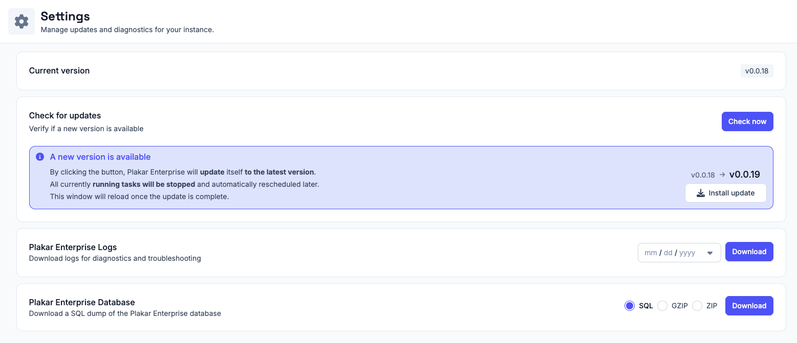

# Updating Plakar Control Plane

Plakar Control Plane supports in-place application updates directly from the web interface.

From the **Settings** page, you can:
* View the currently installed version
* Check whether a newer version is available
* Install updates directly from the UI

When a new version is available, the settings page will display an update notification with the target version and an **Install update** action.

During the update process:
* Running tasks are stopped
* Tasks are automatically rescheduled after the update
* The web interface reloads once the update is complete

> [!NOTE]+
> Most Plakar Control Plane updates only update the application itself and do not require changes to the underlying infrastructure or deployment environment.

## Updating the underlying deployment infrastructure

Plakar Control Plane can run on multiple environments including:
* AWS
* OVHcloud
* Scaleway
* On-premises infrastructure

Depending on the platform, Plakar Control Plane may be distributed using different deployment formats such as:
* Virtual machine images
* Cloud marketplace appliances
* Container images

Occasionally, infrastructure-level updates may also be required depending on the deployment platform and distribution method.

For example, on AWS, Plakar Control Plane is distributed as an AMI through AWS Marketplace. Most application updates can be installed directly from the Settings page without replacing the EC2 instance or updating the AMI.

Platform-specific infrastructure update procedures are documented separately:
* [Updating AWS deployments](#)
* [Updating OVHcloud deployments](#)
* [Updating Scaleway deployments](#)
