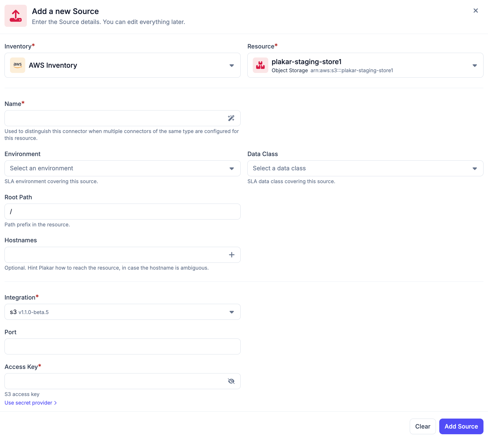
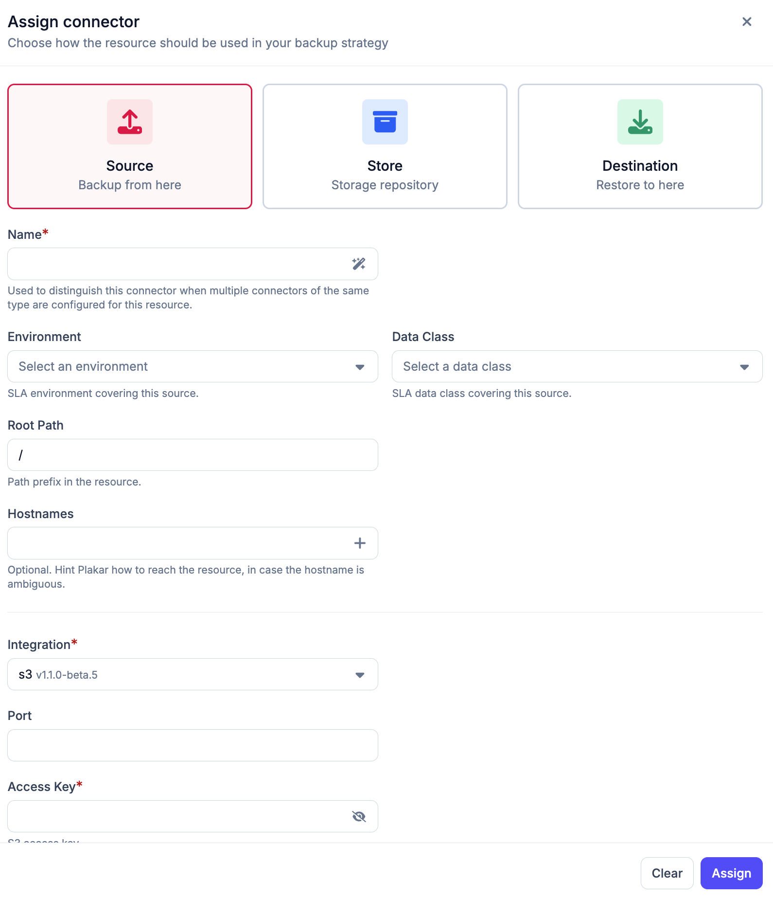

# Connectors

A connector links a resource in your inventory to Plakar Control Plane so it can be used as part of a backup workflow. A resource can have multiple connectors, and each connector belongs to a single resource. The connector type is selected during connector setup.

Plakar Control Plane supports three connector types:
* **Source** - the resource being backed up
* **Store** - where backups are kept
* **Destination** - where backups are restored to

## How connectors work

When attaching a connector to a resource, Plakar Control Plane uses the resource `class` and `subclass` to determine which integrations are compatible with that resource. For example, a resource with a class of `Object Storage` and a subclass of `S3` will automatically match compatible integrations, in this case just the S3 integration.

In most cases, the integration is selected automatically. If multiple compatible integrations are available, you can choose the integration manually from the integration list.

Once the integration is selected, you must provide the configuration and credentials required for that integration. The required configuration depends on:
* The connector type
* The selected integration
* The inventory type managing the resource

For managed inventories (such as AWS), credentials and permissions may already be available at the inventory level. In this case, additional credentials are not required when connecting supported resources.

If the required permissions are not available, or when using a self-managed inventory, you will be prompted to provide the necessary credentials during connector setup.

After configuration, you can test the connector directly from the UI to verify that Plakar Control Plane can successfully reach and authenticate with the resource before using it in a backup job.

When configuring a source connector, additional SLA-related metadata is required:
* **Environment** - the environment the resource belongs to, such as production, development, or testing
* **Data Class** - the type of data stored in the resource, such as critical, database, financial records, PII, etc

These values are used by the policies and SLA system to determine backup requirements and protection rules. See the [policies](#) documentation for more details.

## Adding a connector to a resource

Connectors can be added either from the **Connectors** section in the sidebar or directly from a resource inside an inventory.

### Adding from the Connectors section

The connectors section contains sub-sections for **Sources**, **Stores**, and **Destinations**. Selecting one of these sections displays all connectors of that type and allows you to create a new connector.

When creating a connector, you first select an inventory and then a resource from that inventory. You must also provide a connector name, select an integration, and fill in any integration-specific configuration fields required for the selected resource.

Compatible integrations are automatically filtered based on the selected resource class and subclass. In most cases, the correct integration is automatically preselected.

For source connectors, additional SLA-related fields for the environment and data class are required.

### Adding from an inventory resource

Connectors can also be added directly from a resource inside an inventory. Selecting a resource opens a side panel containing a **Connectors** tab and a **Settings** tab. The settings tab is used to manage the resource itself, while the connectors tab displays all connectors attached to the resource and allows additional connectors to be assigned.

When creating a connector from the resource panel, the inventory and resource are derived from the selected resource and are not configurable, so only the connector type, integration, credentials, and integration-specific configuration need to be provided. For source connectors, the environment and data class fields are also required.

## Managing connectors

The following pages provide detailed configuration and management information for each connector type.

{}
