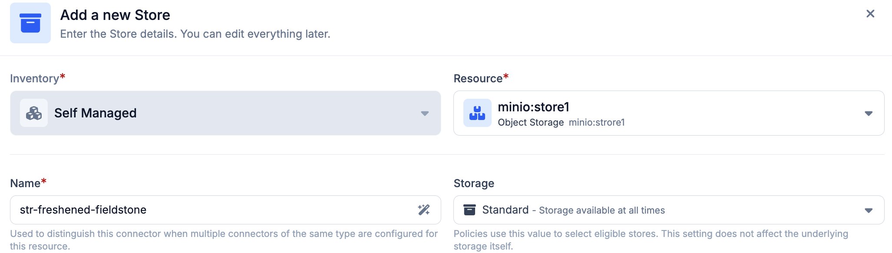
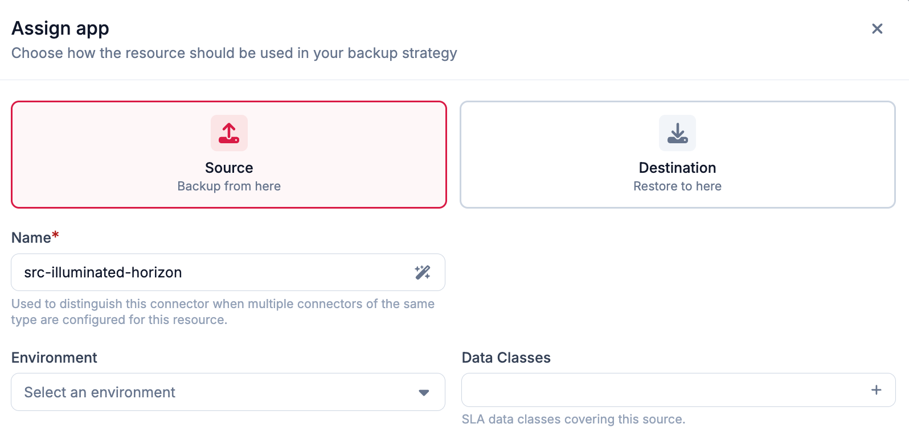
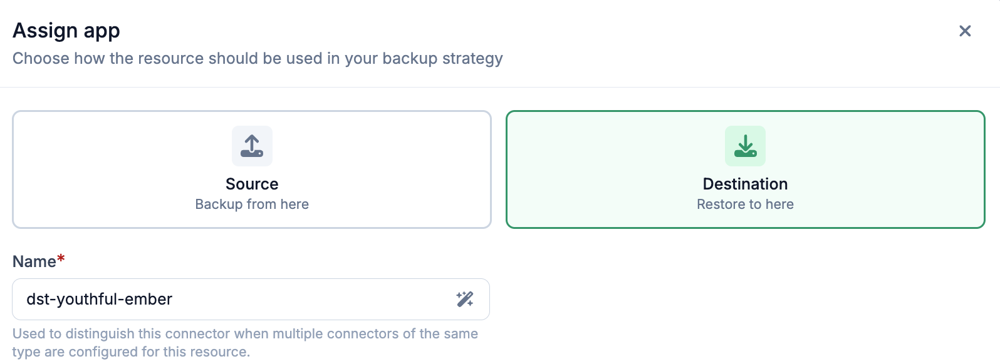

# Apps

An app links a resource in your inventory to Plakar Control Plane so it can be
used as part of a backup workflow. A resource can have multiple apps. The app
type is selected during app setup.

Plakar Control Plane supports three app types:

- **Source** - the resource being backed up
- **Store** - where backups are kept
- **Destination** - where backups are restored to

## How apps work

Each resource has a `class` and `subclass` that describe what kind of resource
it is. For managed inventories, these are set automatically when resources are
discovered. For self-managed inventories, you set them yourself when adding a
resource. This is configured at the [resource](../resources) level, not on the
app.

Plakar Control Plane uses the resource `class` and `subclass` to determine which
integrations are compatible when attaching an app. For example, a resource with
a class of `Object Storage` and a subclass of `S3` will automatically match
compatible integrations, in this case just the S3 integration.

In most cases, the integration is selected automatically. If multiple compatible
integrations are available, you can choose the integration manually from the
integration list.

Once the integration is selected, you must provide the configuration and
credentials required for that integration. After configuration, you can test the
app directly from the UI to verify that Plakar Control Plane can successfully
reach and authenticate with the resource before using it in a backup workflow.

### Store apps

When configuring a store app, you must select a **Storage Type** in addition to
the integration credentials:

- **Standard** - the store is available at all times and can be written to or
  read from immediately
- **Cold** - the store uses archival storage where data must be retrieved before
  it can be accessed, such as Amazon S3 Glacier

The storage type is used by the policies engine to infer the nature of the
store. This setting does not affect the underlying storage itself.

### Source apps

When configuring a source app, you must also provide:

- **Environment** - the environment the resource belongs to, such as production,
  development, or testing
- **Data Class** - the type of data stored in the resource, such as critical,
  database, financial records, or PII. Multiple data classes can be selected if
  the resource contains more than one type of data.

These values tie directly into the policies and SLA system. Policies define
backup requirements based on environment and data class combinations. For
example, a policy might require that all production sources tagged as critical
are backed up every hour and retained for 90 days. The policies engine uses
these values to determine which policies apply to the source and what protection
rules are enforced. See the [policies documentation](../operations/policies) for
more details.

### Destination apps

Destination apps only require the integration configuration and credentials. No
additional fields are needed beyond what is described in
[how apps work](#how-apps-work).

## Managing connectors

The following pages provide detailed configuration and management information
for each connector type.

{}
