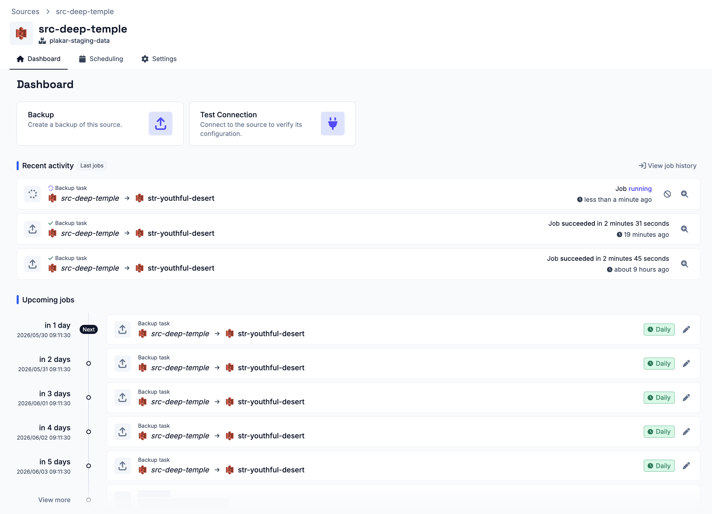
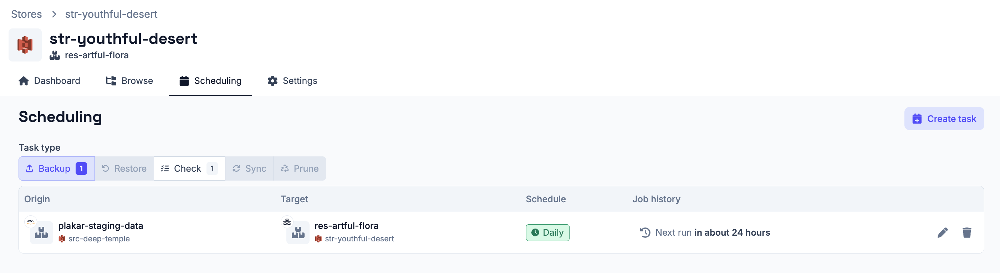

# Job History

The **Operations > Scheduling** section includes a **Job History** for both the
[manual scheduler](../manual-scheduler) and the
[policy scheduler](../policy-scheduler) that lists all jobs that have run,
whether they succeeded or failed, along with any jobs that are currently
running.

Each job has a details popup with the following information:

- **Job ID** - a unique identifier for the job
- **Status** - the current state of the job: `succeeded`, `failed`, or `running`
- **Restore Point** - the restore point produced by the job, available once the
  job completes
- **Progress** - the restore point ID and number of objects processed so far
- **Recent Paths** - a live list of the last files being processed, each showing
  whether it has `succeeded`, `failed`, or is still in `progress`
- **Output** - the full log output for the job, useful for diagnosing failures



If a job is currently running, the output and recent paths update in real time.
A **Cancel job** button is available to stop the job.

Failed or successful jobs from the manual scheduler can be retried directly from
the job history list. This is not available for jobs triggered by the policy
scheduler, as those are fully managed by the policies engine.



## Jobs and Schedules on Apps

Each app ([sources](../../apps/sources), [stores](../../apps/stores) &
[destinations](../../apps/destinations)) also surfaces scheduling information on
its own details page:

- The **Dashboard** tab lists all past and upcoming jobs involving that app,
  scoped to that app only.
- The **Scheduling** tab lists all schedules that involve that app, so you can
  see at a glance what is configured to run and when.

 
