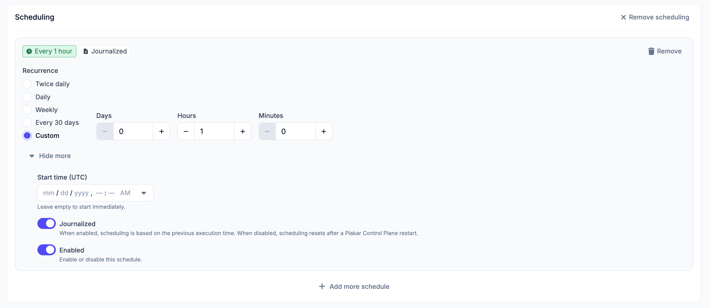

# Manual Scheduler

The manual scheduler runs tasks on a recurring basis. Once a task is configured,
you can attach one or more schedules to it. Each schedule is configured
independently.

## Recurrence

How often the schedule runs. Available options: `twice daily`, `daily`,
`weekly`, `every 30 days`, or `custom`. For a custom recurrence, enter the
interval in `days`, `hours`, and/or `minutes`.

## Start Time (UTC)

The date and time at which the schedule first runs, specified in UTC down to the
minute. If left empty, the schedule starts immediately.

## Journalised

When journalised mode is enabled, each execution is scheduled relative to the
previous one. When disabled, the schedule resets its reference point after a
Plakar Control Plane restart.

## Enabled

Schedules can be enabled or disabled independently. Disabling a schedule pauses
it without deleting it.

See the [job history documentation](../job-history) for details on monitoring
job progress, viewing job output, and finding jobs on connector pages.
