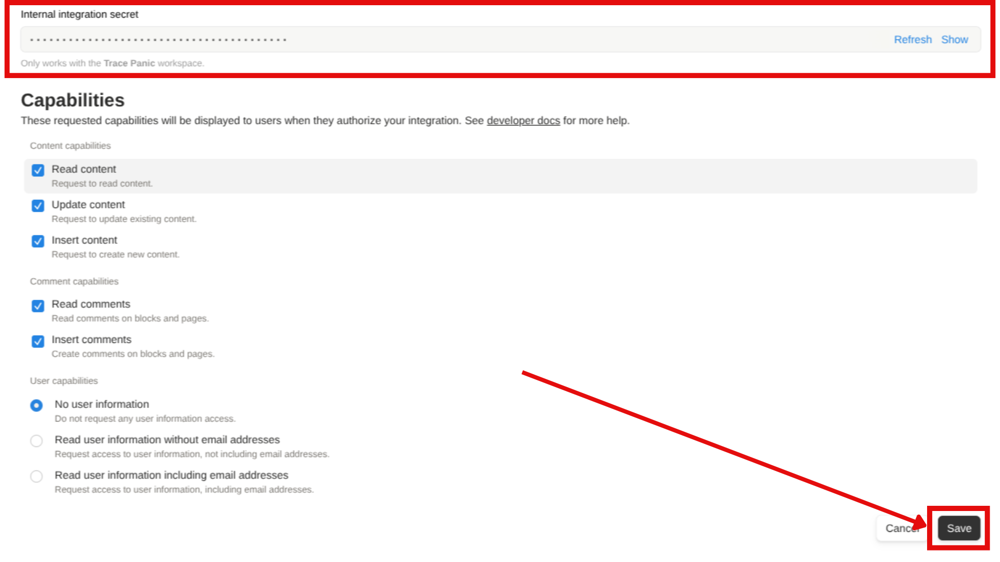
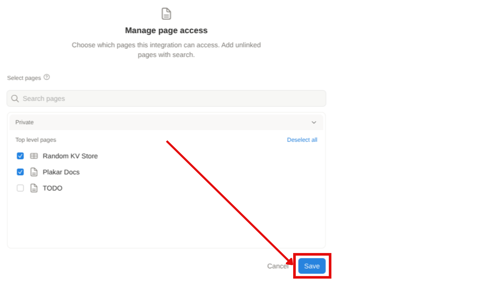

{}
This integration has not yet reached a stable release. It's functional for testing and evaluation but should not be relied upon for production use cases.

See the [Current limitations](#current-limitations) section below for current known issues and planned improvements.
{}

The **Notion integration** enables backup and restoration of Notion workspaces through the official Notion API. All workspace content—including pages, databases, blocks, and hierarchical relationships—is captured as structured JSON and stored in a Kloset store.

The Notion integration provides two connectors:

| Connector type               | Description |
| ---------------------------- | ----------- |
| ✅ **Source connector**      | Back up a Notion workspace into a Kloset store. |
| ✅ **Destination connector** | Restore a Notion workspace from a Kloset store. |

## Installation

The Notion package can be installed using pre-built binaries or compiled from source.


{}
Pre-compiled packages are available for common platforms and provide the simplest installation method.

**Note:** Pre-built packages require Plakar authentication. See [Logging in to Plakar](../../guides/logging-in-to-plakar) for details.

Install the Notion package:
```bash
$ plakar pkg add notion
```

Verify installation:
```bash
$ plakar pkg list
```


{}
Source builds are useful when pre-built packages are unavailable or when customization is required.

**Prerequisites:**
* Go toolchain compatible with your **Plakar** version

Build the package:
```bash
$ plakar pkg build notion
```

A package archive will be created in the current directory (e.g., `notion_v1.0.0_darwin_arm64.ptar`).

Install the package:
```bash
$ plakar pkg add ./notion_v1.0.0_darwin_arm64.ptar
```

Verify installation:
```bash
$ plakar pkg list
```


{}
Check if the Notion package is installed:
```bash
$ plakar pkg list
```

To upgrade to the latest available version, remove the existing package and reinstall it:

```bash
$ plakar pkg rm notion
$ plakar pkg add notion
```

Existing configurations (stores, sources, destinations) are preserved during upgrade.



## Notion API Setup

Before using the Plakar Notion integration, you must create an internal integration in your Notion workspace.

### Create a Notion integration

1. Go to [https://www.notion.so/profile/integrations](https://www.notion.so/profile/integrations)
2. Click **Create a new integration**
3. Configure the integration:
   - **Name**: Choose a descriptive name (e.g., "Plakar Backup")
   - **Type**: Select **Internal**
   - **Associated workspace**: Select the workspace you want to back up
4. Click **Create** to create the integration
5. Click on the **Configure integration settings** in the success popup


### Configure integration capabilities

After creating the integration, you need to enable the required capabilities:

1. In the integration settings page, scroll to the **Capabilities** section
2. Enable the following capabilities:
   - **Read content**: Required for backing up pages and databases
   - **Update content**: Required for restoring pages and databases 
   - **Insert content**: Required for restoring pages and databases
   - **Read comments**: Required for backing up discussion threads
   - **Insert comments**: Required for restoring discussion threads
3. Click **Save**



### Copy the API token

1. In the integration settings page just before the **Capabilities** section, there's the token section
2. Click **Show** on the "Internal Integration Secret"
3. Copy the token (format: `ntn_xxx...`)

{}
Keep this token secure. Anyone with this token can access and modify pages that have been shared with this integration.
{}

### Setup pages access to the integration

You must enable top-level page access to the integration:

1. Click on **Edit Access**
2. Select the top-level pages and databases you want to backup
3. Click **Save**



{}
Once a page is shared with the integration, all child pages are automatically included during backup. You only need to share top-level pages.
{}

## Source connector

The source connector retrieves Notion workspace data via the API and stores it as structured JSON. This includes page content, databases, blocks, metadata, and hierarchical relationships.


flowchart LR

subgraph Source[<b>Notion</b>]
  fs@{ shape: cloud, label: "data" }
end

subgraph Plakar[<b>Plakar</b>]
  Connector@{ shape: rect, label: "<small>Retrieve data via</small><br><b>Notion source connector</b>" }
  Transform@{ shape: rect, label: "<small>Transform data as a structured JSON document</small>" }

  Connector --> Transform
end

Source --> Connector

Store@{ shape: cyl, label: "Kloset Store" }

Transform --> Store

%% Apply classes
class Source sourceBox
class Plakar brandBox
class Store storeBox

%% Classes definitions
classDef sourceBox fill:#ffe4e6,stroke:#cad5e2,stroke-width:1px
classDef brandBox fill:#524cff,color:#ffffff
classDef storeBox fill:#dbeafe,stroke:#cad5e2,stroke-width:1px

linkStyle default stroke-dasharray: 9,5,stroke-dashoffset: 900,animation: dash 25s linear infinite;


### Requirements

Before configuring the source connector, ensure you have:
1. **Completed Notion API setup** (see section above)
2. **Notion API token** from your integration
3. **Shared at least one page** with your integration

### Configuration

Create a Notion source configuration:
```bash
plakar source add mynotion location=notion:// token=$NOTION_API_TOKEN
```

Back up the workspace to a Kloset store:
```bash
$ plakar at /var/backups backup "@mynotion"
```

### Configuration options

| Option     | Required | Description |
| ---------- | -------- | ----------- |
| `location` | Yes      | Must be set to `notion://` |
| `token`    | Yes      | Your Notion API token (format: `ntn_xxx...`) |

### What gets backed up

The source connector captures:
- **Pages**: All content, blocks, and page properties
- **Databases**: Structure, properties, views, and all entries
- **Media**: Images, files, and embedded content (stored as references)
- **Comments**: Discussion threads and annotations
- **Metadata**: Creation dates, authors, last edited information
- **Relationships**: Parent-child hierarchies and database links

## Destination connector

The destination connector reads structured JSON from a Kloset store and recreates pages and content in Notion via the API.



flowchart LR

Store@{ shape: cyl, label: "Kloset Store" }

subgraph Plakar[<b>Plakar</b>]
  Transform@{ shape: rect, label: "<small>Reconstruct data from structured JSON document</small>" }
  Connector@{ shape: rect, label: "<small>Restore data via</small><br><b>Notion destination connector</b>" }

  Transform --> Connector
end

Store --> Transform

subgraph Destination[<b>Notion</b>]
  fs@{ shape: cloud, label: "data" }
end

Connector --> Destination

%% Apply classes
class Destination destinationBox
class Plakar brandBox
class Store storeBox

%% Classes definitions
classDef destinationBox fill:#d0fae5,stroke:#cad5e2,stroke-width:1px
classDef brandBox fill:#524cff,color:#ffffff
classDef storeBox fill:#dbeafe,stroke:#cad5e2,stroke-width:1px

linkStyle default stroke-dasharray: 9,5,stroke-dashoffset: 900,animation: dash 25s linear infinite;


### Requirements

Before configuring the destination connector, ensure:
1. **Completed Notion API setup** with insert capabilities enabled
2. **Created or identified a target page** where content will be restored
3. **Shared the target page** with your integration
4. **Have the Page ID** of the target page

### Finding a Page ID

You need to get the Page ID of the page where you want to restore the backup contents. To find a Notion Page ID:
1. Open the page in Notion
2. Click **Share** in the top right, then **Copy link**
3. The URL format is: `https://www.notion.so/PageName-PAGE_ID`
4. Extract the Page ID (the long alphanumeric string after the last dash)

**Example**: In `https://www.notion.so/MyPage-1234567890abcdef1234567890abcdef`, the Page ID is `1234567890abcdef1234567890abcdef`.

### Configuration

Create a Notion destination configuration:
```bash
plakar destination add mynotion location=notion:// token=$NOTION_API_TOKEN
```

Set the target page ID for restoration:
```bash
plakar destination set mynotion rootID=$NOTION_PAGE_ID
```

Restore a snapshot:
```bash
plakar at /var/backups restore -to "@mynotion" <snapshot_id>
```

### Configuration options

| Option     | Required | Description |
| ---------- | -------- | ----------- |
| `location` | Yes      | Must be set to `notion://` |
| `token`    | Yes      | Notion API token with insert permissions |
| `rootID`   | Yes      | Notion Page ID where content will be restored |

## Current limitations
- **Permission model**: Each top-level page must be manually shared with the integration. Pages not explicitly shared will not be backed up, even if linked from shared pages.
- **Block compatibility**: Some third-party or custom Notion blocks may not serialize perfectly. All standard Notion blocks are fully supported.
- **Media restoration**: Due to Notion API limitations, media files (images, PDFs, documents) cannot be restored directly. You can restore media to the filesystem and manually re-upload.
- **Restoration target**: Restoring requires an existing Notion Page ID as the destination. The API does not support creating new top-level pages.
