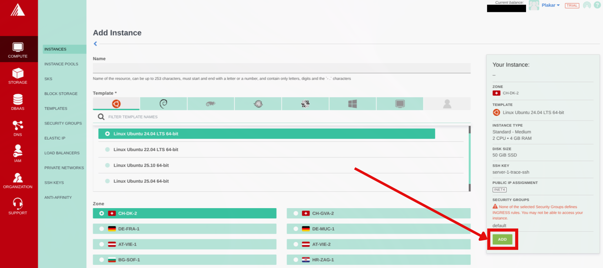

## Overview
This guide configures an Exoscale Compute instance to automatically back up your servers to Exoscale Object Storage (SOS). The setup uses Plakar to create encrypted, deduplicated snapshots on a scheduled interval with web UI monitoring.

## Architecture
- **Backup Compute**: Runs Plakar and schedules backups
- **Source servers**: Exoscale servers to back up
- **Exoscale Object Storage (SOS)**: Stores encrypted backups


flowchart TB
subgraph Sources["Source Servers"]
  Server1["Web Server 1"]
  Server2["Web Server 2"]
  ServerN["Server N"]
end

BackupCompute["Backup Compute<br/>Plakar + Scheduler"]

subgraph Storage["Exoscale Object Storage"]
  Kloset["Kloset Store<br/>Encrypted & Deduplicated<br/>Backup"]
end

Server1 -->|SSH/SFTP| BackupCompute
Server2 -->|SSH/SFTP| BackupCompute
ServerN -->|SSH/SFTP| BackupCompute
BackupCompute -->|Store Snapshots| Kloset

%% Apply classes
class Server1,Server2,ServerN sourceBox
class BackupCompute brandBox
class Kloset storeBox

%% Classes definitions
classDef sourceBox fill:#ffe4e6,stroke:#cad5e2,stroke-width:1px
classDef brandBox fill:#524cff,color:#ffffff,stroke:#524cff,stroke-width:2px
classDef storeBox fill:#dbeafe,stroke:#60a5fa,stroke-width:2px

linkStyle default stroke:#94a3b8,stroke-width:2px,stroke-dasharray:5 5


## Prerequisites
- Exoscale account with billing configured
- SSH keypair for instance access
- SSH access to source servers
- Basic familiarity with Plakar commands

## Create Object Storage Bucket

### Create bucket in Exoscale Portal
1. In the Exoscale portal, navigate to **Storage**
3. Click **Add** to create a new bucket
4. Configure:
    - Zone: Select region (note the name, it'll be used to connect to the container e.g `ch-dk-2`)
    - Name: `plakar-backups` (must be globally unique)
5. Click **Add**


### Generate IAM API Keys
1. In the Exoscale portal, navigate to **IAM** → **Keys**
2. Click on **Add** to create new API keys then provide and role then click **Create**.
3. Copy the key and secret to a secure environment (you cannot see the secret once you leave the page)


## Create SSH Keypair

1. Generate SSH key locally and copy the public key:
  ```bash
  ssh-keygen -t ed25519 -f ~/.ssh/id_exoscale -C "exoscale-backup"
  cat ~/.ssh/id_exoscale.pub
  ```
2. In the Exoscale portal, navigate to **Compute** → **SSH Keys**
3. Click on **Add** then enter a name for the SSH Key and paste in the public key then click **Import**.


## Provision Backup Compute Instance

### Create compute instance
1. In the Exoscale Portal, navigate to **Compute** → **Instances**
2. Click **Add**
3. Configure:
    - Name: `plakar-backup`
    - Template: Ubuntu 24.04 LTS
    - Zone: Same as Object Storage bucket (recommended for better performance)
    - Instance Type: Small (2 vCPUs, 2 GB RAM) or any other you prefer
    - SSH Key: Select the SSH key we created before from the dropdown
4. Click **Add** to provision your compute





### Setup security group rules

1. Once the compute is provisioned, navigate to **Compute** → **Security Groups**
2. By default the compute will be assigned the `default` security group, click on the actions on default then click on **Details**
3. On the next page click on **Add Rule**
4. Configure:
    - Flow direction: Ingress
    - Protocol: TCP
    - Source Type: CIDR
    - Sources: `0.0.0.0/0` allows SSH from anywhere (for better security use your IP Address here)
    - Start & End port: 22
    - A description for the rule e.g. SSH Access
5. Click on **Create**


### Initial connection
Once instance is running, note the public IP and connect:
```bash
ssh ubuntu@<instance-ip>
```

## Install Plakar

Install Plakar on the instance using the [Plakar Installation Guide](../../../../../docs/main/quickstart/installation/)

## Configure Object Storage

### Install S3 integration
```bash
plakar login -email you@example.com
plakar pkg add s3
```

### Add storage connector
```bash
plakar store add exoscale-sos-backups \
  location=s3://<SOS_ENDPOINT>/<BUCKET_NAME> \
  access_key=<YOUR_ACCESS_KEY> \
  secret_access_key=<YOUR_SECRET_KEY> \
  use_tls=true \
  passphrase='<YOUR_SECURE_PASSPHRASE>'
```

Replace:
- `<SOS_ENDPOINT>`: using the format `sos-{zone}.exo.io` where zone is one we selected for the bucket e.g `sos-ch-dk-2.exo.io`
- `<BUCKET_NAME>`: e.g., `plakar-backups`
- `<YOUR_ACCESS_KEY>` and `<YOUR_SECRET_KEY>`: From bucket API credentials
- `<YOUR_SECURE_PASSPHRASE>`: Strong passphrase for encryption

{}
Configuring the passphrase in the store enables automated backups without prompts.
{}

### Initialize Kloset Store
```bash
plakar at "exoscale-sos-backups" create
```

## Configure SSH Access to Source Servers

### Install SFTP integration
```bash
plakar pkg add sftp
```

### Generate SSH keys for backups
```bash
ssh-keygen -t ed25519 -f ~/.ssh/id_ed25519_plakar -C "plakar@backup"
```
Press Enter for no passphrase.

### Copy keys to source servers
```bash
ssh-copy-id -i ~/.ssh/id_ed25519_plakar.pub user@source-server-1
ssh-copy-id -i ~/.ssh/id_ed25519_plakar.pub user@source-server-2
```

Test access:
```bash
ssh -i ~/.ssh/id_ed25519_plakar user@source-server-1 'echo "Success"'
```

### Create SSH aliases
```bash
cat >> ~/.ssh/config << 'EOF'
Host source-1
    HostName source-server-1.example.com
    User backupuser
    Port 22
    IdentityFile ~/.ssh/id_ed25519_plakar

Host source-2
    HostName source-server-2.example.com
    User backupuser
    Port 22
    IdentityFile ~/.ssh/id_ed25519_plakar
EOF
```

Test:
```bash
ssh source-1 'echo "Alias works"'
```

## Configure Backup Sources
Add source connectors for each server:
```bash
plakar source add web-server-1 sftp://source-1:/var/www
plakar source add web-server-2 sftp://source-2:/var/www
```

Verify:
```bash
plakar source show
```

## Test Backup
Run a manual backup to verify configuration:
```bash
# Single source
plakar at "@exoscale-sos-backups" backup "@web-server-1"

# Multiple sources
plakar at "@exoscale-sos-backups" backup "@web-server-1" "@web-server-2"
```

List snapshots:
```bash
plakar at "@exoscale-sos-backups" ls
```

## Schedule Automatic Backups

For scheduler configuration and systemd service setup, follow the same steps as the [OVHcloud backup server guide](../../ovhcloud/ovhcloud-as-a-dedicated-backup-server/#schedule-automatic-backups), replacing:
- `@ovhcloud-s3-backups` with `@exoscale-sos-backups`
- `ubuntu` with your actual username if different

The scheduler configuration, systemd services, and web UI setup are identical on any Linux machine.

## Troubleshooting

**Authentication errors**
- Verify SSH keys and user permissions on source servers

**Can't connect to Object Storage**
- Check S3 credentials and endpoint URL
- Verify passphrase: `plakar store show exoscale-sos-backups`
- Confirm bucket name and zone endpoint match

**Permission denied**
- Ensure SSH user has read access to backup directories

**Services won't start**
- Check status: `systemctl status plakar-scheduler`
- View logs: `journalctl -u plakar-scheduler` or `journalctl -u plakar-ui`

**Alternative UI access**
- Install Plakar locally and configure the same store with Exoscale SOS credentials to access backups without compute instance connection
