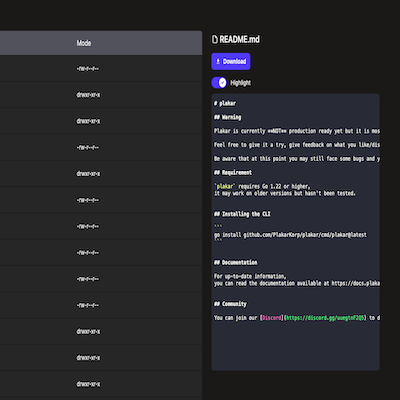
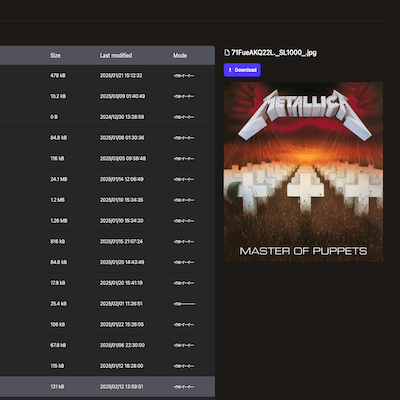
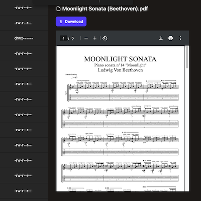

We were thrilled to release our first beta in late February,
but we weren’t just going to sit back and rest on our laurels.

Instead,
we immediately set our sights on refining our product,
incorporating valuable user feedback,
and developing innovative features that would take our software to the next level.

> Want to stay updated ?
>
> <a class="github-button" href="https://github.com/PlakarKorp/plakar" data-color-scheme="no-preference: light; light: light; dark: dark;" data-size="large" data-show-count="true" aria-label="Star PlakarKorp/plakar on GitHub">Star</a> <a class="github-button" href="https://github.com/PlakarKorp/plakar/subscription" data-color-scheme="no-preference: light; light: light; dark: dark;" data-size="large" data-show-count="true" aria-label="Watch PlakarKorp/plakar on GitHub">Watch</a> <a class="github-button" href="https://github.com/PlakarKorp" data-color-scheme="no-preference: light; light: light; dark: dark;" data-size="large" data-show-count="true" aria-label="Follow @PlakarKorp on GitHub">Follow @PlakarKorp</a>


## New beta available

We are excited to announce our new beta release and warmly invite you to test it!

```tt
$ go install github.com/PlakarKorp/plakar/cmd/plakar@v1.0.0-beta.4
```

During our pre-beta phase,
we concentrated on building the core of Plakar—ensuring reliable data storage and reconstruction.
Now that these critical components are in place,
we can shift our focus to enhancing the user experience with intuitive features that simplify your work.

Since these read-only features are low-risk,
we plan to roll out frequent updates with new functionalities just appearing release after release.
This is the perfect opportunity for you to test them and help us shape the tool that best meets your needs.


## Previews

Our web UI provided previews of text content with syntax highlighting and images:

Text&nbsp;           | Image
:-------------------------:|:-------------------------:
 | 

In addition to this,
latest beta added preview for PDF,
audio and video content:

Video           | PDF
:-------------------------:|:-------------------------:
 | 


This works with either a local repository or a remote one,
regardless of whether it's encrypted or not.
You can easily preview data from a backup hosted on a remote,
encrypted repository using a Plakar UI launched locally.
The local UI fetches data in real time as it’s read and decrypts it on the fly,
so there's no need to download the entire backup or stream any bytes in cleartext.

This is the first in a series of new features designed to make the user interface more efficient at helping you find exactly what you need.
Without giving too much away,
additional exciting features are set to roll out in the coming days!


## Test improvements

Tests are crucial,
and I firmly believe that developers should avoid writing tests for their own code.
If I have flawed logic in mind and write both the code and its tests,
we end up verifying that my bug is correctly implemented—which isn’t our goal 😄.

Peer review is invaluable—especially given Plakar Korp’s requirement for two reviewers and our extensive experience with it.
However,
as a small team that frequently collaborates on the same code,
we risk developing shared assumptions that might lead us all to the same flawed logic.
I also prefer that our developers focus on their strengths,
particularly R&D problem-solving,
since that is an area where external help is harder to come by than testing.

In January,
we had tests for the most critical parts of Plakar that affected storage format and could potentially lead to data corruption.
However,
we wanted broader coverage that also included the non-critical components.
We decided to bring on an extra resource focused solely on testing,
and [@sayoun](https://github.com/sayoun) expressed interest,
so he began working with us.

Since then,
he has diligently reviewed every piece of code we write,
adding the missing tests for each package and command.
This approach allows the team to concentrate on improving the software while [@sayoun](https://github.com/sayoun) brings a fresh perspective to testing without being too involved in other discussions.
We’re thrilled to see new tests emerging,
catching bugs,
and enhancing overall quality.

Most recently, his efforts have focused on testing the CLI subcommands—the most user-visible part of Plakar—and he has already helped fix several command-line issues.


## Documentation improvements

This effort was spearheaded by [@omar-polo](https://github.com/omar-polo),
who took on the heavy lifting of restructuring our documentation—converting all previous materials into a unified format and meticulously addressing every detail.
The entire team also contributed by polishing the content,
adding more examples,
and fixing typos,
with significant input from [@semarie](https://github.com/semarie),
a familiar face from the OpenBSD project that we were delighted to see around.

As a result,
all our documentation in [mandoc format](https://mandoc.bsd.lv/) now adheres to a consistent structure,
enabling us to effortlessly automate the generation of Markdown versions.
These versions are seamlessly displayed to users through `plakar help` and synchronized on our [documentation site](https://docs.plakar.io).


## Optimizations

We implemented several optimization improvements—nothing too fancy,
but small wins are still wins!

Among these,
two stand out:

- [@mathieu-plak](https://github.com/mathieu-plak) discovered and fixed an issue with our use of the `binary` package,
which had been causing poor performance in packfile deserialization.
Although the performance boost is significant,
packfile deserialization is rarely used,
so the improvement is only noticeable in specific scenarios.
Nevertheless,
this fix prompted us to review similar constructs to ensure we hadn't made the same mistake elsewhere.

- [@omar-polo](https://github.com/omar-polo) enhanced certain lookups by employing an optimized scan of our B+ tree rather than a node traversal in some cases.
This change significantly boosts performance when scanning all entries of a backup.

As a side note, we've begun working on deeper optimizations that are expected to deliver even bigger gains. Stay tuned for an upcoming article detailing these enhancements.


## Bugfixes

Based on user feedback—especially from [@b1pb1p](https://github.com/b1pb1p),
[@ncartron](https://github.com/ncartron),
[@ajacoutot](https://github.com/ajacoutot),
and [@semarie](https://github.com/semarie)—we have resolved minor bugs that affected SFTP support and the agent when using specific command options.


## Packaging

In January, [@ajacoutot](https://github.com/ajacoutot) emailed me to let me know he had packaged Plakar for the OpenBSD project.
At the time,
we were finalizing the storage format before freezing it,
so I asked him to hold off to avoid users having to trash their data when the beta was released.
Now that the beta is out and the storage format is stable,
he updated his port and [committed it to the OpenBSD project](https://github.com/openbsd/ports/tree/master/sysutils/plakar)—OpenBSD users can simply run `pkg_add plakar` to get started!

On the same day, [@lbartoletti](https://github.com/lbartoletti) informed me on IRC that he had [packaged Plakar for the FreeBSD project](https://github.com/freebsd/freebsd-ports/tree/main/archivers/plakar), meaning FreeBSD users will soon be able to run `pkg add plakar`.
