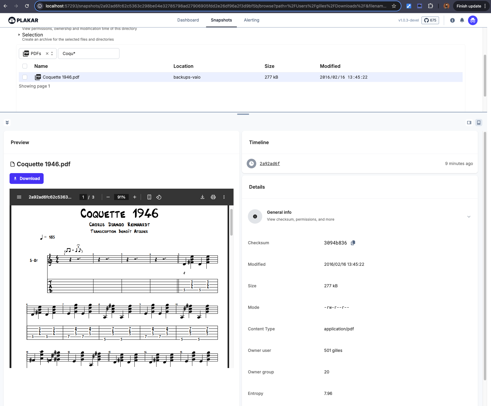
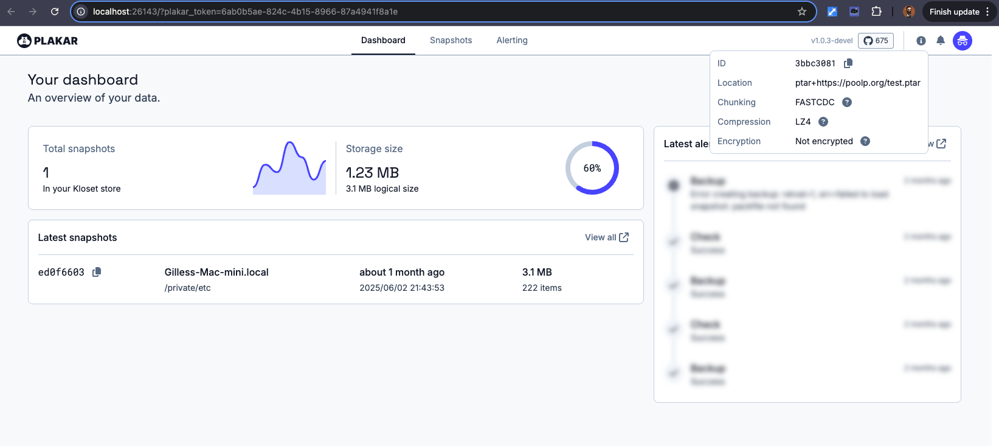

## TL;DR:
We recently introduced our [ptar archive format](/posts/2025-06-27/it-doesnt-make-sense-to-wrap-modern-data-in-a-1979-format-introducing-.ptar/) and the feedback was good,
but many people felt like this was too tied to the plakar backup solution:
if you just want to use a deduplicated archive solution, why should you install a full backup software ?

Today,
we unveil `kapsul`,
an **ISC-licensed open-source** tool dedicated to creating and consuming ptar archives.
It only does a subset of what `plakar` does,
but has less requirements and an even simpler interface with zero configuration and no need for an agent.

This short post tells you all you need to know to get started testing it.

---

## What Is `kapsul` ?

The `kapsul` utility allows creating ptar archives,
_aka. capsules_,
that contain deduplicated, compressed, content-addressed, strongly encrypted data.

What sets it apart from `plakar`,
is that by accepting a trade-off and not supporting _some_ of the features that `plakar` does,
`kapsul` can be implemented as an agentless and zero-configuration tool.

In other words:
you install,
you run,
it works right away.

```
$ go install github.com/PlakarKorp/kapsul@v0.0.0-beta.10
go: downloading github.com/PlakarKorp/kapsul v0.0.0-beta.10

$ kapsul -f /tmp/bleh.ptar create /private/etc 
repository passphrase: 
repository passphrase (confirm): 

$ kapsul -f /tmp/bleh.ptar ls                 
repository passphrase: 
2025-07-07T21:51:57Z   bff68fc7    3.1 MB        0s /private/etc
```

With just these three commands,
you go from nothing to a `/tmp/bleh.ptar` that has all of these properties (shameless copy-paste from previous article):

- **Immutable** — it is write-once, tamper-evident by design.
- **Deduplicated** — it is content-addressed, chunks are referenced multiple times.
- **Compressed** — it has post-deduplication compression to save more space.
- **Encrypted** — it uses same [audited model](/posts/2025-02-28/audit-of-plakar-cryptography/) as underlying Kloset store.
- **Versioned** — it supports granular inspection of previous states.
- **Browsable** — it support browsing via CLI or UI, without full extraction.
- **(Trans)Portable** — it works on a USB stick, offline machine, or tape.

---

## So What Are The Trade-Offs ?

To be zero-config AND agent-less,
`kapsul` only supports a limited set of integrations and does not have the same level of caching as `plakar` to accelerate the processing of previously archived data.

Long story short,
it can archive data coming from the local filesystem,
a remote SFTP,
`stdin` and another `.ptar` archive (we will soon extend to other archive formats to allow conversions into `.ptar`).

While `kapsul` is simpler,
it does not support advanced features like remote read-write targets,
custom scheduling,
or complex caching mechanisms that `plakar` provides.
If you need more granular control over your backup process or advanced features,
`plakar` might still be the better fit.

---

## What Can I Do With It ?

That's the nicest part.

_MOST_ of what `plakar` can do... `kapsul` can do.

You can craft a ptar,
list or display its content,
launch a `ui`,
preview files (including media), ...

```
$ kapsul -f /tmp/bleh.ptar create ~/Downloads
repository passphrase: 
repository passphrase (confirm): 

$ kapsul -f /tmp/bleh.ptar ls                
repository passphrase: 
2025-07-07T23:18:33Z   2a92ad6f     23 GB       55s /Users/gilles/Downloads


$ kapsul -f /tmp/bleh.ptar ls 2a92ad6f | tail -5
repository passphrase: 
2025-01-07T08:54:15Z -rw-r--r--   gilles    staff    75 kB d0f1_01.pdf
2025-01-07T08:54:40Z -rw-r--r--   gilles    staff    75 kB d0f1_02.pdf
2025-01-07T08:54:56Z -rw-r--r--   gilles    staff    75 kB d0f1_03.pdf
2025-01-07T08:55:10Z -rw-r--r--   gilles    staff    75 kB d0f1_04.pdf
2025-04-01T21:41:59Z -rw-r--r--   gilles    staff   1.9 MB we-simpsons.png

$ kapsul -f /tmp/bleh.ptar cat 2a92ad6f:plakar_1.0.0-throwaway.0_checksums.txt
repository passphrase: 
ffdbd5e4f9748038917b7f7d3307292bd8492ba1849f8ef12a6f1937900e6a6f  plakar_1.0.0-throwaway.0_darwin_amd64.tar.gz
0402b978646105478e530010ff3d2c182885f083775842d881df7101b2abe142  plakar_1.0.0-throwaway.0_darwin_arm64.tar.gz
fc32c6a3f1c5fe4867c0ee71f285b0b2fd4e6d6bc480a9cf9714946e23629a43  plakar_1.0.0-throwaway.0_freebsd_386.tar.gz
1c0ccc9083c932e572666b0896025f69fb5115c2dd2cc88eac670f9e223b31f3  plakar_1.0.0-throwaway.0_freebsd_amd64.tar.gz
192d09e94bb9fee80eb37759510fad8fa8578dde296405e7d4f5a90a6836ab80  plakar_1.0.0-throwaway.0_freebsd_arm64.tar.gz
ee3ffff41412b5257f59f845d465e6982682873bb0775096039492574a5c479a  plakar_1.0.0-throwaway.0_linux_386.tar.gz
cefdee40f6caa7b261129fc423a96783f0923c764f8340ee2675889f1141ba75  plakar_1.0.0-throwaway.0_linux_amd64.tar.gz
175c57268939065985acc0cd606ac71446c36f45b0f2ba01546baa0c786208d3  plakar_1.0.0-throwaway.0_linux_arm64.tar.gz
d32091ad7552bb2c36f75caa4ae74dcf14fe2a53f70d593232a33f69abbb0359  plakar_1.0.0-throwaway.0_openbsd_amd64.tar.gz
d4d6e8661b34dffed96dc12b71b1070de3a8ce679177dea62661800e49d75184  plakar_1.0.0-throwaway.0_openbsd_arm64.tar.gz

$ kapsul -f /tmp/bleh.ptar ui                 
repository passphrase: 
```





and some of the commands that are currently not supported,
like `mount` and the like,
are going to be implemented in the next few weeks providing very powerful capabilities to `kapsul`.


Oooooh,
and maybe I'm the only one finding that cool,
but...


It even supports accessing a remote `ptar` over http/https for random access fetching.
Accessing a remote .ptar over HTTP/HTTPS allows you to fetch specific parts of an archive without downloading it in full:

```
$ kapsul -f https://poolp.org/test.ptar ls
2025-06-02T19:43:53Z   ed0f6603    3.1 MB        0s /private/etc

$ kapsul -f https://poolp.org/test.ptar ui
```


All of the commands that work on a local archive can be used on a remote one,
and will transparently use optimized random accesses so the archive is never fetched fully.

---

## Conclusion

A week ago,
we released `ptar` as a `plakar` subcommand and some people thought it should be a separate tool.
A week later,
you have a new standalone tool, `kapsul`, that's ISC-licensed, open-source, free,
and that lets you build your own little secure vaults in seconds.

In case we need to state the obvious,
we care about users <3


