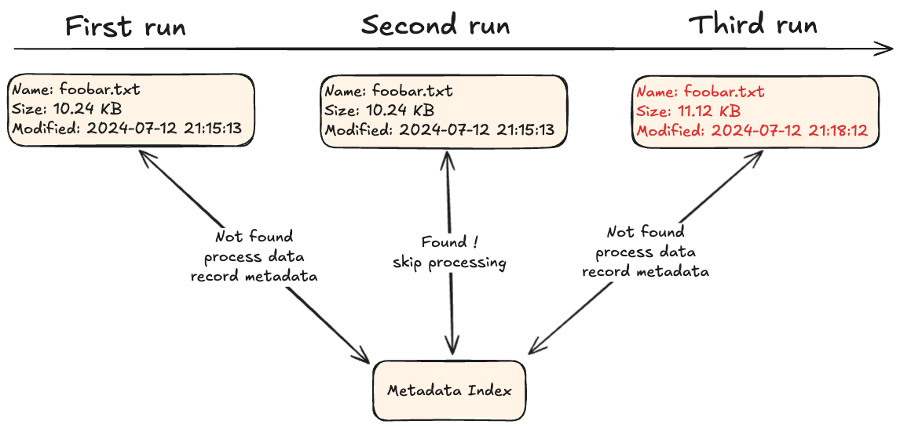
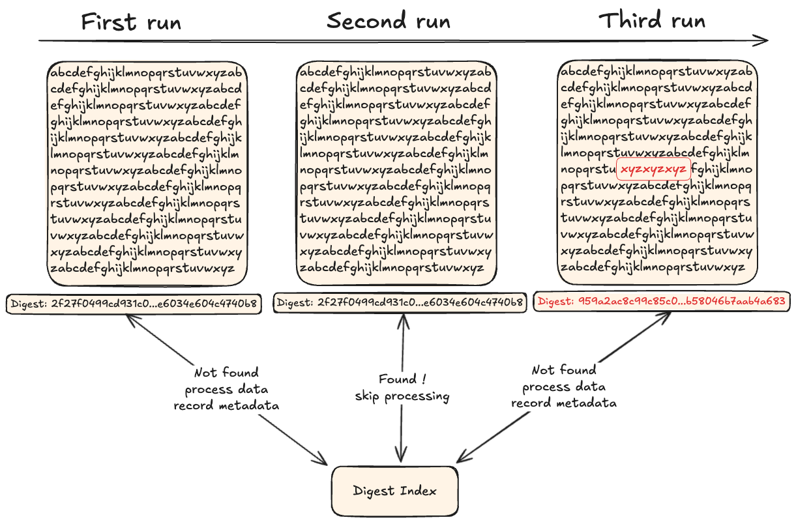
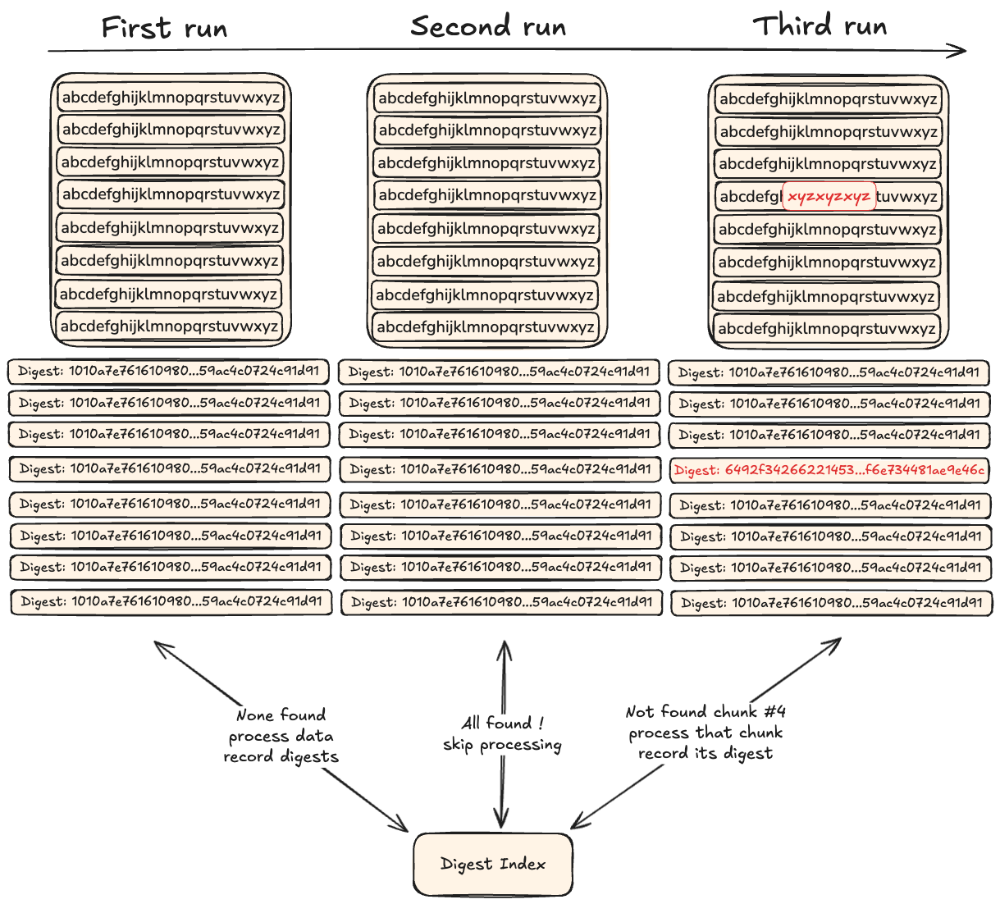
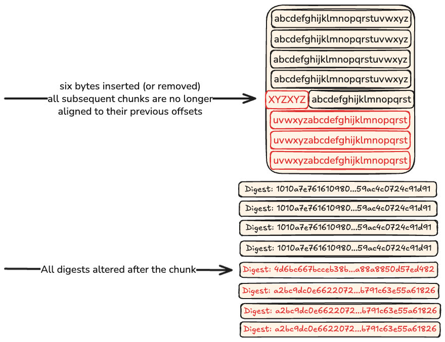
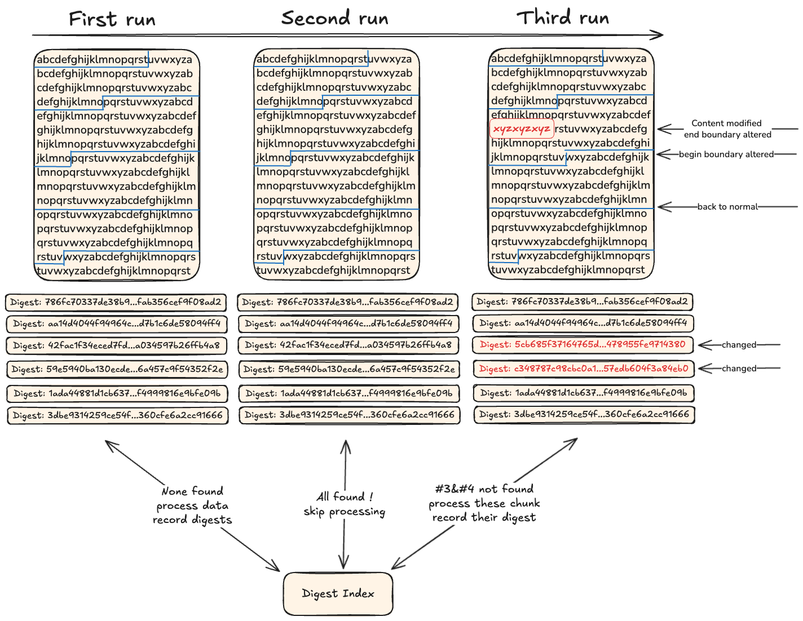

## TL;DR:
Modern data systems suffer from redundancy—wasting time, compute, bandwidth and storage on duplicate content.
Traditional methods of compression don’t help  enough,
especially when you need cross-file, shift-resilient deduplication in large, encrypted datasets.

That’s why we built and released [go-cdc-chunkers](https://github.com/PlakarKorp/go-cdc-chunkers):
an open source and ISC-licensed high-performance Go package for Content-Defined Chunking (CDC),
optimized for deduplication and resilience against data shifts.

Unlike traditional compression, CDC enables fine-grained, shift-resilient deduplication, ideal for a wide range of uses including backup, synchronization, storage, and distributed systems.


## The problem of duplication

Every time your system moves, stores, or processes duplicated data, it’s doing work it doesn’t need to.
That means longer sync times, higher cloud egress fees, bloated containers, over-provisioned caches, and users waiting for things that should’ve been instant.
Multiply that by thousands of files, logs, messages, or binary blobs—and the inefficiency compounds rapidly.
The more data you touch, the more painful and expensive that duplication becomes.

In our business,
where we need to process large amount of data,
transfer it and store it for extended periods of time,
duplication is a nightmare:
it increases processing time,
compute resources usage,
transfer time and cost,
pressure on storage and space needed.
Duplication wastes time and money at every - single - step.

The solution ? Deduplication.

Deduplication isn’t just for backups. It’s for anything that handles recurring or repetitive data: real-time collaboration tools, object storage systems, build artifact pipelines, CI/CD caches, logging infrastructures, messaging queues, document editors, and package registries. If your users upload revisions, move large files across services, or repeatedly generate similar outputs, you’re likely storing and reprocessing the same data again and again—sometimes byte-for-byte.

By deduplicating at the right layer—whether file-level, block-level, or chunk-level—you avoid wasting resources on what's already known. You free up CPU cycles for meaningful computation, reduce latency across your stack, shrink your operational footprint, and make your systems leaner and faster. And if you're paying per gigabyte, per operation, or per millisecond? You're literally buying back time and money.

## Here comes the `go-cdc-chunkers` package

To help developers build smarter,
leaner systems that avoid redundant work,
we’re releasing [go-cdc-chunkers](https://github.com/PlakarKorp/go-cdc-chunkers)—an open-source,
ISC-licensed library for high-performance Content-Defined Chunking (CDC) in Go.

It provides a framework to easily support new algorithms as research advances in the field,
and provides implementations for several algorithms including our optimized version of FastCDC,
our Keyed variant of FastCDC (discussed in this post),
an implementation of the JumpCondition optimization and even the more recent UltraCDC.

This package is designed to make it easy to slice data into variable-sized,
content-aware chunks that are resilient to shifts and edits—perfect for deduplication,
delta encoding,
change tracking,
and more.

Whether you're building synchronization tools,
blob stores,
data pipelines,
or just want to avoid wasting time and compute on repeated data,
go-cdc-chunkers gives you the primitives you need to chunk content efficiently and predictably.

| Algorithm            | Operations per nanosecond | Throughput      |
|----------------------|--------------------------:|----------------:|
| Restic\_Rabin        | `1932542209 ns/op`        |  `555.61 MB/s`  |
| Askeladdk\_FastCDC   |  `579593250 ns/op`        |  `1852.58 MB/s` |
| Jotfs\_FastCDC       |  `448508056 ns/op`        |  `2394.03 MB/s` |
| Tigerwill90\_FastCDC |  `377360430 ns/op`        |  `2845.40 MB/s` |
| Mhofmann\_FastCDC    |  `572578979 ns/op`        |  `1875.27 MB/s` |
|                      |                           |                 |
| PlakarKorp\_FastCDC  |  `117534472 ns/op`        |  `9135.55 MB/s` |
| PlakarKorp\_KFastCDC |  `115304560 ns/op`        |  `9312.22 MB/s` |
| PlakarKorp\_UltraCDC |   `79441967 ns/op`        | `13516.05 MB/s` |
| PlakarKorp\_JC       |   `49784102 ns/op`        | `21567.97 MB/s` |


It’s **very** fast, **very** memory-conscious, and production-ready, with a clean API that fits into streaming and batch workflows alike.
We're releasing it not just as part of our internal stack,
but as a practical tool for any developer who needs data to be handled smartly—only once, not over and over.

oh... and it's trivial to use:

```go
chunker, err := chunkers.NewChunker("fastcdc", rd)
if err != nil {
	log.Fatal(err)
}

offset := 0
for {
	chunk, err := chunker.Next()
	if err != nil && err != io.EOF {
		log.Fatal(err)
	}

	chunkLen := len(chunk)
	fmt.Println(offset, chunkLen)

	if err == io.EOF {
		// no more chunks to read
		break
	}
	offset += chunkLen
}
```


## But what is deduplication ?

Deduplication is the process of identifying and eliminating repeated chunks of data within a larger dataset.

Why bother?

Because avoiding redundant work—like redoing computations, re-transferring data over the network, or storing the same content multiple times—saves compute cycles, bandwidth, I/O, and storage space. It reduces resource consumption, speeds up processing, and frees up capacity to do more useful work within the same time constraints.

In short: do it once, reuse the result, and move faster.


## So it's compression basically ?

Every time we mention deduplication,
people confuse it with compression.

Let's start by refreshing what compression does before going into deduplication,
this way we can better understand how they differ.


### Frequency-based compression

A compressor processes data and tries to identify frequently occurring sequences of bytes,
replacing them with shorter ones.
To help illustrate,
let’s use a simplified example.

```
I have a cat
a beautiful cat
an annoying cat but still a beautiful cat
she does not know she is a cat
but she does cat things
```

From the text above,
we extract the following tokens (bit encoding left for reference):

| Token     | Bit Encoding (UTF-8 bytes)                                                         |
| --------- | ---------------------------------------------------------------------------------- |
| I         | `01001001`                                                                         |
| have      | `01101000 01100001 01110110 01100101`                                              |
| a         | `01100001`                                                                         |
| cat       | `01100011 01100001 01110100`                                                       |
| beautiful | `01100010 01100101 01100001 01110101 01110100 01101001 01100110 01110101 01101100` |
| an        | `01100001 01101110`                                                                |
| annoying  | `01100001 01101110 01101110 01101111 01111001 01101001 01101110 01100111`          |
| but       | `01100010 01110101 01110100`                                                       |
| still     | `01110011 01110100 01101001 01101100 01101100`                                     |
| she       | `01110011 01101000 01100101`                                                       |
| does      | `01100100 01101111 01100101 01110011`                                              |
| not       | `01101110 01101111 01110100`                                                       |
| know      | `01101011 01101110 01101111 01110111`                                              |
| is        | `01101001 01110011`                                                                |
| things    | `01110100 01101000 01101001 01101110 01100111 01110011`                            |
| \n        | `00001010`                                                                         |
| (space)   | `00100000`                                                                         |

If we simply encode each byte using UTF-8, the line:
```
a beautiful cat\n
```

Would become 128 bits:
```
01100001 00100000 01100010 01100101		a be
01100001 01110101 01110100 01101001		auti
01100110 01110101 01101100 00100000		ful 
01100011 01100001 01110100 00001010		cat\n
```

Instead of encoding individual bytes,
we can treat repeated tokens (words, spaces, newlines) as units and assign each a shorter code.
This enables compression if we use fewer bits for more frequent tokens.

Using a Huffman tree, we assign shorter codes to the most frequent tokens.

| Token     | Frequency | Huffman Code |
| --------- | --------- | ------------ |
| (space)   | 20        | `0`          |
| \n        | 5         | `111`        |
| a         | 4         | `1100`       |
| cat       | 4         | `1101`       |
| she       | 3         | `1010`       |
| beautiful | 2         | `10110`      |
| does      | 2         | `10111`      |
| but       | 2         | `10000`      |
| I         | 1         | `100010`     |
| have      | 1         | `100011`     |
| an        | 1         | `100100`     |
| annoying  | 1         | `100101`     |
| still     | 1         | `100110`     |
| not       | 1         | `100111`     |
| know      | 1         | `100000`     |
| is        | 1         | `100001`     |
| things    | 1         | `1000100`    |


With Huffman coding, the same sentence:
```
a beautiful cat\n
```

is now encoded as just 18 bits:
```
a        (space)  beautiful (space) cat       \n
1100     0        10110     0       1101      111
```

Compare that to the original 128 bits – that’s nearly 7× compression just from token frequency-based substitution.

To decompress,
all we have to do is read the short code,
look in our table was was the token they were encoding,
and substitute it back.

Huffman coding is a classic entropy-encoding method optimal for known frequencies.
It's lossless and widely used in formats like ZIP, JPEG, and others.
In real compressors, tokens may include multi-byte sequences, patterns, or dictionary entries,
but the general idea remains: swap **repeating** chunks of bits by smaller ones.

### Isn't that deduplication then ?
So... if compression works so well, why not just use it to handle deduplication?

And if Huffman coding isn’t ideal,
surely modern compression techniques could handle large-scale deduplication more efficiently — right?

Not quite.
While compression and deduplication both aim to reduce storage size,
their strategies and constraints differ significantly.
Compression alone is not well-suited for deduplication at scale due to several inherent limitations — some solvable, others fundamental.
For clarity, we’ll continue using Huffman coding as our baseline example, but the points apply broadly to more advanced algorithms as well.

#### Global frequency analysis doesn't scale

In our earlier example,
we compressed a small input where it was feasible to scan the entire text,
build a complete frequency table,
and derive optimal Huffman codes.
This works well for small datasets.

But if the input is massive — say, multiple terabytes — it's impractical to process the entire data stream upfront just to compute token frequencies. Reading all the data before producing any output isn't viable in real-world pipelines.

#### Streaming compression vs. Global context
To address this, most compressors operate in streaming mode.
They split the input into smaller chunks (blocks or windows that often range between a few KB to several MB), compute local frequencies within each, and build temporary codes or dictionaries on the fly.

This helps manage memory and compute, but comes at a cost:

- Redundancy across boundaries isn't deduplicated.
- Compression is suboptimal because smaller chunks have less statistical context.
- Common sequences in different blocks are encoded differently, breaking any chance of global deduplication.

#### Deduplication needs chunk identity, not just shorter codes

Deduplication isn't just about encoding recurring patterns — it's about recognizing and reusing identical data segments that may be distant one from another across space but also time:
data segments that are produced far apart,
but also in different files,
today but also a week from now.

Compression removes redundancy within a local window of data.
Deduplication removes redundancy across large time- and space-separated segments.

So while compression and deduplication are conceptually aligned, they operate at different levels and under different constraints.
Compression is great for making individual files smaller.
Deduplication is about not storing the same thing twice — ever — even if it shows up a month apart in two backups.

## A few deduplication strategy

Now that we realize that compression doesn't cut it for data deduplication,
let's see how deduplication has evolved a lot throughout the years.

For this article, let's assume that we are backing up files with data in them.
The same holds true for objects in an object storage,
or blobs in a database,
we just need a "resource" holding data and files is the simplest one to think of.


### Metadata matching

The first approach to data deduplication is to look at the metadata and decide from there if it's even worth looking into the data itself.

An example of this,
is for example looking at file name, size and last modification date if available.
If I have a file that I have processed in the past and recorded the metadata for,
then I could for example take the decision to not process it again if the metadata have not changed since then.



```go
package main

import (
	"fmt"
	"os"
)

type FileMeta struct {
	Name    string
	Size    int64
	ModTime int64
}

// seenFiles mimics previously seen file metadata
var seenFiles = map[string]FileMeta{
	"file1.dat":
    {
      Name: "file1.dat",
      Size: 1 << 30,
      ModTime: 1620000000
    },
}

func isDuplicate(meta FileMeta) bool {
	for _, seen := range seenFiles {
		if meta.Size == seen.Size &&
           meta.ModTime == seen.ModTime {
			return true
		}
	}
	return false
}

func main() {
	// simulate a renamed copy with same content
	file, _ := os.Stat("file_copy.dat") // must exist on disk
	meta := FileMeta{
		Name:    file.Name(),
		Size:    file.Size(),
		ModTime: file.ModTime().Unix(),
	}

	if isDuplicate(meta) {
		fmt.Println("File skipped (duplicate by metadata).")
	} else {
		fmt.Println("File processed (new or changed).")
	}
}
```

This is very efficient and nice,
but since it doesn't look at the data at all...
rename the file, update the metadata without changing the content or copy the file so you have another identical copy of it aside with a different name,
and deduplication collapses.

Some tools still rely on this method for the purpose of deduplication,
but more often modern tools use metadata matching solely for caching purpose combined with a more modern approach.


### Exact content matching

With this second approach,
the content is looked over to find an exact match.

To perform deduplication,
data is passed through a function that produces a content identifier of some sort (generally a cryptographic digest) that can be recorded in an index.

When processing new data,
if the content identifier is already in the index,
then the data was already recorded and we can skip some heavier operations.



```go
package main

import (
	"crypto/sha256"
	"fmt"
	"io"
	"os"
)

var seenHashes = map[string]bool{}

func computeHash(path string) (string, error) {
	file, err := os.Open(path)
	if err != nil {
		return "", err
	}
	defer file.Close()

	hash := sha256.New()
	if _, err := io.Copy(hash, file); err != nil {
		return "", err
	}

	return fmt.Sprintf("%x", hash.Sum(nil)), nil
}

func isDuplicate(path string) bool {
	sum, err := computeHash(path)
	if err != nil {
		fmt.Println("Error:", err)
		return false
	}

	if seenHashes[sum] {
		return true
	}

	seenHashes[sum] = true
	return false
}

func main() {
	file := "data.bin" // path to the file
	if isDuplicate(file) {
		fmt.Println("Duplicate file detected, skipping...")
	} else {
		fmt.Println("New content, processing...")
	}
}
```

This has two shortcomings:
- the entire file has to be read before knowing if it's a duplicate
- if a single bit is changed, the entire file is considered as not being duplicate

If we have a 1TB file,
we must first read 1TB of data and compute a digest out of it,
THEN, only when we're done, we know if we need to do something with that data.
If we just append a new-line to the file...
well, it's a new 1TB file even if the rest is unchanged—making this approach costly for large files with minor edits.


### Fixed-Size Chunking

Now, that's a much more interesting approach.

Instead of considering the data as a whole,
it is split into fixed-size chunks that are evaluated individually.
A 1TB file could for example be split into 1024 chunks of 1GB,
then a digest could be computed for each of these chunks and recorded in an index to mark them as seen.

This is effectively as if we had split our file into multiple smaller ones of fixed size,
then performed an exact content match on each of them individually,
while keeping track that they should be glued one to another to produce the original file.


When processing new data,
we split it into chunks of 1GB and compute their digests to look them up in the index:
if a digest is found,
the chunk is skipped as we don't need to process it,
otherwise it means we never saw it or at least a bit was altered so it needs to be processed and its digest recorded for future runs to skip it.




```go
package main

import (
	"crypto/sha256"
	"fmt"
	"io"
	"os"
)

const chunkSize = 1024 * 1024 // 1MB

var seenChunks = map[string]bool{}

func processFile(path string) {
	file, err := os.Open(path)
	if err != nil {
		fmt.Println("Open error:", err)
		return
	}
	defer file.Close()

	buf := make([]byte, chunkSize)
	chunkIdx := 0
	for {
		n, err := file.Read(buf)
		if n == 0 || err == io.EOF {
			break
		}

		sum := sha256.Sum256(buf[:n])
		key := fmt.Sprintf("%x", sum)

		if seenChunks[key] {
			fmt.Printf("Chunk %d skipped (dup)\n", chunkIdx)
		} else {
			fmt.Printf("Chunk %d processed (new)\n", chunkIdx)
			seenChunks[key] = true
		}
		chunkIdx++
	}
}

func main() {
	processFile("data.bin")
}
```

The size of chunks depends on your use-case (ie: you might want small chunks for text and big chunks for video),
but it remains fixed within a file.

This method has the advantage that chunks can be efficiently processed as the data does not have to be read byte-by-byte,
but using fixed-buffer reads that can take advantage of many optimizations to make it extremely fast...

... but the downside is that fixed-size method implies that data is seen as a global structure where data exists at static offsets...
add or remove one byte,
and the whole structure beyond that point is shifted,
the offset have not moved but all of the chunks are no longer aligned with their previous offsets and are considered new causing the deduplication to fall apart.




### Content-Defined Chunking

Finally, there's CDC, the most beautiful thing in the world.


(except for my kids...and my wife...and my cat, see picture above for reference).


CDC builds upon the idea of Fixed-Size Chunking:
split an input into smaller chunks so that the whole data doesn't have to be reprocessed in case of a single bit change...
but it doesn't use a global structure and static offsets so that it can recover if data is shifted.

It uses a function to process the data and cut it into chunks of varying size...using the data itself to decide where to produce the cutpoints.
This means that running the function on the same data twice produces the same cutpoints and the same series of chunks,
but altering a single bit causes the cutpoint to be shifted in the stream and produce a different series of chunks.
Since we still compute digests on chunks to record them in an index,
the ones that are found are skipped and the others lead to new records.

If you've followed so far,
this should raise the following question:

> But... if a cutpoint has been shifted, doesn't it shift all subsequent ones ?

And the answer is: no.




The function that processes the data only looks at a relatively small window of data and computes a rolling digest to decide if it should insert a cutpoint or not.

Because this is a rolling digest,
if a change has caused a new cutpoint to be inserted,
then after we have read a certain amount from this new cutpoint...
the chunker resumes producing the same boundaries once the rolling window exits the modified region.

```go
package main

import (
	"crypto/sha256"
	"fmt"
	"os"

	"plkr.io/go-cdc-chunkers"
)

var seen = map[string]bool{}

func processCDC(path string) {
	file, err := os.Open(path)
	if err != nil {
		fmt.Println("Failed to open:", err)
		return
	}
	defer file.Close()

    chunker, err := chunkers.NewChunker("fastcdc", file)   // or ultracdc
    if err != nil {
        log.Fatal(err)
    }

    i := 0
    for {
        chunk, err := chunker.Next()
        if err != nil && err != io.EOF {
            log.Fatal(err)
        }

		sum := sha256.Sum256(chunk.Data)
		key := fmt.Sprintf("%x", sum)

		if seen[key] {
			fmt.Printf("Chunk %d skipped (dup, %d bytes)\n", i, len(chunk.Data))
		} else {
			fmt.Printf("Chunk %d processed (new, %d bytes)\n", i, len(chunk.Data))
			seen[key] = true
		}
	}
}

func main() {
	processCDC("data.bin")
}
```

While the algorithm is more complex than fixed-size chunking,
FastCDC remains extremely fast thanks to its streamlined rolling hash and precomputed table—often outperforming naive fixed-size methods in practice.


## So, what is FastCDC ?

FastCDC is a high-performance variant of CDC first introduced by researchers in 2016,
followed by further improvements in subsequent publications.

It was designed to preserve the benefits of CDC,
but with a much faster decision process and more balanced chunk size distributions.

Where traditional CDC uses expensive sliding window techniques to compute rolling fingerprints at each byte,
FastCDC introduces several optimizations.

### How FastCDC works

FastCDC uses the Gear fingerprinting function—a technique that computes a rolling hash by `XOR`-ing precomputed values from a random table with incoming byte values.
This replaces the more CPU-intensive Rabin fingerprinting used in classic CDC.

FastCDC’s Gear table is precomputed at compile time:

```go 
// chunkers/fastcdc/fastcdc_precomputed.go
var G [256]uint64 = [256]uint64{
  0x4d65822107fcfd52,
  0x78629a0f5f3f164f,
  0xd5104dc76695721d,
  [...]
  0x7e23bc6fc8214b8a,
  0xeadaea4753b428d7,
  0xaa80d0564cf20a65,
}
```

The overall flow looks like this:

#### Rolling hash calculation

For each byte, a new hash is computed based on the last value and a Gear table:

`hash = (hash << 1) + G[data[i]]`

This can be done efficiently without a sliding window buffer, which speeds up processing considerably.

#### Cutpoint decision

A chunk boundary is declared when a bitmask condition is satisfied:

`if hash & mask == value → cutpoint`

The mask is derived from the target average chunk size, ensuring chunks are distributed around that target with controlled variability.

#### Smart window bounds

FastCDC avoids very small or very large chunks by using minimum and maximum window sizes before checking for cutpoints, smoothing chunk distribution.

--- 

This gives FastCDC several advantages as it can do byte-at-a-time processing with no need for an N-byte rolling buffer,
it is cache-friendly thanks to the fixed Gear table and simple operations,
and it has predictable performance with adjustable minimum, average and maximum chunk size bounds.

```
data:        [ A, B, C, D, ... ]
Gear table:  [ G[A], G[B], G[C], ... ]
Rolling hash: H = ((H << 1) + G[data[i]])
```

This loop is tight, fast, and easy to implement in Go. Better yet, it avoids memory pressure by not needing to keep large buffers in memory between chunk decisions.

As a matter of fact,
pre-computed Gear table set aside,
our own optimized implementation fits in just a few lines:

```go
func (c *FastCDC) Algorithm(options *ChunkerOpts, data []byte, n int) int {
	MinSize := options.MinSize
	MaxSize := options.MaxSize
	NormalSize := options.NormalSize

	const (
		MaskS = uint64(0x0003590703530000)
		MaskL = uint64(0x0000d90003530000)
	)

	switch {
	case n <= MinSize:
		return n
	case n >= MaxSize:
		n = MaxSize
	case n <= NormalSize:
		NormalSize = n
	}

	fp := uint64(0)
	i := MinSize
	mask := MaskS

	p := unsafe.Pointer(&data[i])
	for ; i < n; i++ {
		if i == NormalSize {
			mask = MaskL
		}
		fp = (fp << 1) + G[*(*byte)(p)]
		if (fp & mask) == 0 {
			return i
		}
		p = unsafe.Pointer(uintptr(p) + 1)
	}
	return i
}
```


### Why FastCDC matters
In practice,
FastCDC provides CDC-grade resilience to shifted data while running at much higher speed than traditional Rabin variants.

This makes it a near drop-in for backup systems,
object stores,
and delta encoders where throughput matters:

```
Rabin		1932542209 ns/op	 555.61 MB/s
FastCDC		 117534472 ns/op	9135.55 MB/s
```

Its controlled chunk size variance is especially valuable for deduplication systems,
which benefit from avoiding too-small (overhead) or too-large (inefficient reuse) chunks.


## Keyed CDC

Following a recent paper on attacks that target CDC algorithms,
[not only did we introduce mitigations in plakar itself](/posts/2025-03-19/plakar-1.0.1-beta.13-out/#cdc-attacks-publication),
but we also introduced a Keyed CDC mode in our go-cdc-chunkers package and [added support for a Keyed FastCDC implementation](https://github.com/PlakarKorp/go-cdc-chunkers/commit/c0fa7f7498c569ae675901ccd7c1cdaa77690b00).

As we saw in the previous section,
FastCDC relies on a Gear table to perform its rolling hash calculation and take its cutpoint decision.
The values need to be generated randomly to benefit from proper bit distribution and avoid biases that would undermine chunk distribution,
but once generated they need to remain the same so that identical input data produce the same cutpoints between runs:
the table is usually built-in and considered a public information.

While these values are public and supposedly not sensitive,
they still have the disadvantage that cutpoints are predictable by everyone.
If I share a file with you,
you can determine what the cutpoints for that file will be on my machine by running the chunking on yours.
The side-effect of that,
is that if you have a list of chunk sizes but not their content,
it can help you determine if a file you know is present within these chunks.
Depending on your use of CDC,
this may or may not be a privacy concern.

With Keyed FastCDC,
a key is provided upon chunker initialization.
It is used to setup a Keyed BLAKE3 hasher from which an alternate Gear table is derived,
a Keyed Gear table if you will.
Using the same key produces the same Keyed Gear table with similar cutpoints between two runs,
whereas using a different key produces a different table and therefore different cutpoints:
for a file you know,
you can no longer predict the cutpoints generated by someones' chunker using a key you don't know.

The good part is that this Keyed mode bears _absolutely no performance cost_,
it is a fast computation that's only done at chunker initialization,
it is essentially free and there to be used when privacy is a concern.

```
FastCDC		117534472 ns/op		9135.55 MB/s
KFastCDC	115304560 ns/op		9312.22 MB/s
```

To our knowledge,
no other CDC library offers a keyed mode for FastCDC,
so...here's some R&D for you straight from Plakar Korp's lab :-)


## Conclusion

Our package is open source and distributed under the permissive ISC-license.
It is free for you to use in any application,
including commercial ones.

Feel free to [hop in our Discord channel](https://discord.gg/uuegtnF2Q5) and ask for help if you want to integrate it somewhere,
make improvements to it,
or add support for new algorithms.

It can be used for a wide range of use-cases,
so we are curious to see what you can build with it !
