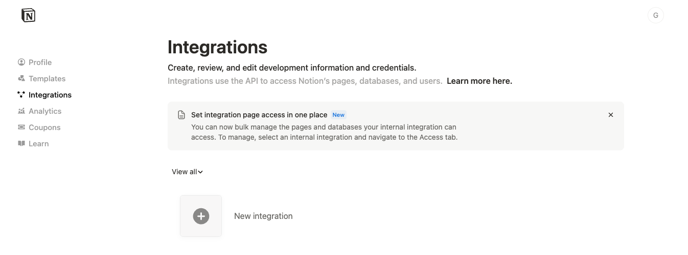
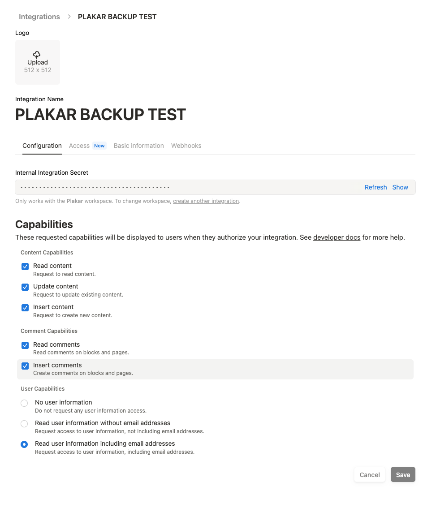
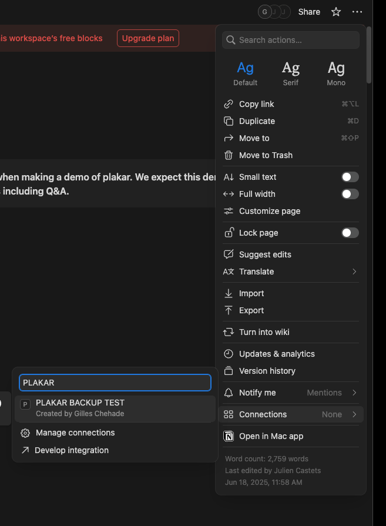
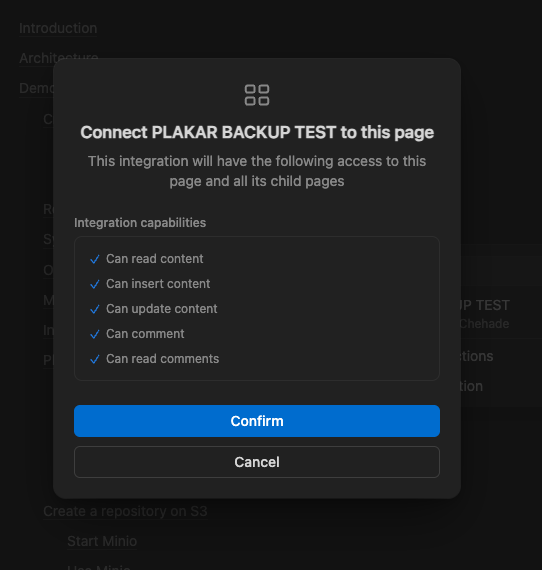
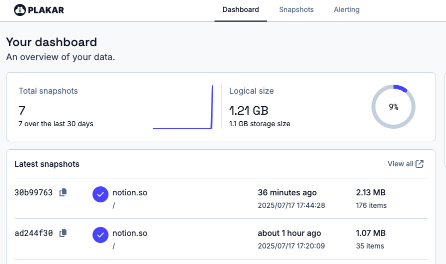

You didn't ask. We still listened. And now — it’s here 🎉


## Notion backup integration is live !

Notion powers countless personal and team workflows — but backing it up?

That’s another story.

Let’s be honest:
Backing up Notion is painful — clunky exports, API weirdness, and lots of manual overhead.
As a result,
most people don’t even have backups, and for a tool so central to everyday work, that’s… a bit scary.

**What if your Notion data gets accidentally wiped out?**

brrrrrr, that changes today.



With our new Notion integration, you can now:
- Import your Notion pages as versioned snapshots
- Maintain a local copy of all your Notion content

All using the same Plakar tooling you already know and love 💜


## Attention

This feature only works on our development branch for the time being,
you can give it a try by installing our latest devel release:

```
$ go install github.com/PlakarKorp/plakar@v1.0.3-devel.889b4b6
```


## Install in seconds

Since this is still a testing version,
we don't provide pre-built binaries yet,
but you can easily build the plugin and install from source as `plakar` comes with its own tooling.

Typing the following command will fetch the latest version of the integration and build a plugin out of it:

```
$ plakar pkg build notion
/usr/bin/make -C /tmp/build-notion-v0.1.0-devel.a1f54e6-644909591
ea7b3ad6: OK ✓ /manifest.yaml
ea7b3ad6: OK ✓ /notion-importer
ea7b3ad6: OK ✓ /notion-exporter
ea7b3ad6: OK ✓ /
Plugin created successfully: notion_v0.1.0-devel.a1f54e6_darwin_arm64.ptar
```

The resulting file,
`/tmp/notion_v0.1.0_darwin_arm64.ptar`,
is a plugin that's exactly like the ones that will be pre-built and distributed by us,
ready to be installed:

```
$ plakar pkg add ./notion-v0.1.0-devel.a1f54e6_darwin_arm64.ptar
```

You can verify that it's properly installed (see how notion appears now):

```
$ plakar version
plakar/v1.0.3-devel

importers: fs, ftp, notion, s3, sftp, stdin, tar, tar+gz, tgz
exporters: fs, ftp, notion, s3, sftp, stderr, stdout
klosets: fs, http, https, ptar, ptar+http, ptar+https, s3, sftp, sqlite
```

And... that's all you have to do !


## Setup the Notion side

Notion also provides a system of integrations to allow applications to interact with it,
so before you perform you first backup you need to  [create an integration at Notion](https://www.notion.com/my-integrations):




This will provide you with a secret token that you need to keep for the `plakar` configuration.



Then,
for each page you want `plakar` to have access to,
you will need to go to the upper-right menu and attach your integration there:






This is tedious,
but hey...
either we missed something or it's like they didn't want data to be extracted that easily ;-)


## Setup the Plakar side

Once everything is ready at Notion,
you need to provide `plakar` with a source configuration for it to know where to fetch the data.

```
$ plakar source set mynotion notion:// \
    token=ntn_1234567890123456789012345678901234567890123456
```

Reload the agent configuration (this step will soon become optional):
```
$ plakar agent reload
```

... and run your backup !
```
$ plakar backup @mynotion 
/Users/gilles/.cache/plakar/plugins/notion_v0.1.0_darwin_arm64
30b99763: OK ✓ /e2fdfe56-536a-4172-8974-78b14b351df7/page.json
30b99763: OK ✓ /e2fdfe56-536a-4172-8974-78b14b351df7/9ccb9414-066f-4743-a694-6589cce600b6/page.json
30b99763: OK ✓ /e2fdfe56-536a-4172-8974-78b14b351df7/8ea2b894-7caa-4f57-8695-803e3c09369c/page.json
[...]
```

You're done.

--- 
To restore,
you do the opposite by providing a destination configuration,
however Notion public API doesn't let you restore directly to a workspace,
so first:

- create an empty page and **make sure you have write access**
- get ID from URL: https://www.notion.so/1ea782d6899380dd96c2f88f20f68635
- attach the notion integration to that page, as explained in the previous section

Then you can do the `plakar` setup as was done for backup,
but now for the destination side:

```
$ plakar destination set mynotion notion:// \
    token=ntn_1234567890123456789012345678901234567890123456 \
    rootID=1ea782d6899380dd96c2f88f20f68635
```

Reload the agent config:
```
$ plakar agent reload
```

... and restore !
```
$ plakar restore -to @mynotion 30b99763
30b99763: OK ✓ /e2fdfe56-536a-4172-8974-78b14b351df7/page.json
30b99763: OK ✓ /e2fdfe56-536a-4172-8974-78b14b351df7/9ccb9414-066f-4743-a694-6589cce600b6/page.json
30b99763: OK ✓ /e2fdfe56-536a-4172-8974-78b14b351df7/8ea2b894-7caa-4f57-8695-803e3c09369c/page.json
[...]
```

There. you. go... 

Note that you can also restore to a local directory or an alternate target,
the restored data will maintain the original structure.

```
$ plakar restore -to /tmp/notion-backup 30b99763
30b99763: OK ✓ /e2fdfe56-536a-4172-8974-78b14b351df7/page.json
30b99763: OK ✓ /e2fdfe56-536a-4172-8974-78b14b351df7/9ccb9414-066f-4743-a694-6589cce600b6/page.json
30b99763: OK ✓ /e2fdfe56-536a-4172-8974-78b14b351df7/8ea2b894-7caa-4f57-8695-803e3c09369c/page.json
[...]
```

--- 

Now let's run the UI:

```
$ plakar ui
```




## Caveats

Due to the fact that the API was not designed to make it easy to extract or inject data,
implementing backups for Notion is a circle of hell,
particularly if you want browsable snapshots as we do.

Here's a depiction, and we're somewhere near the middle now:


The integration is not the fastest to say the least,
however we have ways to improve that as we've mainly focused on making it work without any optimization whatsoever.

Backup works fine once the pages have been configured,
including medias that are present in them,
however at the current time restore can't restore the medias within Notion:
they are part of the backups but can't be pushed back.

The reason for that is that the Notion API wants the images to be hosted somewhere else,
so we can provide them a link and they can pull from it.
Obviously,
we can't push the content of your backups to some hosting platform,
so we still need to think of a creative way to tackle this...
at least they are present in your backups, so there's that.


## Your usual call to action

> We’re shipping early to get your feedback — don’t hesitate to file issues or contribute patches.

- ⭐ Star us on [GitHub](https://github.com/PlakarKorp/plakar)
- 💬 Join the chat on [Discord](https://discord.com/invite/uqdP9Wfzx3)
- 🚀 Stay tuned for another integration dropping tomorrow
