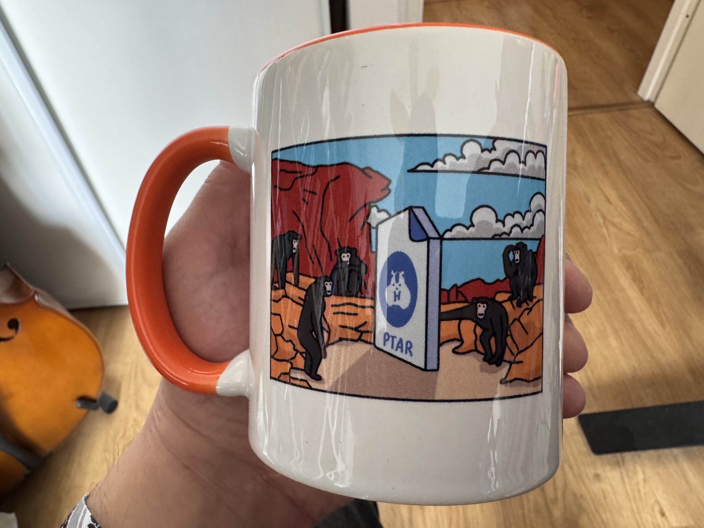
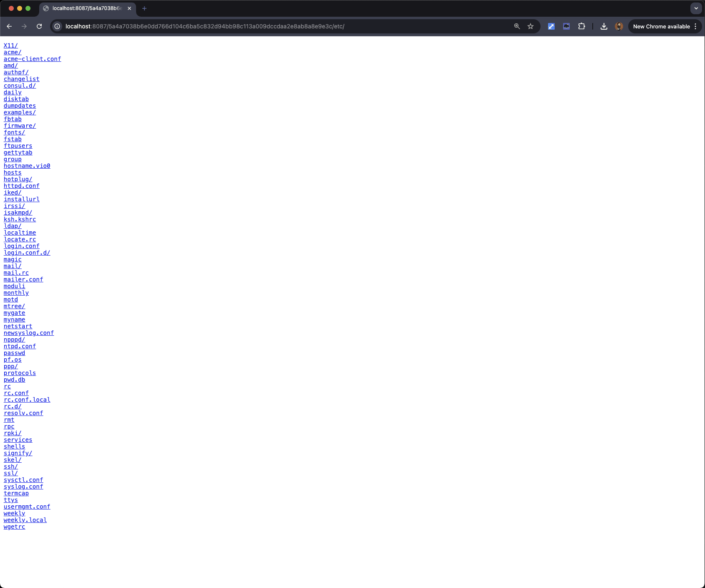
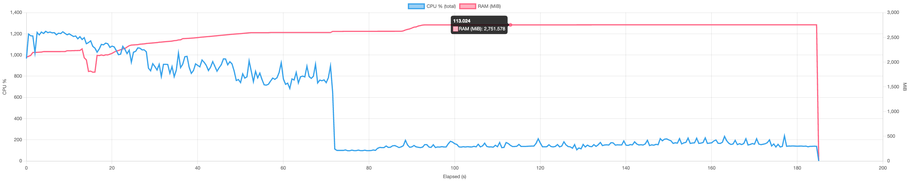
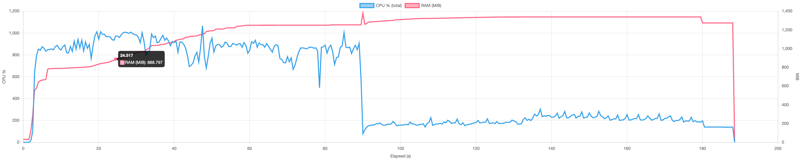
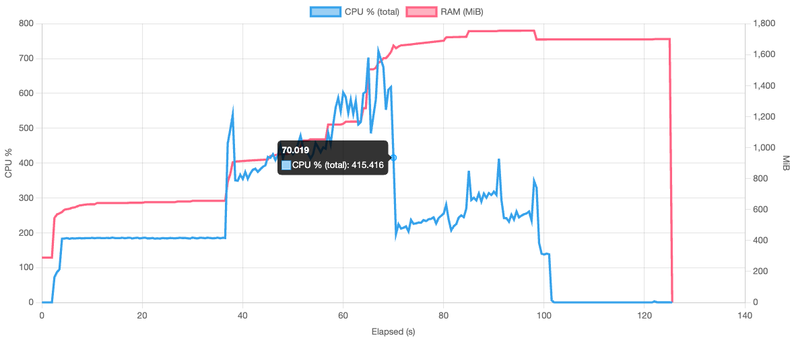
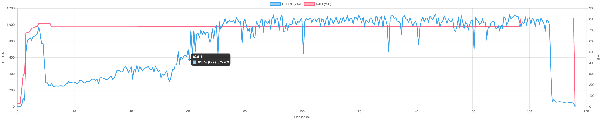
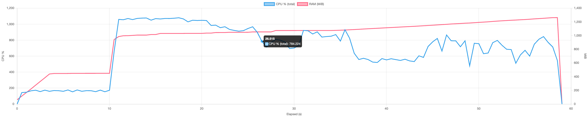
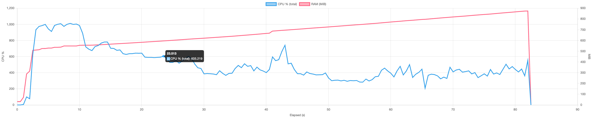

In case you missed it, here is a video recap of our 2025 retrospective.
It highlights just how impressive the amount of work delivered by our team has been,
with meaningful progress and achievements every single month throughout 2025.

I cannot overstate how proud I am to be part of a team that maintains such a strong focus on quality,
while still moving at a very high pace and delivering consistently, week after week.

<center>
<iframe width="560" height="315" src="https://www.youtube.com/embed/Kdo3ibZNOGA?si=9xSFTYswWWboIryL" title="YouTube video player" frameborder="0" allow="accelerometer; autoplay; clipboard-write; encrypted-media; gyroscope; picture-in-picture; web-share" referrerpolicy="strict-origin-when-cross-origin" allowfullscreen></iframe>
</center>

At this pace, whenever we go more than a week without communicating, it feels like we have been silent for ages.
In reality, it has only been a couple of months since our last community release and just one month since our enterprise preview release.

That said, we have not shared many updates about the community edition since November, as our focus has been on building the enterprise edition.
The two are far from isolated: they share the same building blocks, and a significant part of the work done for the enterprise edition now flows back into the community edition.


## TL;DR

* v1.1.0-beta is out, stable and fully backward compatible. We expect RC in February and the final release in March.
* What’s new: a cleaner terminal UI, multi-directory backups (single source), much better FUSE mounting (plus HTTP mounts), and a new package manager for integrations.
* Reliability: the old agent is gone and replaced by a tiny background service called cached that only manages shared cache and locking while commands run in the CLI.
* Performance: big wins in our Korpus tests, especially restore speeds. More backup latency improvements are coming with the next optimizations.
* Memory and disk: peak RAM use is down, and the VFS cache footprint is much smaller by trading a bit of bandwidth for disk space.
* For integrators: importer/exporter/store interfaces are much simpler, so writing a connector is easier than before.
* Next up: point-in-time recovery, multi-source snapshots, better store maintenance and repair tools, and packfile work.
* Try it, tell us what breaks, and help shape the final release.


## Announcing plakar v1.1.0-beta

Throughout 2025, we released **four updates to the v1.0.x branch** of plakar’s community edition, each bringing its share of improvements and new features.
As we begin 2026, roughly two months after our last release, we are entering the beta phase of the v1.1.0 branch, which packs **a lot** of new capabilities and internal improvements.

Beta often implies instability, but in this case most of the work for the v1.1.0 branch was completed during the second half of 2025.
Since then, we have already run thousands, if not tens of thousands, of snapshots through this codebase.

So while this is still a beta and should not be used on production stores, it is already very stable.
We strongly encourage you to try it out, especially since it is fully backward compatible.
You can safely create a new store, sync your data to it, and experiment with the beta without impacting existing setups.

The goal of this beta phase is to gather user feedback, polish areas we may have missed in both code and documentation, and gain additional confidence before a final release, given the significant amount of work that has gone into this branch.

Our current plan is to move from beta to release candidate during February, and from release candidate to a final release in March.
New development during this period will continue on our main development branch and will only be backported to beta or release candidates when it is clearly low risk.


## How can you help?

Feel free to join our Discord channel and help us by testing the beta and reporting any issues you encounter.
Your feedback is invaluable and directly helps shape the final release.

```terminal
$ go install github.com/PlakarKorp/plakar@v1.1.0-beta.3
```

Active testers can earn a contributor role,
allowing them to talk in our hackrooms,
and with significant contributions comes significant goodies too :-p

<center>




</center>


## What's new ?

The v1.1.0 branch introduces a lot of new features as well as improvements all over the place.

### Terminal UI

Starting with the most visible change.

Until now, plakar’s terminal output was very verbose.
While this provided a lot of information, it made it difficult to track progress and quickly identify what mattered during long-running operations.

<video controls width="800">
  <source src="tui-stdio.mp4" type="video/mp4">
  Your browser does not support the video tag.
</video>


In v1.1.0, terminal output has been completely reworked around a new terminal UI rendering interface.
We introduced an `stdio` renderer, which preserves the exact same output format as before,
and a new `tui` renderer that provides a dedicated terminal UI for better visibility during long-running jobs.

<video controls width="800">
  <source src="tui-tea.mp4" type="video/mp4">
  Your browser does not support the video tag.
</video>

This makes it easier to understand what plakar is doing at a glance, while still retaining access to detailed output when needed.
The result is a quieter, more readable terminal experience, especially for long-running backups and restores.

The new `tui` view is available on `backup` and `restore` commands but we will progressively cover more commands,
such as `check` or `sync` as we go.


### Multi-directory support

The v1.1.0 branch introduces **support for multi-directory backups**.

```terminal
$ plakar backup /etc /home
```

Early versions of plakar only supported filesystem-based backups, which made multi-directory snapshots straightforward.
When additional integrations were introduced, however, resource naming collisions became possible:
a local path such as `/etc` could clash with an object path like `s3://bucket/etc`.

To avoid ambiguity, multi-directory support was temporarily removed until it could be implemented in a clear and unambiguous way across all integrations.

With v1.1.0, this limitation is now lifted and multi-directory backups are once again supported **on a single source**.
Work to unlock multi-source backups has begun but could not be completed in time for this release,
hopefully it can land in the next one.


### Better FUSE and mounting

FUSE (Filesystem in Userspace) allows plakar snapshots to be mounted as a regular filesystem,
making it possible to browse snapshot contents as if they were present on disk.
This makes it possible to use your operating system’s standard tools on data contained in plakar snapshots seamlessly,
without having to actually restore the data to disk:
structure and data is transparently streamed as it is accessed.

<video controls width="100%">
  <source src="fuse.mp4" type="video/mp4">
  Your browser does not support the video tag.
</video>

Our FUSE support was fairly stable on Linux, despite occasional hiccups.
On macOS, the situation was more complicated, as FUSE is not supported natively.
Using FUSE required installing a kernel extension, which was cumbersome to set up, but for which we provided stable support...
or relying on the FUSE-T implementation,
which was friendlier to the users as it uses NFS v4 local server instead of kernel extension,
but with which plakar didn't play well with.

In v1.1.0, FUSE support has been completely rewritten and significantly improved,
making it more reliable, including over high-latency connections.

At the same time, the `plakar mount` command was extended to support mounting specific snapshots or individual snapshot directories.
We also introduced support for exposing mounts over HTTP, making it possible to serve a specific directory from a specific snapshot over HTTP.



Work is ongoing to support additional mount protocols, including S3.


### New package manager

We have provided a means for users to install integrations through a plugin system in v1.0.0,
but our package manager was a bit... meh.

Our beta comes with a brand new package manager that's simpler, cleaner and much more featureful.
I won't spoil too much as I think we'll have a dedicated article on it,
but at the very least I can spoil that it supports integrations updates which is something we were lacking.


### New integration interfaces

The importer, exporter, and storage interfaces have been redesigned to be simpler and more explicit.
This work lays the groundwork for faster iteration and more reliable third-party integrations.

A new store backend can now be implemented by satisfying a simple interface.
In practice, this means that almost anything capable of `List`, `Put`, `Get`, and `Delete` operations can be used to host a Kloset store:

```go
type Store interface {
	Create(context.Context, []byte) error
	Open(context.Context) ([]byte, error)
	Ping(context.Context) error

	Origin() string
	Type() string
	Root() string
	Flags() location.Flags
	Mode(context.Context) (Mode, error)
	Size(context.Context) (int64, error)

	List(context.Context, StorageResource) ([]objects.MAC, error)
	Put(context.Context, StorageResource, objects.MAC, io.Reader) (int64, error)
	Get(context.Context, StorageResource, objects.MAC, *Range) (io.ReadCloser, error)
	Delete(context.Context, StorageResource, objects.MAC) error

	Close(ctx context.Context) error
}
```

On the importer side, the interface now turns any data source that can be enumerated into a candidate for being backed up by plakar:

```go
type Importer interface {
	Origin() string
	Type() string
	Root() string
	Flags() location.Flags
	Ping(context.Context) error
	Import(context.Context, chan<- *connectors.Record, <-chan *connectors.Result) error
	Close(context.Context) error
}
```

Finally, on the exporter side, a symmetrical interface makes it possible to restore data by receiving an enumeration of resources and their contents:

```go
type Exporter interface {
	Origin() string
	Type() string
	Root() string
	Flags() location.Flags
	Ping(context.Context) error
	Export(context.Context, <-chan *connectors.Record, chan<- *connectors.Result) error
	Close(context.Context) error
}
```

A side effect of this rework is that an Importer can become the input to an Exporter,
something that was not possible with previous interfaces.
This will simplify the testing considerably and allow the implementaton of a new "transfer" capability to synchronize origins and destinations without going through a Kloset !

That set aside,
with these interfaces,
developers can easily extend plakar without needing to understand its internal architecture:

Implement a few simple CRUD functions and you have a new store.
Implement a function that enumerates your dataset and you have a new importer.
Implement a function that reconstructs a dataset from an enumeration and you have a new exporter.

We believe this significantly lowers the barrier to entry.
Writing a first integration can now take just a few hours for newcomers, and only minutes for experienced developers.
I think we will start seeing some Twitch sessions of integration development from our team soon :-)


### Improved performance

Contrary to common assumption, backup and restore complexity isn’t driven by total bytes but by per-item work:
tree traversal and stat calls, open/close overhead, lots of small random I/O, hashing/chunking each object, dedup lookups and metadata handling,
plus the CPU, memory and coordination costs that come with huge file counts and deep directory trees.
So beyond a few dozen GiB, total size ceases to be informative:
transfer time scales roughly linearly and is determined by raw storage or network throughput, not by the metadata, CPU, and I/O-seek costs that actually make backups hard.

We measure performance with **Korpus**, an assorted collection of resources (low- and high-entropy; small and large; images, audio, video, text, code, PDFs, etc.) laid out across a very large, deep directory tree.

| Op        | Items     | v1.0.6      | v1.1.0-beta           |
|-----------|-----------|-------------|-----------------------|
| Backup    | 1.000.000 | ~3 minutes  | ~3 minutes            |
| Sync      | 1.000.000 | ~5 minutes  | ~5 minutes            |
| Restore   | 1.000.000 | ~60 minutes | ~3 minutes **(-95%)** |
| Check     | 1.000.000 | ~1 minute   | ~1 minute             |

<small>*tested on a 14-core mac mini with 64 GiB RAM and NVMe storage.</small>


Note the **dramatic** improvement for Restore which is due to several changes:
- a better algorithm for restore
- a better use of parallelism
- a better use of our prefetch mechanism
- the removal of some expensive system calls that were not strictly necessary

We didn't include most of our backup optimizations in v1.1.0-beta:
they're fairly recent and we didn't want them to interfere with the release cycle as we're already happy with unoptimized performances.
Most of them will be merged during the beta phase,
others may have to wait for the next release in Q2.

| Op        | Items     | v1.0.6                | v1.1.0-beta (w/optimizations)  |
|-----------|-----------|-----------------------|--------------------------------|
| Backup    | 1.000.000 | ~3 minutes            | ~2 minutes **(-33%)**          |
| Sync      | 1.000.000 | ~5 minutes            | ~4 minutes **(-20%)**          |
| Restore   | 1.000.000 | ~60 minutes           | ~3 minutes **(-95%)**          |
| Check     | 1.000.000 | ~1 minute             | ~1 minute                      |

<small>*tested on a 14-core mac mini with 64 GiB RAM and NVMe storage.</small>


Note that we also have plans for further optimizations,
which we have not yet pushed past the point of initial experimentation,
and which show promising results in all cases for future releases.


### Improved RAM usage

We received reports of high memory usage during certain operations.
Investigations revealed two separate root causes and we’ve made targeted fixes that already show measurable improvements.

The first issue was a gRPC-level memory leak that mostly affected long-running backups using integrations (notably SFTP and S3). We reviewed the gRPC code path end-to-end and applied a series of fixes to eliminate the leak and stabilise long jobs.

The second issue stemmed from the third-party cache implementation we were using. Replacing this component was non-trivial as our cache layer must satisfy strict correctness and performance properties and there are few viable alternatives. Over a focused three-month effort we reworked the caching subsystem: while we haven’t yet removed the old implementation completely, the changes already deliver clear RAM reductions and better behaviour under load.

Lastly, we now default to spilling temporary data to disk rather than keeping it all in memory. The performance impact is small, but the memory savings are significant, it is a practical trade that greatly improves stability for large or long-running operations.

|           | v1.0.6     | v1.1.0-beta           |
|-----------|------------|-----------------------|
| Backup    | ~3.0 GiB <br /> | ~1.3 GiB **(-43%)** <br /> |
| Sync      | ~3.6 GiB <br /> | ~1.7 GiB **(-52%)** <br /> |
| Restore   | ~2.3 GiB <br /> | ~800 MiB **(-66%)** <br /> |
| Check     | ~1.3 GiB <br /> | ~800 MiB **(-40%)** <br /> |

<small>*tested on a 14-core mac mini with 64 GiB RAM and NVMe storage.</small>

There's still some room for improvement but memory usage being a factor of concurrency,
this is controlable by reducing concurrency to an amount that suits the RAM requirements.


### Improved cache space

The local cache was taking too much space, so we reworked caching to reduce on-disk usage.

Plakar uses three caches:

* **State cache**: not really a cache but a required copy of the store state used to decide whether data needs to be pushed. It’s synchronized before an operation and recreated if missing, so it must remain local.
* **VFS cache**: stores metadata for resources as last seen so we can skip work (and avoid recomputing chunks) when a resource appears unchanged. We removed the on-disk VFS cache and now query the store instead, saving local storage in exchange for additional bandwidth. During the beta we’ll add a flag to prefer the previous local-cache behaviour when that makes more sense.
* **Scan cache**: a transient cache built during operations and discarded when the operation completes.

Removing the on-disk VFS cache has **significantly reduced** local cache usage for large trees by trading some bandwidth for disk space, while still allowing users to opt back into a local cache to save bandwidth when desired.

|     Items | v1.0.6 |      v1.1.0-beta   |
| --------: | -----: | -----------------: |
| 1,000,000 |  4 GiB | 1.8 GiB **(-55%)** |

In short: less local disk usage by default, an explicit option to favour the old local cache if you prefer lower bandwidth, and the required state cache still ensures correctness and fast change detection.


### Agent is dead. Long live cached.

When you use backup software, you expect to be able to run multiple commands in parallel.
This implies some level of shared cache and state.

In **plakar v1.0.0**, to coordinate access and handle locking, we introduced an *agent* process that executed commands on behalf of the CLI.  
This meant the agent had to be running for anything to work at all, which quickly proved to be a fairly annoying requirement.

To address this, **plakar v1.0.4** introduced an auto-spawned, auto-teardown agent.  
While this improved usability, the agent remained on the critical path. Every command was still executed by the agent, with the CLI merely proxying input and output.

This design came with drawbacks:

- Interactive prompting was difficult or impossible for some integrations, for example SFTP passphrase prompts.
- A failure in a single command, including an out-of-memory condition, could take down the agent rather than just the operation.
- The agent accumulated complexity by combining execution, coordination, and cache management in a single process.

With **plakar v1.1.0**, the agent is gone.

It is replaced by **cached**, a lightweight, auto-managed process dedicated exclusively to shared cache maintenance and locking.
**cached** will automagically start if needed and stop when not needed anymore,
so you never have to think about it.
Commands now execute directly in the CLI, while cached ensures safe, coordinated access to the cache.

This separation of responsibilities simplifies the architecture, dramatically reduces the failure blast radius, unlocks features that were previously difficult to implement, and makes plakar **considerably more reliable**.


## And... plenty more

It is difficult to write about everything we have been working on while remaining concise,
especially since much of this work is not immediately visible.

Since v1.0.6, there have been hundreds of commits to Kloset,
hundreds more to plakar itself,
and dozens across various integrations.
Altogether, this represents thousands of lines of changes, peer-reviewed and approved,
spread over several months and across multiple subsystems of our software.

Several of these changes will be covered in dedicated articles,
as we plan to significantly increase our technical writing to this blog this year.


## What’s next?

The immediate next step is the stabilization of the beta, followed by the release of **v1.1.0-rc** and then **v1.1.0**.

In parallel, we are continuing work on several major features.
Much of the prerequisite groundwork for these efforts has already been completed as part of the v1.1.0 development cycle, and some of them already have active implementation branches.

The next major milestones include:

- **Point-in-time recovery (PITR)** support, enabling more robust and precise database backups.
- **Multi-source snapshots**, allowing a single snapshot to span multiple data sources.
- **Improved store maintenance and space recovery**, through recompaction and packfile optimizations.
- **Store repairability**, with mechanisms to recover from corruption, including ECC and cross-store data sharing.

Stay tuned, and happy hacking 🚀

