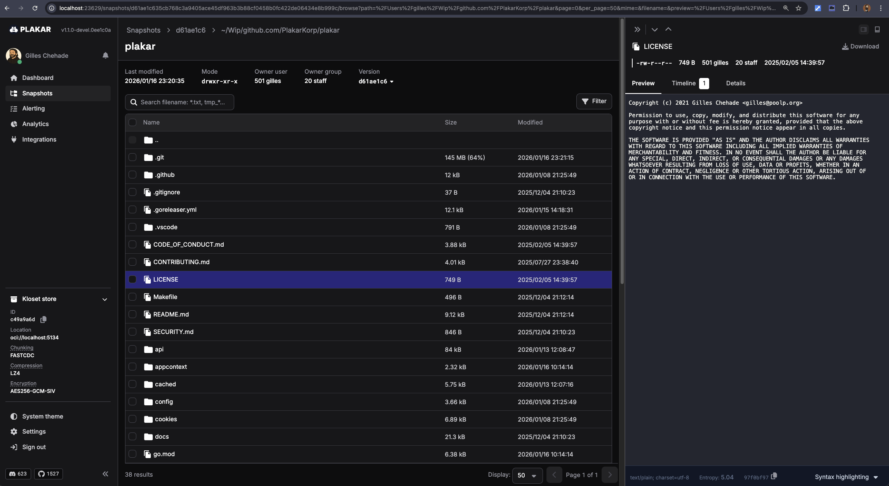

**TL;DR:**

> After a podcast suggestion, we built an **OCI registry storage backend for Plakar**... and it took ~30 minutes.
> OCI registries (the tech behind Docker Hub) are content-addressed, immutable artifact stores, which map surprisingly well to Plakar’s packfile model.
> It’s now available in beta (`plakar pkg add oci`), fully working and testable.


Three weeks ago,
Julien and I were invited by [Bret Fisher](https://www.youtube.com/@BretFisher) on his podcast, [Cloud Native DevOps and Docker Talk](https://www.youtube.com/playlist?list=PLX0bTycx8m-UhIXY2c4-7AXaEokaTdn6S).

<center>
<iframe width="560" height="315" src="https://www.youtube.com/embed/Qpt4HYorNsQ?si=jDGWwfS7Lp9gE6-I" title="YouTube video player" frameborder="0" allow="accelerometer; autoplay; clipboard-write; encrypted-media; gyroscope; picture-in-picture; web-share" referrerpolicy="strict-origin-when-cross-origin" allowfullscreen></iframe>
</center>

The discussion was very interesting and, after the show, Bret casually mentioned that we should really add an OCI registry storage integration.

Up to that point, my knowledge of OCI registries came mostly from conversations with SREs, I had never worked with them directly.
But since I had claimed during the show that writing a storage integration was *easy*, it felt like the perfect opportunity to put code where my mouth is.

The next day, after wrapping my work, I jumped on the task.
Half an hour later, I announced on our Discord that the OCI registry integration was already working.


This is not a flex, and it’s not because I’m particularly fast or good.

It happened that quickly because extending Plakar is genuinely simple.
We designed the storage layer so that adding a new backend is trivial.
I honestly believe we’ve lowered the bar enough that a first-year computer science student could implement a new Plakar storage backend as a weekend project.

That’s exactly the kind of extensibility we were aiming for: not just *possible*, but *boringly easy*.


## First of all, what is an OCI Registry?

An **OCI registry** is a standardized service for storing, versioning, and distributing binary artifacts. While best known for container images, it is not limited to them.

OCI stands for **Open Container Initiative**, an open governance body that defines vendor-neutral standards for containers. One of these standards, the **OCI Distribution Specification**, defines how clients and registries communicate over HTTP to push, pull, and manage artifacts.

In short, an **OCI registry** is a content-addressable, HTTP-based artifact store with strong guarantees around immutability and integrity.

### From container images to general artifacts

OCI registries were originally designed for **container images** (for example, Docker Hub), but the underlying model is generic.

An OCI artifact consists of:

* one or more **blobs** (binary data)
* a **manifest** describing those blobs
* optionally an **index** to group variants
* identifiers based on **cryptographic digests**, not filenames

Because of this, OCI registries are now used to distribute much more than containers, including Helm charts, WASM modules, VM images, CLI tools, plugins, policies, signatures, and other software artifacts.

### Content-addressed and immutable by design

All content in an OCI registry is addressed by its hash (typically SHA-256). This provides:

* **Integrity**: pulled content is exactly what was pushed
* **Deduplication**: identical blobs are stored once
* **Immutability**: any change results in a new digest
* **Efficient caching**: blobs can be safely cached and reused

Tags such as `latest` or `v1.2.3` are merely mutable references.
The true identity of an artifact is its digest.


### Why OCI registries in our context ?

OCI registries have become a **universal distribution layer** because they are standardized, widely deployed, secure, and efficient at scale. They are also deeply integrated into modern CI/CD ecosystems.

If you need a reliable way to publish, version, and retrieve large or immutable artifacts, an OCI registry is often the simplest and most robust solution,
and you don’t need to be shipping containers to benefit from it.


## How does it tie to Plakar ?

In many aspects, the kloset storage layer is very similar to an OCI registry and the primitives map fairly well one to another.

During backups,
Plakar will generate packfiles that are MAC-indexed in kloset and will locate the data through that MAC.
The storage layer can store these packfiles in the OCI registry and map the MAC to the blob through a manifest.
With this plumbing in place,
calls are mapped 1:1 with the registry with manifests being used to locate the blob by MAC.


### Installing the OCI registry integration

At the time of this writing,
the OCI registry integration has been [committed to a public repository](https://github.com/PlakarKorp/integration-oci) and is **only available for plakar v1.1.0-beta**.

To test it, you first need to install our latest beta of plakar:

```
$ go install github.com/PlakarKorp/plakar@v1.1.0-beta.4
```

You can their either use our prebuilt package by authenticating to our platform:

```
$ plakar login
[...]
$ plakar pkg add oci
$
```

Or build the integration yourself...

```
$ plakar pkg build oci
/usr/bin/make -C /var/folders/9x/9k0f6mc10sbd0_kfx63__fvc0000gn/T/build-oci-v1.1.0-beta.4-510526837
48317f2d: OK ✓ /
48317f2d: OK ✓ /manifest.yaml
48317f2d: OK ✓ /ociStorage
Plugin created successfully: oci_v1.1.0-beta.4_darwin_arm64.ptar
$ 
```

... and install the resulting ptar:

```
$ plakar pkg add ./oci_v1.1.0-beta.4_darwin_arm64.ptar
```

That's it, you're good to go !


### Launching a registry container

The easiest way to test is to simply start a docker container for the OCI registry.

This can be done with this simple command,
which will run the container and bind the registry to port 5000 on localhost:

```
$ docker run -d --name oci-registry \             
  -p 5000:5000 \
  -v $(pwd)/registry-data:/var/lib/registry \
  registry:2
b61a4bc5df40307b6301d30f692cd276db64acd8448258ba49f2a4c6c760cb8c
$
```


### Using Plakar with the registry container
To avoid having to type the passphrase over and over in this article,
I just start by setting the `PLAKAR_PASSPHRASE` environment variable to a key that I generated with `openssl rand -hex 32`:

```
$ export PLAKAR_PASSPHRASE=6292d531ecede679b5e4afbbe9ce994a78c9c7986c742e97232f2730b8bfb5df
```

Once this is done, I can create the store:
```
$ plakar at oci://localhost:5000/helloworld create
```

Then backup my current directory:
```
$ plakar -silent at oci://localhost:5000/helloworld backup   
```

The snapshot is now in store and can be inspected as usual:

```
$ plakar at oci://localhost:5000/helloworld ls    
2026-01-16T22:22:25Z   d61ae1c6   216 MiB        1s /Users/gilles/Wip/github.com/PlakarKorp/plakar
```

Including its content:

```
$ ./plakar at oci://localhost:5134/helloworld cat d61:LICENSE 
Copyright (c) 2021 Gilles Chehade <gilles@poolp.org>

Permission to use, copy, modify, and distribute this software for any
purpose with or without fee is hereby granted, provided that the above
copyright notice and this permission notice appear in all copies.

THE SOFTWARE IS PROVIDED "AS IS" AND THE AUTHOR DISCLAIMS ALL WARRANTIES
WITH REGARD TO THIS SOFTWARE INCLUDING ALL IMPLIED WARRANTIES OF
MERCHANTABILITY AND FITNESS. IN NO EVENT SHALL THE AUTHOR BE LIABLE FOR
ANY SPECIAL, DIRECT, INDIRECT, OR CONSEQUENTIAL DAMAGES OR ANY DAMAGES
WHATSOEVER RESULTING FROM LOSS OF USE, DATA OR PROFITS, WHETHER IN AN
ACTION OF CONTRACT, NEGLIGENCE OR OTHER TORTIOUS ACTION, ARISING OUT OF
OR IN CONNECTION WITH THE USE OR PERFORMANCE OF THIS SOFTWARE.
```

Everything is browsable as with any other storage through our UI:

```
$ plakar at oci://localhost:5000/helloworld ui
```




## Limitations

This is the first iteration of the integration.
It is not production-ready and currently lacks some important features, such as authentication.

The goal was to build a functional proof of concept first,
it will now need polishing and hardening before real-world use.

## Conclusion

This integration was not originally planned; it emerged from a casual discussion.

Even without prior knowledge of OCI registries, it took roughly half an hour to implement, which is a good demonstration of how easy it is to extend Plakar to new use cases.

Let us know what you think, and don’t hesitate to suggest new ideas!