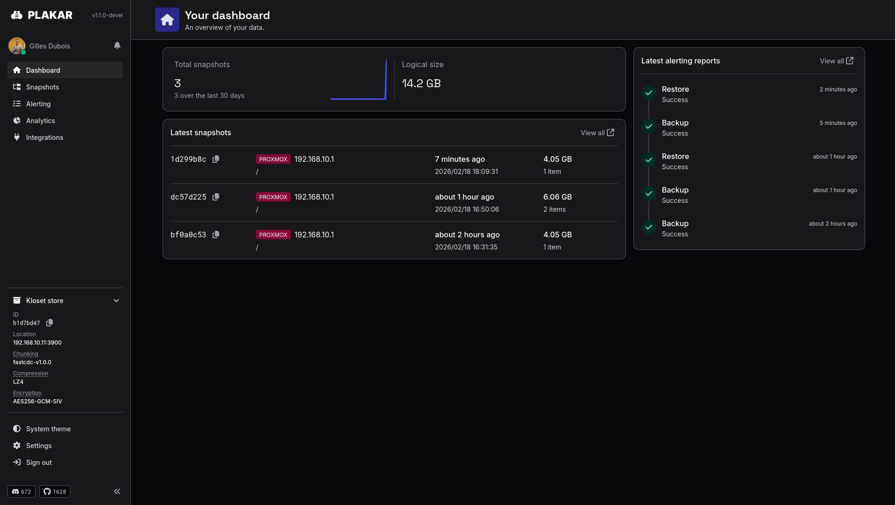
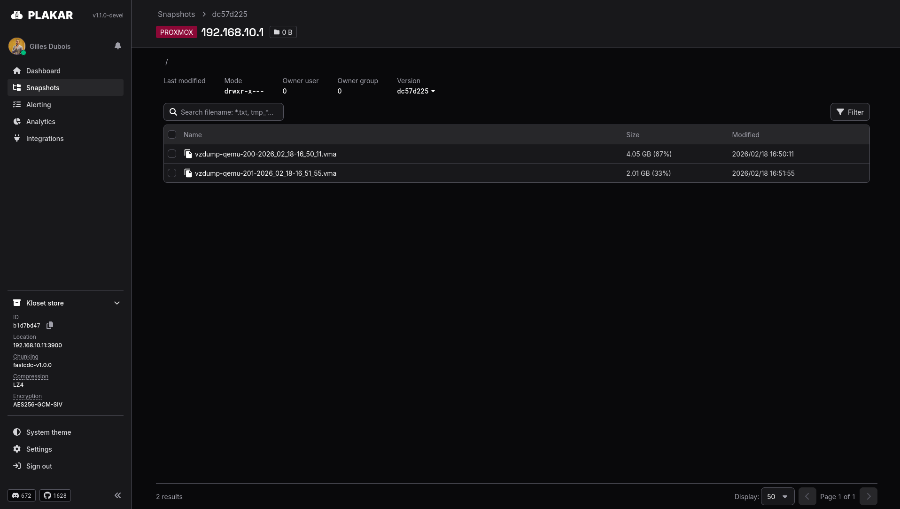

**TL;DR:**

> The team at [FactorFX](https://www.factorfx.com/) built a Proxmox integration for Plakar that wraps Proxmox’s native vzdump backups and stores them as deduplicated Plakar snapshots, making VM and container backups portable, encrypted, and easy to restore across clusters.

Proxmox support had been requested many times... but the interesting part is that we didn't end up building it ourselves.

---

Throughout 2025,
the topic of virtual machine backups came up every now and then.

We knew we wanted to support it,
but we weren't convinced it was the highest priority.
There are many things people want to back up,
and virtual machines didn't seem more urgent than S3, GCS or PostgreSQL in daily discussions.

Then something interesting happened.

Mathieu and I were holding a booth at the [Capitole du Libre 2025](https://capitoledulibre.org/),
in Toulouse,
and we kept getting the same question from visitors:

> Can Plakar back up Proxmox clusters?

So many people asked that Mathieu started looking into how Proxmox backups worked.

Later,
[François-Xavier](https://github.com/fxguidet), who was also holding a booth for [FactorFX](https://www.factorfx.com/), came over and told me:

> Hey Gilles, we need to talk about Proxmox support in Plakar!

A couple of weeks later,
at the Tech Rocks event,
the exact same scenario unfolded with a completely different crowd.


At that point,
it became clear this was no longer a "should we prioritize Proxmox" debate,
but a "who does it and when".


---
## FactorFX enters the game !

Technically,
our team can write most integrations fairly quickly,
anywhere between an hour and a few days depending on the complexity.

Which makes it tempting to just do them ourselves:
spend a few hours on it and the problem is solved.

But that's not what we want.

Our goal is for Plakar to become a de-facto standard to back up *anything*,
and that can't happen if we're the only ones writing integrations.
The ecosystem of tools out there is simply too large.

Instead, we want a layered ecosystem:

- **official integrations** maintained by us
- **third-party integrations** that we review and stamp as "trusted by Plakar"
- **community integrations** where anyone can build support for whatever software they like

Since [FactorFX](https://www.factorfx.com/) had already shown interest in Proxmox,
this felt like the perfect opportunity to bootstrap that model.

After a few discussions,
[Gilles Dubois](https://github.com/gillesdubois) came back a few days later with a working Proxmox integration !

---

## What is Proxmox ?

[Proxmox Virtual Environment](https://www.proxmox.com/) (PVE) is an open-source virtualization platform used to run and manage virtual machines and containers.

<center>

</center>

At a technical level,
it combines several well-known pieces of infrastructure software:

- **KVM** to run virtual machines
- **LXC** to run containers
- multiple storage backends such as ZFS, Ceph or simple directory storage
- a web UI and REST API to manage everything

Proxmox includes many of the features people expect from enterprise virtualization platforms,
including live migration, high availability, storage replication, **built-in backups** and clustering.
All of this in a single system that is relatively easy to deploy and operate.

Over the past year,
it has also become a very popular alternative to other hypervisors,
especially as many organizations started reconsidering their virtualization stack following the VMware/Broadcom flustercluck.

Which explains why,
every time we showed Plakar at a conference booth,
someone eventually asks:

> That's cool... but can it back up Proxmox?


## Why use Plakar for Proxmox backups?

Proxmox already includes a backup tool called `vzdump`,
and it works very well,
so why introduce another tool in the mix?

The answer is that Plakar does not replace Proxmox backups,
it **extends them**.

The integration simply relies on `vzdump` to generate the backup archives,
and then stores them inside Plakar snapshots.
This means the backups behave exactly like native Proxmox backups,
while gaining a few extra properties along the way.

For example,
Plakar deduplicates data across snapshots.
If multiple virtual machines share the same base image,
that data only needs to be stored once.

Snapshots can also be archived to different storage backends,
making it easy to keep long-term backups on object storage or cold storage.

Finally,
because Plakar integrations share the same connector model,
data is not tied to a single environment.
A VM backed up from Proxmox could later be restored to another cluster,
archived elsewhere,
or inspected without restoring the entire machine.

---

## Installing the Proxmox integration

The proxmox integration has been [committed to a public repository](https://github.com/PlakarKorp/integration-proxmox) and is **only available for plakar starting with v1.1.0-beta**.

To test it, you first need to install our latest beta of plakar:

```sh
$ go install github.com/PlakarKorp/plakar@v1.1.0-beta.7
```

You can then either use our prebuilt package by authenticating to our platform:
```sh
$ plakar login
[...]
$ plakar pkg add proxmox
$
```

Or build the integration yourself...

```sh
$ plakar pkg build proxmox
/usr/bin/make -C /var/folders/9x/9k0f6mc10sbd0_kfx63__fvc0000gn/T/build-proxmox-v1.1.0-510526837
48317f2d: OK ✓ /
48317f2d: OK ✓ /manifest.yaml
48317f2d: OK ✓ /proxmoxImporter
48317f2d: OK ✓ /proxmoxExporter
Plugin created successfully: proxmox_v1.1.0_darwin_arm64.ptar
```

... and install the resulting ptar:

```sh
$ plakar pkg add ./proxmox_v1.1.0_darwin_arm64.ptar
```

Aaaaaand that's it.


---

## Local vs remote operation

Before showing how it's used, a few words about how it works.

The integration supports two operating modes.

In **local mode**,
Plakar runs directly on the Proxmox node:

```
Proxmox node
 ├ vzdump
 └ plakar
```

This is the simplest setup.

In **remote mode**,
Plakar runs on a separate machine and connects to the Proxmox host via SSH:

```
Backup server
     │
     │ SSH
     ▼
Proxmox node
     └ vzdump
```

This allows a single Plakar instance to back up multiple hypervisors.


---

## Backing up virtual machines and containers

Once the integration is installed,
backing up Proxmox virtual machines and containers becomes straightforward.

First,
we configure a Proxmox source:

```sh
$ plakar source add myProxmox proxmox+backup://10.0.0.10 \
  mode=remote \
  conn_username=root \
  conn_identity_file=/path/to/key \
  conn_method=identity
```

Then we can start backing up workloads.

For example,
to back up a single virtual machine:

```sh
$ plakar backup -o vmid=101 @myProxmox
```


Or all the machines in a pool:

```sh
$ plakar backup -o pool=prod @myProxmox
```

<video controls width="100%">
  <source src="backup-pool.mp4" type="video/mp4">
  Your browser does not support the video tag.
</video>


Or even the entire hypervisor:

```sh
$ plakar backup -o all @myProxmox
```

Under the hood,
the integration invokes `vzdump`,
collects the resulting archive,
and ingests it into a Plakar snapshot.

Once stored,
the backup benefits from all Plakar features such as deduplication,
encryption and snapshot browsing.

<center>


</center>

---

## Restoring virtual machines and containers

Restoring workloads is equally straightforward.

First,
configure a Proxmox destination:

```sh
$ plakar destination add myProxmox \
  proxmox+backup://10.0.0.10 \
  mode=remote \
  conn_username=root \
  conn_identity_file=/path/to/key \
  conn_method=identity
```

Then restore a snapshot:

```sh
$ plakar restore -to @myProxmox <snapid>
```

The integration uploads the dump archive to the Proxmox node and restores it using native tools:

* `qmrestore` for virtual machines
* `pct restore` for containers

It is also possible to restore **only one VM from a snapshot containing multiple machines**:

```sh
$ plakar restore -to @myProxmox <snapid>:/backup/qemu/101_myvm
```

<video controls width="100%">
  <source src="restore-qemu.mp4" type="video/mp4">
  Your browser does not support the video tag.
</video>

If configured,
the restored machine can automatically start once the restore completes.

---

## Beyond simple backups

Because Plakar integrations share the same connector model,
data is not locked into a single environment.

For example,
a virtual machine backed up from Proxmox could be:

* inspected with high granularity using the Plakar UI.
* stored in ~~a minio instance~~, err, an S3 bucket at <a href="https://www.scaleway.com/object-storage/">Scaleway</a>, <a href="https://www.ovhcloud.com/fr/public-cloud/object-storage/">OVH</a> or <a href="https://www.exoscale.com/object-storage/">Exoscale</a>.
* synchronized between stores at <a href="https://www.scaleway.com">Scaleway</a>, <a href="https://www.ovhcloud.com">OVH</a> and <a href="https://www.exoscale.com">Exoscale</a> for multiple copies.
* exported to a [ptar archive](/posts/2025-06-27/it-doesnt-make-sense-to-wrap-modern-data-in-a-1979-format-introducing-.ptar/) and archived in cold storage.
* restored to another cluster.

This flexibility enables backup workflows that go far beyond traditional hypervisor backups.

---

## Wrapping up

This Proxmox integration is still early, but it's already working well.

If you're running a Proxmox cluster,
be it on-premise or in the cloud,
please give it a try and let us know what you think!

And if you're interested in writing integrations yourself,
take a look at what the [FactorFX](https://www.factorfx.com/) team achieved:
they had an initial version working in just a few days,
with no prior experience whatsoever with our codebase.

We can help you get started and bootstrap things,
and you might just end up building that one integration
that everyone wants but nobody has written yet !
