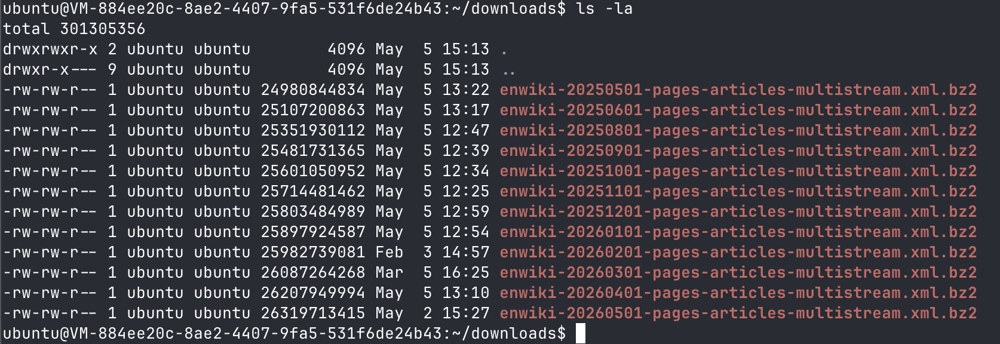
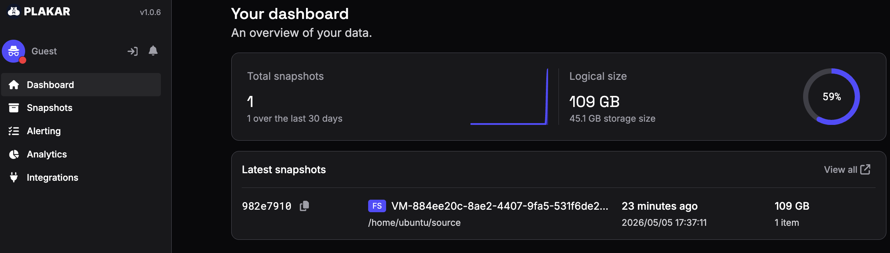
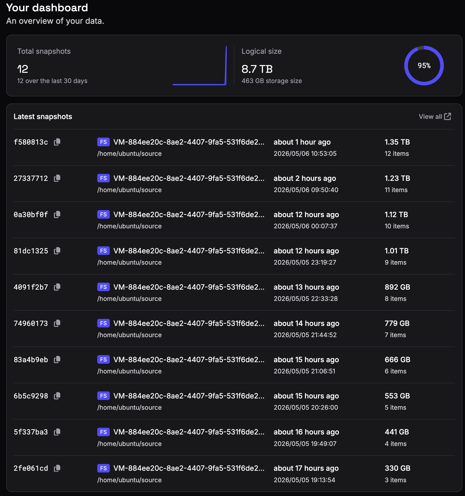
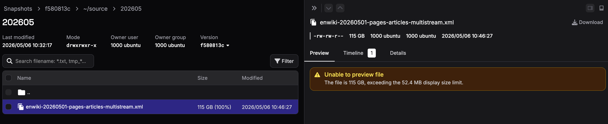

**TL;DR:**

> We backed up 12 months of English Wikipedia (`enwiki`) dumps into a single
> Kloset store. The final snapshots represented around 1.35 TB of logical data,
> while the repository itself only occupied 463 GB on disk.

At Plakar, we like to experiment on projects for the sake of technical fun.

Wikipedia publishes public dumps of its data, making it possible to preserve
independent copies of the encyclopedia.

For this experiment, we used the monthly English Wikipedia (`enwiki`) dumps.
Each dump is distributed as one large XML file representing the state of the
encyclopedia at that point in time. Once uncompressed, each monthly dump is
around 110 GB.

That makes it an interesting dataset for testing deduplication. Every monthly
release is another full copy of the encyclopedia, but most of the content stays
the same between releases.

The question was simple: _How well can Plakar store 12 monthly Wikipedia dumps?_

---

## The problem with traditional backups

The obvious approach is to store every monthly dump separately.

That works, but it gets expensive quickly. Twelve monthly dumps at roughly 110
GB each already means well over a terabyte of data.

The bigger issue is repetition. The February dump is not a patch on top of the
January dump. It is another complete XML file. The March dump is another
complete XML file again.

So if a backup system treats the file as one big object, it ends up storing
almost the same encyclopedia over and over again.

That is exactly the kind of workload where deduplication matters.

---

## Why Plakar is a good candidate

Plakar is built around a content-addressed store. Instead of storing the same
data repeatedly, it stores unique pieces of data once and lets snapshots refer
back to them.

To understand why that matters, imagine a 10 MB file and two versions of it.

### The naive approach

The simplest strategy is straightforward: if the file is not already present in
the store, save it.

That is very easy to implement, but it has a major limitation. If the file
changes, even slightly, the whole file becomes invalidated and has to be stored
again.

For Wikipedia dumps, this would work very poorly because each monthly dump is
one massive XML file.

### Fixed-size chunking

A smarter approach is to split the file into fixed-size chunks, for example 1 MB
chunks.

Now the backup system can check each chunk independently. If a chunk already
exists in the store, there is no need to store it again.

This already works much better. If data is appended at the end of the file, only
the new chunks need to be stored.

But fixed-size chunking still has a weakness.

If data changes near the beginning or middle of the file, all following chunk
boundaries shift. Once that happens, many chunks no longer line up with the
previous version, even if most of the content is still identical.

So the backup system ends up storing a lot of data again simply because the
fixed chunk boundaries moved.

### Content-defined chunking

Plakar uses content-defined chunking (CDC).

Instead of cutting chunks at fixed offsets, CDC derives chunk boundaries from
the file content itself.

That makes the chunking resistant to insertions and modifications in the middle
or beginning of a file. Changed areas produce new chunks, but unchanged areas
around them can still be recognized and reused.

This makes CDC a very good fit for large evolving files like the Wikipedia
dumps.

Each monthly dump is still one huge XML file, but Plakar can recognize repeated
content inside the file and avoid storing it again.

CDC is more complex internally, but the Plakar team already did the hard work
and made this possible.

If you want a deeper technical explanation of how CDC works internally, check
out the dedicated
[CDC blog post](../../2025-07-11/introducing-go-cdc-chunkers-chunk-and-deduplicate-everything).

---

## The setup

We downloaded 12 monthly `enwiki` dumps and backed them up into a single Kloset
store.

Each month was stored as a separate snapshot. The source directory kept growing
over time: first one dump, then two dumps, then three, until the final snapshot
contained all 12 monthly dumps.

The backups were run on a cloud instance with 4 vCPUs and 16 GB of RAM. On
average, each backup took around 21 minutes to complete.

The first backup processed 109 GB of logical data and stored 45.1 GB inside the
repository.

After all 12 dumps were backed up, the latest snapshot represented around 1.35
TB of logical data.

The entire repository only occupied 463 GB on disk.

That means Plakar was able to preserve all 12 monthly snapshots while storing
roughly one third of the original data size.

---

## Conclusion and next steps

The goal of this investigation was simple: see how Plakar performs when backing
up multiple months of Wikipedia dumps.

For this first test, we backed up the dumps exactly as they are published: one
large XML file per month. Even then, the storage reduction was significant.

There is still an interesting next step though.

Instead of backing up one massive XML file, we could split the dump into
individual Wikipedia pages and back those up as separate files. That would make
the dataset much easier to browse in Plakar UI, since every page could appear as
its own file instead of being buried inside a huge XML document.

That could make for a fun community project to build a Wikipedia importer for
Plakar.

A Plakar integration is relatively easy to build, and the
[integration example github repo](https://github.com/PlakarKorp/integration-example/tree/main)
is a good place to start if you want to experiment with one.
