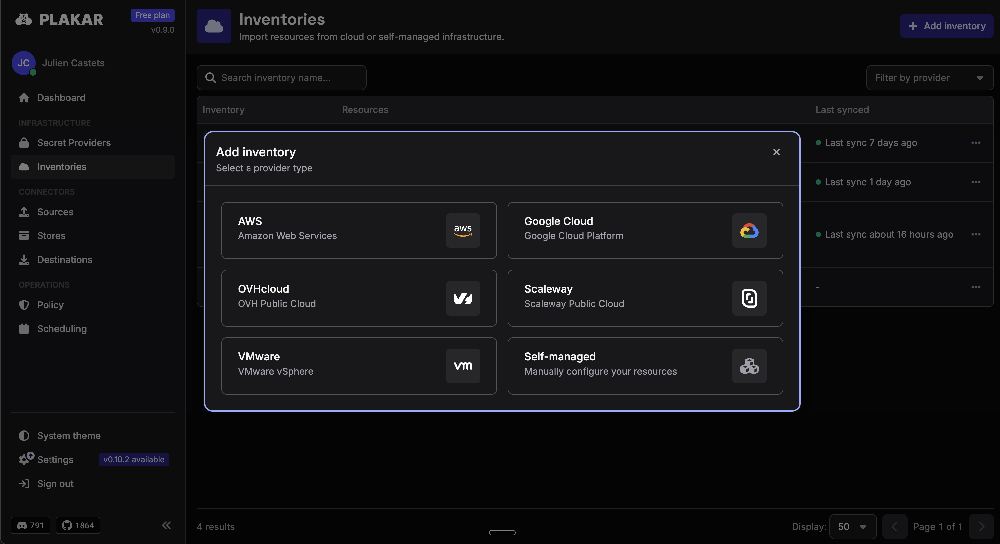
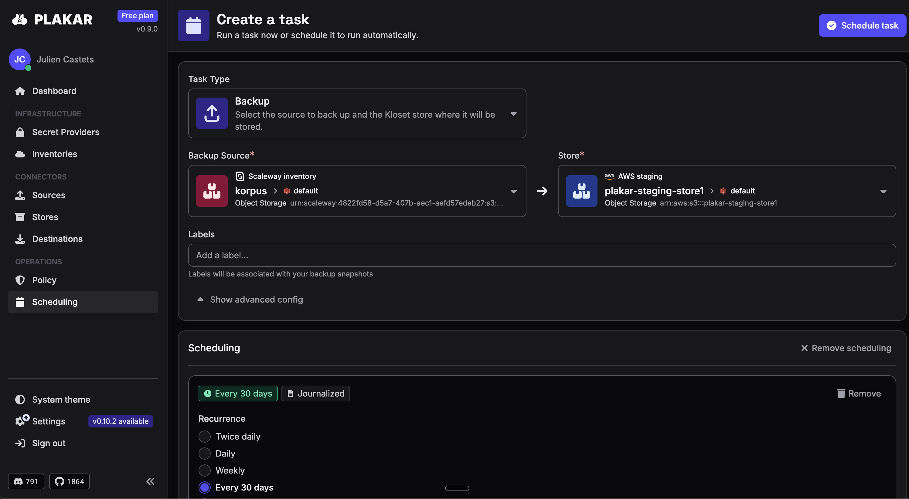
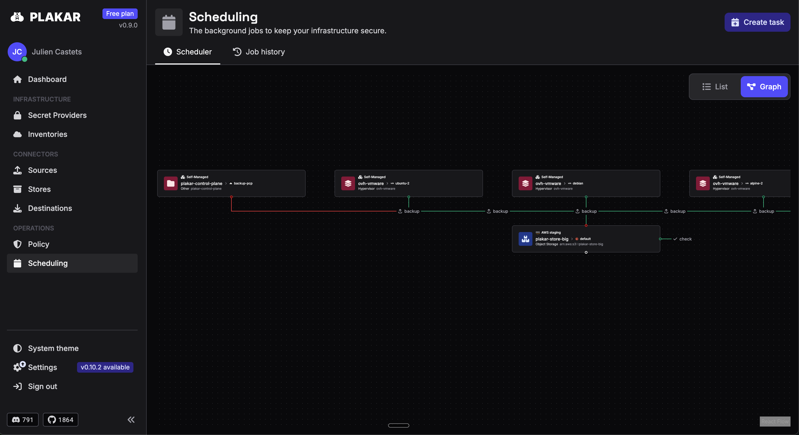
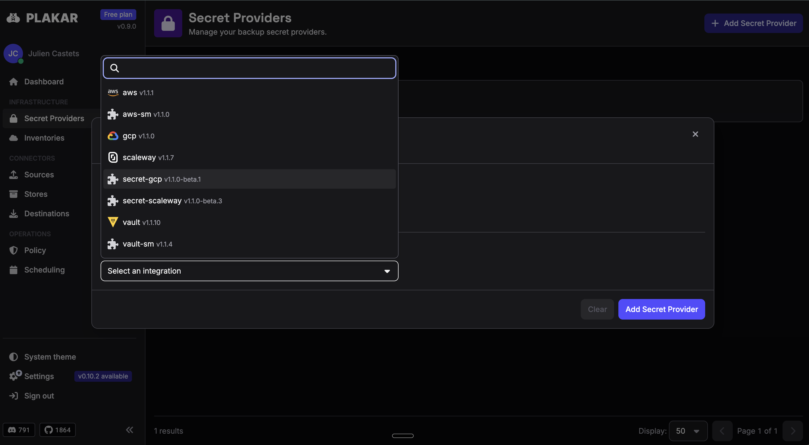

Last week, we [released Plakar 1.1.3](/posts/2026-06-16/plakar-v1.1.3-is-here/), the open source engine for efficient backup, with a new terminal UI, multi-directory backups (single source), rewritten FUSE mounting (plus HTTP mounts), a brand new package manager, and much simpler integration interfaces. That was a massive release and a proof of our open source commitment.

Today, after months of collaboration with design partners and customers, we're officially launching a free plan for our first commercial product: **Plakar Control Plane**, a self-hosted backup management platform built on top of the open-source Plakar.

## Who is the Plakar Control Plane for?

At Plakar, our mission is to make reliable backup accessible to everyone. That's why Plakar is open source, and it's why Plakar Control Plane now includes a free plan — fully functional, with no time limit — so that individuals, independent researchers, SMBs and NGOs can run enterprise-grade backup management without a large budget.

That said, security-conscious enterprises standing up or rebuilding their cyber-resilience posture under board, regulator, or incident pressure are the ones who will most benefit from Plakar Control Plane.

## Why do enterprises need a Plakar Control Plane?

Breach is no longer a risk. It's a certainty. Ransomware, AI-driven exfiltration, and the erosion of the internal perimeter have turned cyber-resilience into the last line of defense. And attackers know it: 96% of ransomware attacks target backup repositories directly (2024 Ransomware Trends Report). When it works, 43% of affected data ends up unrecoverable.

At Plakar, we fundamentally believe that enterprises need four capabilities their current tools structurally cannot deliver:

**First, a provable posture.** The modern infrastructure estate spans VMs, databases, Kubernetes clusters, cloud buckets, and SaaS — spread across providers, teams, and environments, each with its own blind spots. There is no single view of what is protected, what isn't, when the last job ran, or whether a restore would actually succeed.

**Second, safe and cost-efficient copies stored with the provider of their choice.** Zero-trust encryption with client-side deduplication means you never have to choose between cost control and data security.

**Third, a backup system that can be steered from code.** In an infrastructure-as-code (IaC) world, resilience is the last layer still managed through GUIs and spreadsheets. Plakar Control Plane changes that: inventories, integrations, schedules, and policies are all configurations you own, version, and automate.

**Fourth, strategic autonomy.** Platform engineers and CTOs are increasingly being asked where their data actually lives and who can reach it. Model training pipelines, proprietary datasets, and the competitive intelligence embedded in operational data are now geopolitically sensitive. Plakar Control Plane deploys on infrastructure you choose, with encryption keys that never leave your control and a codebase you can audit end to end.

## What is a Plakar Control Plane?

Plakar Control Plane is a self-hosted backup management platform enabling resilience-as-code for security and infrastructure teams.

Built on top of Plakar's zero-trust resilience engine, Plakar Control Plane comes as a self-hostable software appliance with a full web interface providing a unified view of data inventories, different types of integration connectors, backup policies and scheduling tasks, as well as secrets management. Let's take a quick look at each of these capabilities.

### Unified inventory management

**Inventories** connect Plakar Control Plane to a provider and expose the list of compute or storage [resources](/docs/control-plane/resources/) available to back up — i.e. EC2 instances, S3 buckets, etc. There are two types of [inventories](/docs/control-plane/infrastructure/inventories/): **Managed inventories** to sync resources automatically using credentials, and **Self-managed inventories** to define resources manually.

### Integration as first-class objects

Plakar Control Plane ships with native integrations for the systems that actually make up a production estate: databases, object stores, network-attached storage and filers, virtual machines, and Kubernetes workloads. Plakar Control Plane automatically matches each compatible integration based on the resource type and captures SLA metadata to feed the policy engine and determine backup frequency and protection rules.

### Centralized backup policies and scheduling

Plakar Control Plane gives you multiple ways to define and drive resilience posture, depending on how your team works. [Backup policies](/docs/control-plane/operations/policies/) can be configured manually through the interface, derived automatically from resource tags, or defined programmatically through code-based rules. You are not locked into a single console-driven workflow; the model adapts to how your infrastructure is already managed.

The same flexibility applies to [scheduling](/docs/control-plane/operations/scheduling/#scheduling). Some schedulers are driven from the UI, others are steered programmatically through the API or infrastructure-as-code tooling. What makes this different from a standard scheduler is that the Control Plane dashboard gives you unified visibility and control across all of them. Programmatic control and a single pane of observability are not separate concerns; they converge in one place, which is what actually makes resilience manageable at scale.

There is also a graph view of scheduled tasks, so you can easily visualize the background jobs keeping your infrastructure secure.

### Secrets without exposure

When configuring any resource that requires a token or password, you can either store it directly in the Control Plane database for simplicity, or delegate resolution to your existing secrets manager — such as AWS Secrets Manager, HashiCorp Vault, Scaleway Secret Manager, or GCP Secret Manager — so the credential stays where your organization already manages it, and is only resolved at runtime.

## Get started

Plakar Control Plane is available today for deployment on AWS, OVHcloud, Scaleway, and self-hosted virtual machines.

[**Download and deploy → plakar.io/download**](/download/)

The list of providers is growing fast and should soon include all hyperscalers — i.e. Azure, GCP — and other European cloud providers. Your backup data never leaves your environment. Only the consumption metrics needed for billing ever touch our systems.

## Join us: Plakar Control Plane live demo

We're hosting a live session where Julien Castets, the engineer at Plakar who built the Control Plane interface, will walk through the product from first deploy to first backup — and answer questions live.

[**Register for the event →**](https://luma.com/p0pi6i7y)

If you're managing backups across more than a handful of machines, or if you're the person who gets paged when something isn't recoverable, this is for you.
