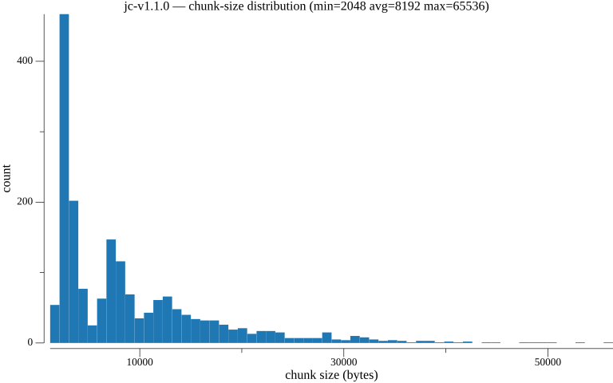
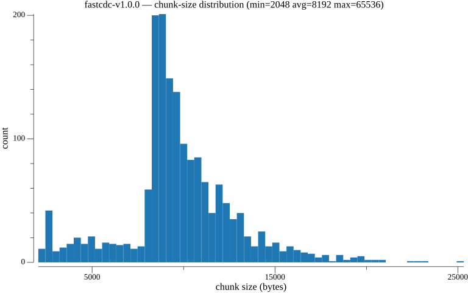
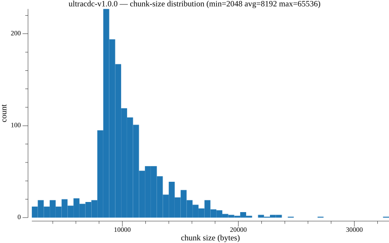
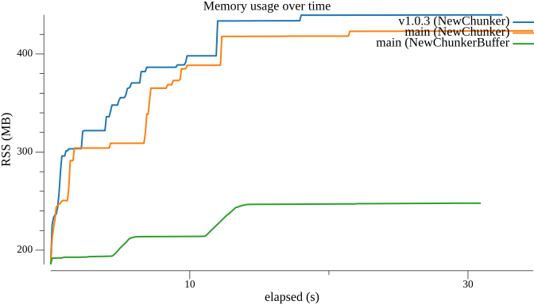
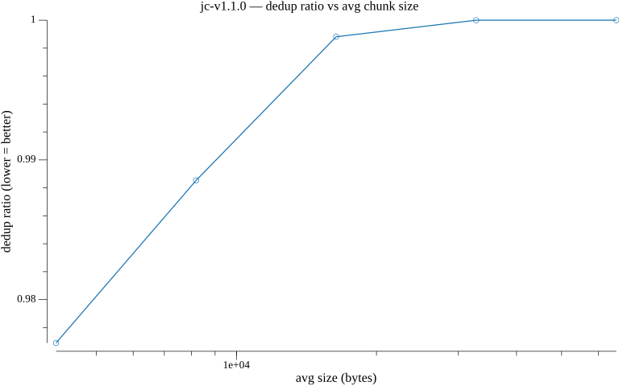
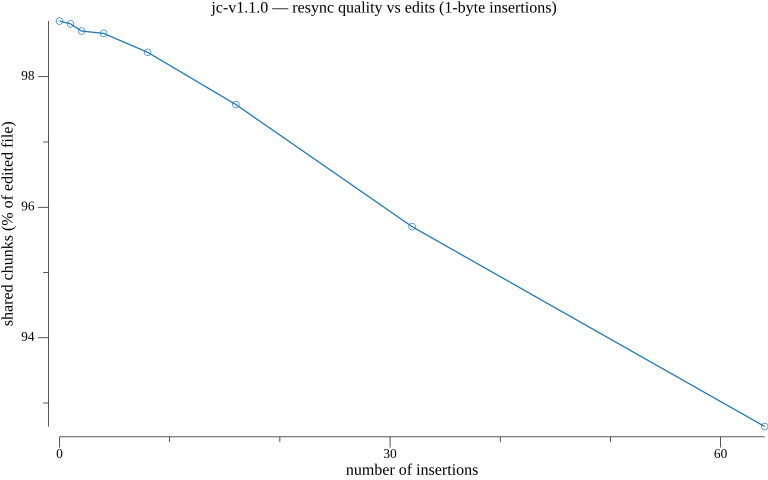

**TL;DR:**

> [`go-cdc-chunkers`](https://github.com/PlakarKorp/go-cdc-chunkers) v1.1.0 is out.
> It is the little library that sits at the very bottom of Plakar: the thing that decides *where* to cut a stream of bytes into chunks so we can deduplicate them.
> This release adds spec-faithful, versioned variants of the algorithms we ship (`jc-v1.1.0`, `ultracdc-v1.0.0`, `fastcdc-v1.0.0`), a new `NewChunkerBuffer` API that lets callers own the scan buffer, and a serious investment in correctness: 100% library test coverage, a fuzz target, and cross-language conformance vectors.
> The headline numbers: our new JC variant chunks 1 GiB of random data at **3747 MB/s**, and pooling buffers across concurrent workers cuts peak RSS by roughly a third while reducing allocations by **~100×**.

If you have followed Plakar for a while, you know that almost everything interesting about a deduplicating backup engine happens *before* we ever write a byte to a store.
The question that matters is: given a stream of data, how do you split it into chunks such that, when the data changes a little, only a few chunks change?

That is the entire job of content-defined chunking (CDC), and it is the entire job of `go-cdc-chunkers`.

It is a small library, and it has been quietly doing its work inside Plakar for a long time.
But "small" and "unimportant" are not the same thing.
This is the hottest path in the whole system: every single byte you back up flows through a chunker.
A few percent of throughput here, or a few hundred megabytes of RAM there, shows up directly in your backup times and your machine's load.

So we sat down and gave it the attention it deserves.

---

## A quick refresher on content-defined chunking

The naive way to split a file is to cut it every N bytes: fixed-size chunking.
It is fast and trivial, and it is terrible for deduplication.
Insert a single byte at the start of a file and every subsequent boundary shifts, so every chunk changes, and your "incremental" backup re-uploads the whole file.

Content-defined chunking solves this by deciding boundaries based on the *content* of the data rather than its offset.
You slide a window over the bytes, compute a rolling hash, and cut a boundary whenever the hash satisfies some condition.
Now if you insert a byte, only the chunk around the insertion changes; everything before and after re-aligns naturally.

There is a whole family of these algorithms, each trading off speed, boundary quality, and chunk-size distribution differently:

- **FastCDC** — the workhorse, using a Gear-based rolling hash with a normalized chunk-size distribution.
- **KFastCDC** — a keyed variant of FastCDC that derives the Gear table from a key, so two repositories with different keys cut at different boundaries.
- **UltraCDC** — trades a little throughput for more uniform chunk sizes and fewer, larger chunks.
- **JC** — a more recent design that, in our benchmarks, turns out to be remarkably fast.

`go-cdc-chunkers` exposes all of them behind a single, boring interface, which is exactly what you want from a building block:

```go
chunker, err := chunkers.NewChunker("fastcdc", rd)
if err != nil {
    log.Fatal(err)
}

for {
    chunk, err := chunker.Next()
    if err != nil && err != io.EOF {
        log.Fatal(err)
    }
    // ... use chunk ...
    if err == io.EOF {
        break
    }
}
```

Swap `"fastcdc"` for `"ultracdc"`, `"jc"`, or `"kfastcdc"` and nothing else changes.

---

## Spec-faithful, versioned variants

The first big theme of v1.1.0 is *correctness by specification*.

Over time, "FastCDC" and friends drift.
Everyone's implementation accumulates small deviations from the published papers: a slightly different mask, an off-by-one in the window, a tweaked normalization threshold.
Each deviation might be defensible on its own, but the result is that "FastCDC" stops meaning one specific thing.
That is a problem for a backup tool, because the chunk boundaries are part of your data's identity: change them and you change which chunks dedup against which.

So in this release we introduced **spec-faithful, explicitly versioned variants**:

- `jc-v1.1.0` — a spec-faithful implementation of the JC algorithm.
- `ultracdc-v1.0.0` — a spec-faithful UltraCDC (which, along the way, fixed a short-tail panic on tiny inputs).
- `fastcdc-v1.0.0` — our reference FastCDC, pinned.

The point of the version suffix is that it is a *contract*.
`ultracdc-v1.0.0` will always cut bytes the same way, forever.
If we ever want to improve the algorithm, that becomes `ultracdc-v1.1.0`, a new name, opting in deliberately, never silently re-chunking data underneath anyone.

This matters far more for a backup engine than for a benchmark.
Determinism across versions and across machines is not a nice-to-have; it is the property that lets a chunk produced on your laptop today dedup against a chunk produced on a server next year.

Each variant produces a different chunk-size distribution for the same `min=2 KiB / avg=8 KiB / max=64 KiB` parameters. Here is what they actually look like, straight out of `cmd/cdcplot`:





You can see the trade-offs in the shapes: JC and FastCDC cluster tightly around the target average with a long thin tail, while UltraCDC pushes toward larger chunks (fewer, bigger chunks, which is exactly its design goal).

---

## Performance: the new JC variant is fast

With the variants nailed down, we refreshed the benchmarks end to end.
Here is the throughput on 1 GiB of random data, comparing our implementations against two well-known reference points (Tigerwill90's FastCDC and Restic's Rabin chunker):

| Implementation                | Throughput |    Chunks |       B/op | allocs/op |
| ----------------------------- | ---------: | --------: | ---------: | --------: |
| PlakarKorp JC (v1.1.0)        | 3747 MB/s | 130,901 |    131,306 |         5 |
| Tigerwill90 FastCDC           | 2412 MB/s | 129,246 |    131,248 |         3 |
| PlakarKorp FastCDC            | 2213 MB/s | 114,876 |    131,306 |         5 |
| PlakarKorp UltraCDC (v1.0.0)  | 1821 MB/s |  94,169 |    131,264 |         5 |
| Restic Rabin                  |  497 MB/s |  16,875 |  3,329,797 |        46 |

A few things stand out.

The new **JC variant runs at 3747 MB/s**, comfortably ahead of everything else in the table, while producing a sane chunk-size distribution.
Random data is the hard case for a chunker (there is no structure to exploit), so these numbers are close to a floor rather than a best case.

The contrast with the Rabin chunker is also worth dwelling on.
Rabin is the classic, textbook CDC algorithm, and you can see exactly why the field moved on from it: it is roughly **7.5× slower** than our JC variant, and it allocates **3.3 MB per operation versus a few kilobytes** for the Gear-based algorithms.
That allocation difference is not cosmetic. It is GC pressure, and on a busy machine running many backups concurrently it is the difference between smooth and miserable.

---

## `NewChunkerBuffer`: owning the scan buffer

The second big theme is memory, and this is the change I am most pleased with.

Every chunker needs a scan buffer to slide its window over.
Until now, `NewChunker` allocated that buffer internally, which is fine when you create one chunker.
But Plakar does not create one chunker.
When you back up a large source, we fan out across many files and many goroutines, and each one spins up its own chunker.
Peak memory grows with the number of chunkers you have alive at once, and those internal buffers add up fast.

So v1.1.0 adds a sibling constructor that hands buffer ownership to the caller:

```go
chunker, err := chunkers.NewChunkerBuffer("fastcdc", rd, opts, buf)
```

Now you can keep a `sync.Pool` of buffers, hand one to each worker, and return it when the worker is done.
The buffers get recycled across the whole backup instead of being allocated and discarded per chunker.

The effect, measured across a 38 GB corpus, is exactly what you would hope:

**100 concurrent workers**

- `NewChunker` (internal buffer): ~432 MB peak RSS
- `NewChunkerBuffer` (pooled): **245 MB peak RSS**

**1000 concurrent workers**

- `NewChunker` (internal buffer): ~578 MB peak RSS
- `NewChunkerBuffer` (pooled): **~400 MB peak RSS**

Pooling a buffer per worker **cuts peak RSS by roughly a third and total allocations by ~100×**.

The picture is even clearer than the table. This is RSS over the course of a run, comparing the old `NewChunker` (on `v1.0.3` and on `main`) against the pooled `NewChunkerBuffer`:



The two `NewChunker` lines climb steadily past 400 MB as buffers pile up; the pooled `NewChunkerBuffer` line flattens out around 245 MB and stays there. Same work, same chunk boundaries, a third less memory.

The old API has not gone anywhere.
If you create one chunker and forget about it, `NewChunker` is still the right call and still allocates its own buffer.
`NewChunkerBuffer` is the tool you reach for when you are running many chunkers concurrently and you care about peak memory, which is precisely Plakar's situation.

We also took the opportunity to **share and cache the Gear table** behind `getGearTable()`, so the (immutable) lookup table is computed once and reused rather than rebuilt per chunker. Small change, real savings when you create thousands of them.

---

## Correctness: 100% coverage, fuzzing, conformance vectors

A chunker is the kind of code where a subtle bug is both easy to write and catastrophic to ship.
If boundaries shift even slightly between two runs, deduplication silently degrades, and you may not notice until your store is much larger than it should be. Worse, a panic on a pathological input can take down a backup.

So a large part of this release was, frankly, unglamorous testing work, and I think it is the most important part.

- **100% library test coverage.** We brought the core library to full statement coverage, then added a `codecov.yml` to scope coverage to the library itself so the auxiliary tools and benchmarks do not dilute the signal.
- **A fuzz target.** Chunkers eat arbitrary bytes, which is exactly the shape of problem fuzzing is built for. The UltraCDC short-tail panic mentioned above is the kind of thing fuzzing surfaces immediately.
- **Cross-language conformance vectors.** Because the variants are now spec-faithful and versioned, we can publish test vectors that an implementation in *any* language can check itself against. If someone writes a JC chunker in Rust or C, they can verify byte-for-byte that it cuts the same boundaries we do. That is what turns "spec-faithful" from a claim into something testable.

This is the part of the release that will never show up in a benchmark, but it is the part that lets me sleep at night knowing this code is on the hot path of everyone's backups.

---

## Tooling: seeing the chunkers work

Alongside the library, the repository now ships a couple of small commands that made this work possible and that you can run yourself:

- **`cmd/cdcplot`** — graphs chunk-size distributions (the histograms above), but also the things that actually matter for deduplication. For example, how the dedup ratio responds as you sweep the average chunk size:

  

  and how well boundaries *resynchronize* after you edit the data, which is the whole point of content-defined chunking:

  

- **`cmd/cdcbench`** — a concurrent benchmark that measures time, CPU, and memory together, which is how we produced the multi-worker RSS numbers (and the memory graph) above.

We also merged the previously separate `cdc-benchmarks` repository in as a nested module, so everything (library, tools, and benchmarks) now lives and versions together.

---

## What this means for Plakar

None of this is a feature you will click on.
But the next time you run a backup, you are running it on top of this work: faster chunking on the hot path, lower peak memory when we fan out across many files, and a chunking layer whose boundaries are now pinned by version and verified by a fuzzer and a coverage gate.

That is the kind of foundation work we like.
It is invisible when it works, which is exactly the point.

---

## Get it

`go-cdc-chunkers` is open source and lives here:

👉 [github.com/PlakarKorp/go-cdc-chunkers](https://github.com/PlakarKorp/go-cdc-chunkers)

```terminal
$ go get github.com/PlakarKorp/go-cdc-chunkers@v1.1.0
```

**Full changelog:** [v1.0.3...v1.1.0](https://github.com/PlakarKorp/go-cdc-chunkers/compare/v1.0.3...v1.1.0)

As always, if you find a bug, a deviation from a spec, or a way to make it faster, come find us on [Discord](https://discord.gg/uqdP9Wfzx3) or open an issue. This is the layer where small improvements compound across every backup anyone ever takes.
