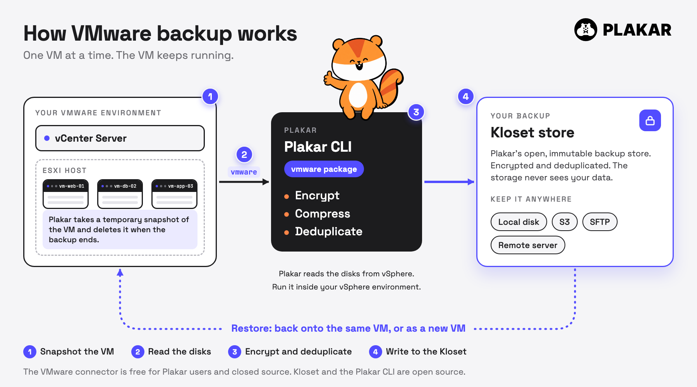

**TL;DR:** Plakar's VMware integration, which was only available in the Plakar Control Plane before, is now available in Plakar OSS. Install the integration with one command, point it at your vCenter, and you get encrypted, deduplicated backups, stored in an open, portable format, while the VM keeps running. It is free for registered Plakar users.

In case you have not heard of us before, Plakar is an open source backup platform, and it now has [native integrations](/integrations/) for many of the essential parts of a modern stack. That includes databases such as [PostgreSQL](/posts/2026-04-03/backing-up-postgresql-with-plakar/), [MySQL](/integrations/mysql/), and [SQL Server](/posts/2026-09-08/agentless-vss-sql-server-backup/), Windows through [VSS](/posts/2026-09-08/agentless-vss-sql-server-backup/), orchestrators such as [Kubernetes](/posts/2026-02-18/backing-up-kubernetes-clusters-with-plakar/), hypervisors such as [Proxmox](/integrations/proxmox/), and cloud and object storage such as [AWS](/integrations/aws/), [Google Cloud](/integrations/gcp/), [Azure](/integrations/azblob/) and [S3](/integrations/s3/). It also covers identity and secrets tools like [Active Directory](/integrations/msad/) and [Vault](/integrations/vault/).

Today, we're excited to announce the release of our VMware integration. You can now back up VMware with Plakar, an open source backup tool. If you run VMware, you can protect it with the same tool, in the same open format, as the rest of your stack.

```bash
plakar pkg add vmware
```

That installs the integration. The full path to a first backup is a few more commands, shown below.

## Installing and your first backup

The VMware integration is free for Plakar users. It is not open source, so you install it as a ready-made package after a [`plakar login`](/docs/community/main/guides/logging-in-to-plakar/).

```bash
plakar login -github
plakar pkg add vmware
plakar source add myvm vmware://<instance-uuid> \
  vsphere_server=vcenter.example.com \
  vsphere_datacenter=Datacenter \
  vsphere_username=<username> \
  vsphere_password=<password>
plakar at /var/backups create
plakar at /var/backups backup "@myvm"
```

Each source is one VM, and you find its instance UUID with a tool like govc. There is one protocol, `vmware`, and it reads the disks in `nbd` transport mode by default. See the [VMware integration docs](/docs/community/main/integrations/vmware/), the [guide to logging in to Plakar](/docs/community/main/guides/logging-in-to-plakar/), and the [guide to managing packages](/docs/community/main/guides/managing-packages/).

## Two ways to read the disks

Plakar can read the disks in two ways, set with the `transport_mode` option. The default is `nbd`: Plakar reads the raw disk from the ESXi host. The alternative is `nfchttp`: vSphere exports each disk as a compressed, stream-optimized VMDK file that travels over your production network, and it only needs network access to your vCenter. Pick the transport that fits your network.

Default (`nbd`), same commands as above:

```bash
plakar source add myvm vmware://<instance-uuid> \
  vsphere_server=vcenter.example.com \
  vsphere_datacenter=Datacenter \
  vsphere_username=<username> \
  vsphere_password=<password>
plakar at /var/backups backup "@myvm"
```

<!-- TODO: add the `nfchttp` source add command once Paul confirms the option name (transport_mode=nfchttp?). -->

## How it works

Plakar takes a snapshot of the VM, reads the disks, encrypts and deduplicates them, and writes the result to a [Kloset](/posts/2025-04-29/kloset-the-immutable-data-store/), Plakar's encrypted, deduplicated backup store that can live on a local disk, in S3 or on a remote server. The VM keeps running the whole time. The snapshot is removed when the backup ends.



## Backing up and restoring

<!-- TODO video: backup and restore. One short terminal recording (about 30 seconds). First, `plakar at /var/backups backup "@myvm"`, with the VM still running in a second pane. Then, `plakar at /var/backups restore -to "@myvm-restore" <snapshot_id>`, ending on the new VM in vSphere. Recorder: Paul. -->

Restore goes both ways. Put the disks back on the same VM, or create a new VM from the backup. You can even bring it back with its network disconnected, to look at it safely after an incident.

## Why Plakar for VMware

A VMware snapshot is not a backup. It lives next to the VM it protects, so it can be lost with it. A Plakar backup is a separate copy, stored where you choose. Here is what you get:

- **Encrypted and deduplicated.** Most tools make you choose. Plakar does both, so backups stay private and small.
- **Your backup is a Kloset.** A portable store you can keep anywhere. It is not tied to a vendor's format.
- **No agent.** Nothing to install inside your VMs.

## Beyond simple backups

Your VMware backups can live in the same kind of store as the rest of your Plakar backups. Keep a copy on more than one storage, and use the same tool for databases, Kubernetes, Windows and Proxmox. One tool and one format across your stack.

## Try it

New to Plakar? [Download it](/download/) for macOS, FreeBSD, Alpine, Debian, other Linux distributions, Windows and more.

Install the integration, back up a VM, and share your feedback or questions on [Discord](https://discord.gg/uuegtnF2Q5).

Stay safe!
