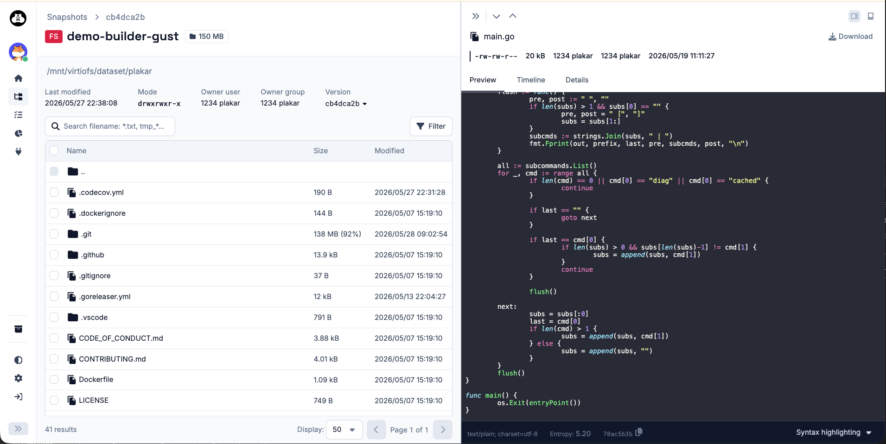
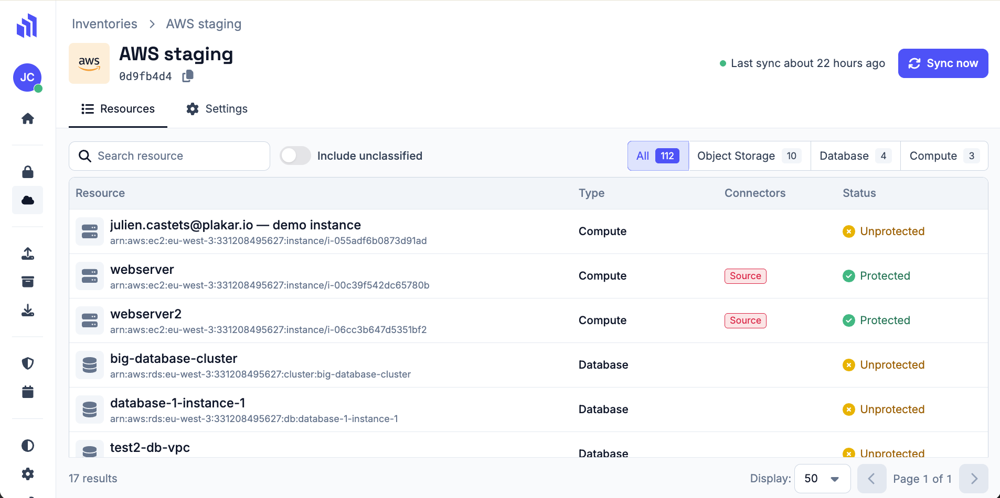

The command `plakar ui` spawns your browser and displays a nice interface to list your backups, view their content, and download them.

The commercial version of Plakar, that we call Plakar Control Plane which is targeting enterprise customers, has a more complex UI that also includes user management, multi-stores management, inventories of Cloud resources, and so on.

Behind the scenes, both are React applications written in TypeScript.

When backend developers at Plakar open the `plakar-ui` GitHub repository for the first time, they might be surprised by the complexity of the frontend codebase. They might see a `pnpm-workspace.yaml`, a `turbo.json`, seven `package.json` files, and a `node_modules` folder big enough to make `find` overflow their terminal scrollback.

That's the reason why I decided to write a few lines about the Plakar UI stack: to explain the rationale behind our choices, why we do things the way we do, what our dependencies are, and how they fit together.

## A few lines… turned into a series

Alright, I might have lied a bit in the previous sentence… "A few lines" turned into a whole series of articles. Each article will cover a specific aspect of our frontend stack.

Here's the list of topics we will cover:

- **pnpm and Turborepo** — why the monorepo is split the way it is, and how Turborepo keeps `pnpm build` from taking ten minutes
- **React** — for a backend developer, React might be like a unicorn: people talk about it all the time, but you've never actually seen one. We'll explain briefly why React changed the frontend landscape
- **TypeScript** — I know that most developers are allergic to anything related to frontend, but I'll try to convince you that TypeScript is a real game-changer in the way we write code
- **Zod** — TypeScript will lie to you at API boundaries: Zod is how we deal with that
- **TanStack Query** — probably the most important library we use. It's a server-state synchronization layer, and it's insanely cool
- **TanStack Form** — forms are at the heart of any application UI. Tanstack Form is what we use to build them, and it's a joy to work with
- **React Aria Components** — have you ever realized Plakar UI is accessible using your keyboard? That's thanks to React Aria, a library of accessible components that we use as building blocks for our UI
- **TanStack Table** — tables are nothing more than a `<table>` element, right? Lol. You bet.
- **TanStack Router** — how do we avoid having a 404 when we change the URL?
- **Storybook** — this article explains how we build our UI components in isolation, using Storybook as a playground and a documentation tool
- **Testing strategy** — let's explain how we test our UI, and why we don't try to achieve 100% test coverage… quite the opposite, actually
- **Build process** — this final article will explain how the code is shipped to production

## Who is this for?

This series was originally written for the backend developers at Plakar, to help them understand the frontend codebase. Quickly, I realized that it could be useful for people outside of Plakar as well: don't tell me you've always been in situations where there's no gap in knowledge between your frontend and backend teams.

## A word from a recovering backend developer

I'm originally mostly a backend/systems developer and a system administrator.

For years, I thought that the complexity comes from the backend, that frontend development is the "easy part" of a project, and something I would try to avoid as much as possible.

**I was wrong**, and I think that if you share these feelings I had and accept to be open-minded, you might change your mind and discover that frontend development comes with its own set of challenges — and not only related to the color of a button or the layout of a page.

[Let's start with pnpm and Turborepo](/posts/2026-05-25/plakar-ui-pnpm-turborepo/)
