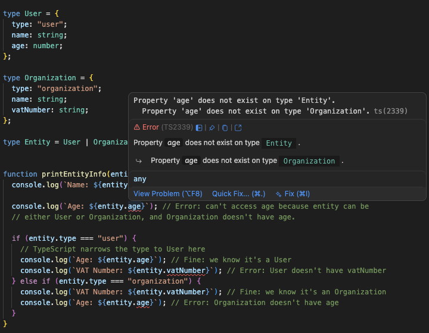

I know most Go developers are allergic to TypeScript. But if you're honest about it, the allergy is usually not about TypeScript itself — it's about the ecosystem around it. npm and its thousands of transitive dependencies. `node_modules` weighing more than a black hole. JavaScript's history of footguns. That feeling of dread when you open a JavaScript codebase and find `any` everywhere and nothing makes sense.

Those are legitimate complaints. But TypeScript is not JavaScript. TypeScript is a language that compiles to JavaScript, and its type system is genuinely one of the most expressive in any mainstream language — more so than Go's in some ways that actually matter for UI code.

I'm not going to give you a full tour. I want to highlight two things that I think will change how you see TypeScript.

## 1. You don't need everything to compile in order to keep working

In Go, the compiler is your gatekeeper. You cannot run anything until everything compiles. This is generally a good thing — it catches mistakes early. But it has a real cost during large refactors.

If you've ever changed an interface that's used across 20 files in the Plakar codebase, you know the experience: you make your change, then you're stuck fixing compilation errors in 19 other files before you can run a single line of your new code to see if it even works. The compiler forces you to bring the entire codebase into a consistent state before you can test anything.

TypeScript takes a different stance. TypeScript type errors are surfaced by your editor and by the `tsc` type checker, but they don't prevent your code from running. You can have type errors in files you haven't touched yet, and your application will still start up, navigate to the route you're working on, and behave correctly.

Here's a concrete scenario. Say we're refactoring our `Button` component in `packages/ui`, changing a prop from `variant: "primary" | "secondary"` to a richer type. This button is used in 30 places across `apps/oss` and `apps/plakman`. In TypeScript, here's what we do:

1. Change the `Button` component. TypeScript immediately shows errors on all 30 call sites.
2. We focus on the page we're actively working on, fix it, and see it working in the browser.
3. We work our way through the other 30 call sites at our own pace.
4. Throughout the whole process, the application runs fine.

The cost of a large refactor is dramatically lower because you can do it incrementally. Your editor gives you the full list of things to fix (like a compiler's error list), but you can tackle them in whatever order makes sense for your workflow.

This isn't a loophole or a compromise — it's a deliberate design decision. TypeScript's goal is to help you write correct code, not to hold your application hostage until every file is perfect.

## 2. Discriminated unions

This is the one that I think will genuinely impress Go developers.

Let's say you need to represent an entity that can be either a User or an Organization. They share some fields (like `name`) but also have fields that are specific to each type (`age` for users, `vatNumber` for organizations).

**The Go approach — option 1: a single struct with optional fields**

```go
type Entity struct {
    Type      string `json:"type"`
    Name      string `json:"name,omitempty"`
    Age       int    `json:"age,omitempty"`       // optional, organizations don't have age
    VatNumber string `json:"vat_number,omitempty"` // optional, users don't have vat number
}
```

This works, but it's imprecise. Nothing in the type system prevents you from setting both `Age` and `VatNumber` on the same struct. You have to check `Type` manually every time you want to use the struct, and if you forget, you might access a field that isn't meaningful for that entity type.

**The Go approach — option 2: an interface with two structs**

```go
type Entity interface {
    Type() string
    Name() string
}

type User struct {
    Name string
    Age  int
}

type Organization struct {
    Name      string
    VatNumber string
}
```

This is cleaner and more precise. But now you have boilerplate: you need to implement the interface on both structs, and every time you have an `Entity` and you need to access `Age`, you have to type-assert it down to `*User`. The code is correct, but verbose.

**The TypeScript naive approach: same as Go option 1**

TypeScript lets you express option 1 directly:

```typescript
type Entity = {
  type: "user" | "organization";
  name: string;
  age?: number; // optional, organizations don't have age
  vatNumber?: string; // optional, users don't have vat number
};
```

The `?` makes a field optional. This is equivalent to Go's struct with `omitempty`. `age` and `vatNumber` can be either present or `undefined`. Same imprecision as Go option 1.

**The TypeScript better approach: discriminated unions**

```typescript
type User = {
  type: "user";
  name: string;
  age: number;
};

type Organization = {
  type: "organization";
  name: string;
  vatNumber: string;
};

type Entity = User | Organization;
```

`Entity` is a **union type**: a value of type `Entity` is either a `User` _or_ an `Organization`. The `|` is the union operator.

What makes it a **discriminated** union is that each member of the union has a literal type for the `type` field — `"user"` for `User` and `"organization"` for `Organization`. TypeScript uses this discriminant field to understand which type you're dealing with when you inspect the value.

Here's what this looks like in practice:

```ts
function printEntityInfo(entity: Entity) {
  console.log(`Name: ${entity.name}`); // Fine: both User and Organization have name

  console.log(`Age: ${entity.age}`); // Error: can't access age because entity can be
  // either User or Organization, and Organization doesn't have age.

  if (entity.type === "user") {
    // TypeScript narrows the type to User here
    console.log(`Age: ${entity.age}`); // Fine: we know it's a User
    console.log(`VAT Number: ${entity.vatNumber}`); // Error: User doesn't have vatNumber
  } else if (entity.type === "organization") {
    console.log(`VAT Number: ${entity.vatNumber}`); // Fine: we know it's an Organization
    console.log(`Age: ${entity.age}`); // Error: Organization doesn't have age
  }
}
```



When we say "Error" in those comments, we mean that TypeScript gives you a **compile-time error** if you try to access a property that isn't guaranteed to exist on the type. Your editor shows a red underline. The `tsc` check fails. You catch the bug before it ships.

And here is the key insight: after the `if (entity.type === "user")` check, TypeScript **automatically narrows** the type. Inside that branch, `entity` is no longer of type `Entity` — it's of type `User`. TypeScript tracks this statically, without any explicit cast or assertion on your part. It just works.

This is much closer to Go option 2 (the interface + two structs approach) in terms of correctness and precision, but with far less boilerplate. No interface to implement, no type assertions, no boilerplate methods — just a type definition and an `if` statement.

There's one more thing discriminated unions give you: exhaustive checking. Our codebase has a small utility called `assertNever`:

```ts
function assertNever(x: never): never {
  throw new Error(`Unexpected value: ${x}`);
}
```

Used in a switch statement, it forces TypeScript to verify you've handled every case:

```ts
function getStatusLabel(status: InstallationStatus): string {
  switch (status) {
    case "installed":     return "Installed";
    case "not-installed": return "Not installed";
    case "built-in":      return "Built-in";
    default:              return assertNever(status);
  }
}
```

If someone later adds `"pending"` to `InstallationStatus`, TypeScript will error at `assertNever(status)` because `status` is no longer `never` in the default branch — it's `"pending"`, which means you haven't handled it. You can't miss it. This is the equivalent of Go's exhaustive switch checks, except the compiler enforces it for you without any extra tooling.

**One more clarification about "Error" vs "runtime error"**

When TypeScript tells you `entity.age` is an error because `entity` might be an `Organization`, it means the TypeScript compiler rejects that code. But because TypeScript compiles to JavaScript, and JavaScript has no type system at runtime, if you suppress the error and run the code anyway, you won't get a crash — you'll get `undefined`. TypeScript's job is to make sure you never get to that situation by catching it at compile time.

This is also why the incremental refactoring workflow from point 1 is safe: a TypeScript error doesn't mean your application crashes at runtime. It means "you've written something that might be incorrect". You can choose to fix it now or later, and the application keeps running.

## How we use this in Plakar UI

Discriminated unions are everywhere in the codebase. Some are simple — an integration can be `"installed"`, `"not-installed"`, or `"built-in"`, and every component that renders an integration card uses that type directly rather than a raw string. The type tells you what values are valid; TypeScript tells you if you use the wrong one.

Some are more involved. The file preview component in the snapshot browser needs to handle text, JSON, images, PDFs, videos, and audio files differently. Each has a different set of available actions and a different renderer. Instead of a chain of `if (type === "text" || type === "json")` checks with no type safety, the resolved file type flows as a union through the component tree, and TypeScript narrows it at each branch:

```ts
if (data.type.resolved === "text" || data.type.resolved === "json") {
  return <FilePreviewText ... />;
} else if (data.type.resolved === "image") {
  return <FilePreviewImage ... />;
} else if (data.type.resolved === "pdf") {
  return <FilePreviewPDF ... />;
  // ...
} else {
  return <FilePreviewError>Unknown file type: {data.type.raw}</FilePreviewError>;
}
```

Add a new file type to the union and forget to handle it, and TypeScript will flag it.

One rule we enforce in this codebase: no `any`, avoid `unknown`. It's not aesthetic. If you punch a hole in the type system with `any`, TypeScript's analysis stops being meaningful at that boundary. Every piece of data has a type, which means the compiler's guarantees hold end to end.

---

Next up: TanStack Query. We've talked about how to structure our code and describe our types — now let's talk about how we actually fetch the data that fills all those types.
