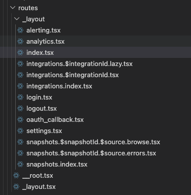
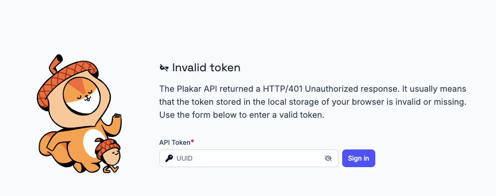

If you've only built backend services in Go, you've used routers: something like `net/http.ServeMux` or a third-party library like `chi` or `gin`. The concept is the same on the frontend, but the mechanics are different in ways that take some getting used to.

In the [previous article](../plakar-ui-tanstack-table) we saw how TanStack Table stores pagination state in the URL. TanStack Router is the piece that makes that possible.

## What a frontend router does

In a traditional server-rendered web application, the URL is a direct instruction to the server. When you visit `https://myapp.com/users/42`, the server receives a request for that path, runs the appropriate handler, fetches user 42 from the database, renders an HTML page, and sends it back. The browser displays the result. Simple.

In a Single Page Application (SPA), none of that happens. The entire application is delivered to the browser in a single bundle. The server returns one HTML file with a `<script>` tag, and after that, everything runs client-side. When you navigate from `/users` to `/users/42`, there's no server request. The JavaScript intercepts the URL change and renders a different component.

Without a router, this breaks in ways that feel subtle but are deeply annoying to users:

- The back button doesn't work: it navigates *out* of the app, back to wherever the user came from
- Links are meaningless: you can't bookmark `/users/42` and come back to it, because the app doesn't know how to render it on initial load
- Sharing a URL is broken: if you paste `https://myapp.com/users/42` into a chat, the recipient lands on the app's blank state, not on user 42
- Refresh is broken: same problem as above

A router solves this by maintaining a mapping between URL patterns and the components that should render for each. It intercepts URL changes (from `<a>` clicks, browser history navigation, programmatic redirects) and renders the right components without a server round-trip. It also handles the initial load, so that if someone lands directly on `/users/42`, the correct component renders.

Every serious SPA has a router.

## Why TanStack Router

There are several mature router options for React. The most widely used is React Router (now React Router v7 / Remix). It works fine. But we chose TanStack Router for one reason above all others: it is fully type-safe.

When you create a link to a route with TanStack Router, TypeScript knows whether that route exists. It knows what path parameters the route expects. It knows what search parameters are valid. If you rename a route's path, every link to it that uses the old path becomes a compile error.

This might sound like a minor convenience. It isn't. In a large application where routes get renamed, paths get restructured, and parameters get added or removed, having TypeScript enforce consistency across the entire routing tree catches bugs before they reach anyone. We've experienced the alternative: a rename that missed a few link destinations, discovered three days later by a user reporting a 404. We don't miss it.

## What that looks like in practice

Routes live in files whose names define the URL structure. `users.$id.tsx` becomes `/users/:id`. `users.$id.settings.tsx` becomes `/users/:id/settings`. A CLI tool watches the `src/routes/` directory and regenerates a `routeTree.gen.ts` file whenever route files change. You never hand-write a routing config. The generated tree is what TypeScript types everything against.



Every route, link, and navigation call is typed against that generated tree. Here's a real example from Plakar, a link to a source connector's detail page:

```tsx
<Link
  to="/sources/$id"
  params={{ id: connector.id }}
  className="font-medium hover:underline"
>
  {connector.name}
</Link>
```

TypeScript knows this route exists and that it takes an `id` param. Rename the route file, and every link that references the old path becomes a compile error. Omit the `params` prop, and it won't compile either.

The same applies to search params. They're declared with a Zod schema on the route, so `Route.useSearch()` returns a properly typed object. `?page=abc` falls back to the default instead of becoming `NaN` silently. `?provider=unknown_type` fails validation if the schema restricts the values. The component just reads `page` as a number and moves on.

## A real example: auth redirects

The routing layer is also where you handle cross-cutting concerns like auth. In Plakar, if the API returns HTTP 401, our API client throws an `APIResponseUnauthorizedError`. The check lives in the `/_layout` `beforeLoad`:

```tsx
import { createFileRoute, redirect } from "@tanstack/react-router";

export const Route = createFileRoute("/_layout")({
  beforeLoad: async ({ context: { queryClient }, location }) => {
    try {
      await queryClient.ensureQueryData(getMeQueryOptions());
    } catch (error) {
      if (error instanceof APIResponseUnauthorizedError) {
        throw redirect({
          to: "/login",
          search: {
            redirect: location.pathname,
          },
        });
      }
      throw error;
    }
  },
  component: LayoutComponent,
});
```

This is declared once. Every route nested under `/_layout` inherits this behavior automatically. You don't scatter `if (error instanceof APIResponseUnauthorizedError)` checks across every component.

The routing layer is where you handle cross-cutting concerns: auth, redirects, prefetching. Because it's all typed, a mistake in wiring it up is caught before it ships.



Next up: [Storybook](../plakar-ui-storybook), and how we document and test components in isolation.
