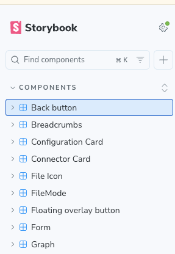
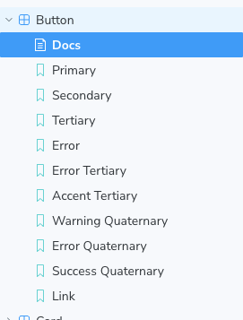
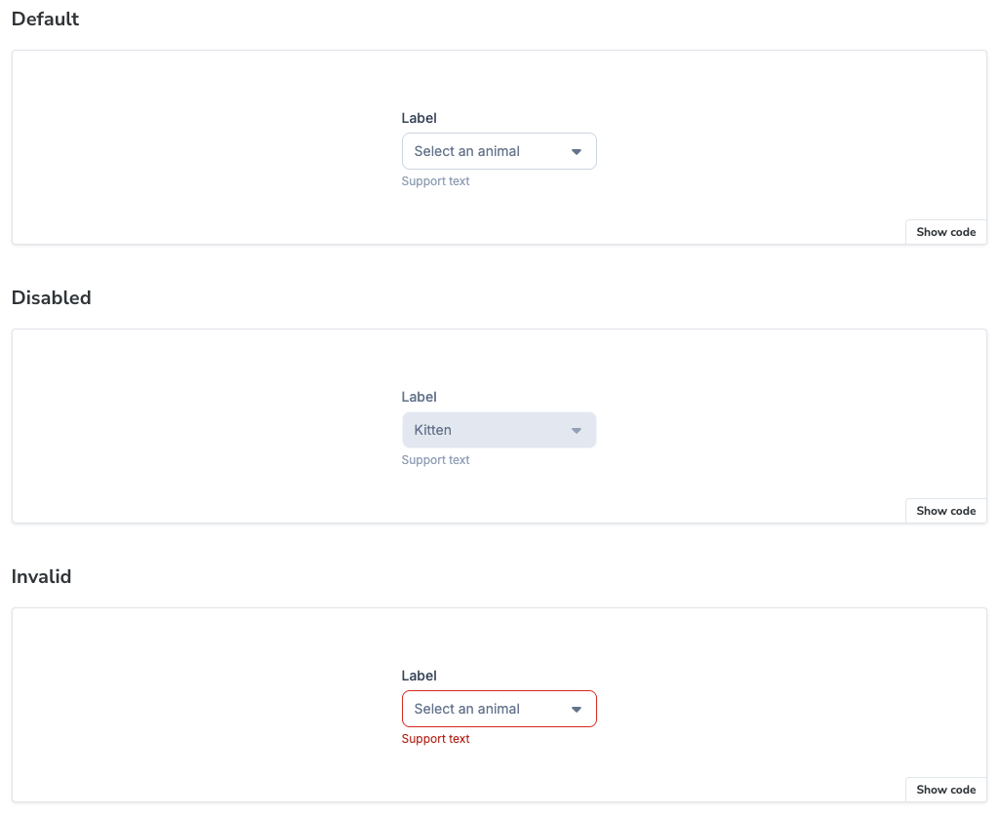

This article is about how you develop a UI component without losing your mind.

This is part of an ongoing series. The [previous article](../plakar-ui-tanstack-router) covered TanStack Router.

## The problem: developing components inside routes

When you're working on a component that lives inside a route, you're never really working on _just_ that component.

Take a concrete example. Say I need to update the styling of a select dropdown that appears in a settings form. To see my changes, I need to start the dev server, log in, navigate to the settings page, make sure there's data in the right shape for the form to render, open the form, and then finally look at my dropdown.

Six steps before I can see the thing I'm actually working on. And if I want to check the _disabled_ state of that dropdown, I now need to set up some condition that triggers the disabled state, which might mean tweaking the data, intercepting a prop, or adding a temporary `isDisabled={true}` somewhere I'll inevitably forget to remove.

A component typically has many states: normal, disabled, invalid, loading, empty, with a very long label, with a very short label. In the real application, you might only ever see two or three of those states during normal navigation.

Before we used Storybook, the coping strategy was... not great. We'd sometimes write throwaway test files: a quick route or page whose only purpose was to render one component in isolation, with hardcoded props. You'd add it locally, poke at the component, delete the file when you were done. It was never committed because it was junk. It was never reused because the next person doing the same thing didn't know it had existed. It was annoying, and it scaled terribly.

## What Storybook is

Storybook is a development environment for UI components. You run it as a separate process alongside your main dev server, and it gives you a browser-based workbench where every component lives in its own isolated sandbox.

Each component has stories: discrete, named examples of the component in a specific state. Think of a story the way you'd think of a test case, except instead of asserting on a result, you look at the component. A story says: "here is this component, with these exact props, showing this particular configuration." The Storybook UI shows a sidebar with all your components and their stories. You click through them. You see the component rendered cleanly, with no routing, no data fetching, no parent components, no application state. Just the component, exactly as you defined it.

There's also an interactive controls panel. For every prop, Storybook generates a UI control that lets you modify the value live. Change a string, toggle a boolean, pick from an enum. The component updates in real time. It's like having a scratchpad for your props where you can see the result immediately.

Storybook lives in `packages/ui/`, our pure presentational component library. Every component in that library has stories. It's how we develop new components, how we verify existing ones, and how new developers learn what's available and how to use each piece.

Story files live next to the component they describe and are typed against its props. Rename a prop, and the story stops compiling. You can't silently leave the stories behind. It works the same way a call site and a function signature stay in sync.

Think about what it would take to reach those states in the real application. To see the `Disabled` state, you'd need a page that renders a pre-populated, disabled select. To see `Invalid`, you'd need to trigger a validation error. To see `Pending`, you'd need to catch the component mid-request or mock the API. With Storybook, each of these is a single click in the sidebar.

## The cost

I won't pretend this is free. Stories take time to write. When you add a prop, you consider whether it needs a new story. When you rename a prop, you update the story file too. When you substantially redesign a component, the stories need rethinking.

The rule of thumb we've landed on: write at least one story per meaningful state. Not one story per prop permutation, which would be thousands of stories and pure noise. But one story per state that users or developers might care about: the happy path, the disabled state, the error state, the empty/loading/pending state, any unusual variant.

The development workflow payoff is real. Being able to develop a component in complete isolation, with full control over every prop, is faster than navigating the real app to find the right page, setting up the right data, and hoping the component renders in the state you need. The time saved during development more than compensates for the time spent writing stories.

There's also what TypeScript and tests can't catch. TypeScript catches type errors. Tests catch logic errors. But neither of them tells you that a button now looks wrong in its disabled state because you accidentally removed a CSS class, or that a select's dropdown is cut off because a parent container got `overflow: hidden` added. Storybook is visual. When you open it after making a change, you see every state of every component. Visual regressions are obvious in a way that they're not when you're only looking at the specific page you happen to be working on.

Next up: [Testing Strategy](../plakar-ui-testing-strategy), and why we test less than you might expect.
