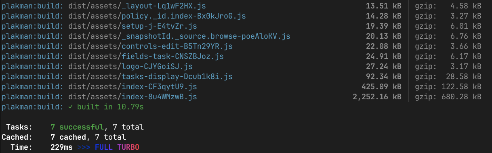

Before any of the runtime machinery can run, the source code has to be transformed into something a browser can actually understand. That transformation is the build process.

This is part of an ongoing series. The [previous article](../plakar-ui-testing-strategy) covered our testing strategy.



## What the browser actually needs

Browsers don't understand TypeScript. They don't understand JSX. They don't understand `import` statements that reference local workspace packages like `@plakar-ui/ui`. They need plain JavaScript, plain CSS, and assets, all served from a URL.

The build process takes everything we've written and produces exactly that: a `dist/` folder of static files that a backend can serve. For the OSS version of Plakar, those files are embedded directly in the Go binary and served by `plakar ui`. There is no separate frontend deployment. The UI ships with the backend.

## Vite: the build tool

We use [Vite](https://vite.dev) as our build tool. In development, it runs a local server with hot module replacement: save a file and the browser updates in under a second, no full reload. TypeScript and JSX are transpiled on demand. In production, `vite build` bundles the entire application into optimized static files: TypeScript is stripped, JSX is compiled to `React.createElement` calls, and all imports are resolved and bundled together.

The build command for each app is:

```bash
tsc -b && vite build
```

`tsc -b` runs the TypeScript compiler first, type-checking the entire project. If there are type errors, the build fails before Vite even starts. You cannot ship a build with type errors.

Then Vite takes over to produce the actual bundle.

## Code splitting

A naive bundler would produce one enormous JavaScript file containing the entire application. The browser would have to download all of it before rendering anything. With a UI that has dozens of routes, most of which a user will never visit in a single session, that's wasteful.

Vite splits the bundle automatically. TanStack Router's Vite plugin, configured with `autoCodeSplitting: true`, makes each route its own chunk. When a user navigates to `/scheduling`, the browser downloads only the code for that route, not the code for `/inventories` or `/sources` or any other route they haven't visited. The initial bundle is small; additional chunks are fetched on demand as the user navigates.

## How the UI ships with Plakar

When a user runs `plakar ui`, Plakar starts an HTTP server and serves the UI directly from the binary. The compiled HTML, JavaScript chunks, CSS, and assets are all embedded in the Go binary using Go's `embed` package. There is no CDN, no separate frontend server, no deployment step on the user's side. It just works out of the box.

To keep the embedded assets up to date, the Plakar repository has a GitHub Action that runs automatically. When triggered, it:

1. Checks out the `plakar-ui` repository
2. Runs `pnpm run build` to compile the OSS app
3. Copies the resulting `dist/` files into the appropriate directory in the Plakar Go repository
4. Opens a pull request with the updated compiled assets

A Plakar maintainer reviews and merges the PR. The next release of the Plakar binary automatically includes the latest UI. From a user's perspective, updating Plakar is enough. There is nothing frontend-specific to install or deploy.

This model is possible precisely because the output of the build is just static files. No server-side rendering, no Node.js runtime, no process to keep alive. The Go binary serves `index.html` for any route, and the browser takes it from there.

## Putting it all together

The full pipeline from source to production looks like this:

```
[plakar-ui repo] pnpm run build
  └── turbo build (for each package and the oss app)
        └── tsc -b          # type-check everything; fail fast on errors
        └── vite build      # bundle, split, optimize
              ├── TypeScript transpilation
              ├── JSX → React.createElement
              ├── Tailwind → optimized CSS
              └── Route-level code splitting

[GitHub Action] copies dist/ → plakar repo, opens PR

[plakar repo] Go embeds the files → plakar ui serves them
```

Next up: [Conclusion](../plakar-ui-series-conclusion).
