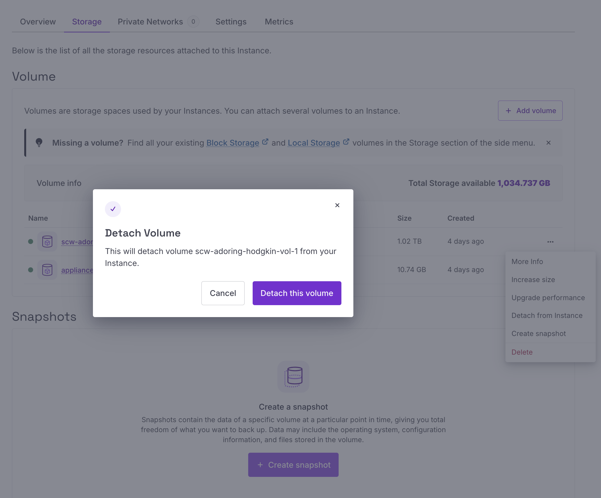
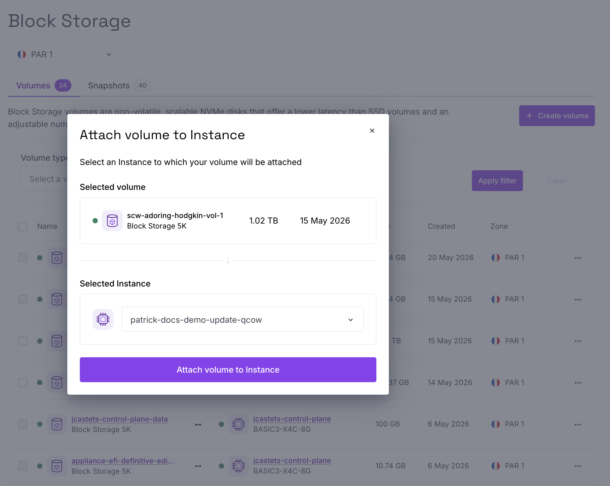

# Updating Scaleway QCOW2 image for Control Plane

Plakar Control Plane on Scaleway is deployed from a QCOW2 image imported into Scaleway Block Storage as a snapshot.

Most Plakar Control Plane updates can be installed directly from the settings page without replacing the instance. However, in rare cases, the underlying QCOW2 image also needs to be updated. This usually happens when infrastructure-level changes are required.

## Deployment layout

A typical Scaleway deployment consists of:
* A root boot volume created from the imported QCOW2 snapshot
* A separate persistent Block Storage volume (`1024GB`) used for Plakar Control Plane application data

The important volume is the separate persistent data volume because it contains the actual Plakar Control Plane data and configuration.

## Updating the installation image

The update process consists of:
1. Uploading the new QCOW2 image
2. Creating a new Block Storage snapshot
3. Launching a new instance from the updated snapshot
4. Reattaching the existing persistent data volume

## 1. Upload the new QCOW2 image

Download the newer Plakar Control Plane QCOW2 image, then upload it to Scaleway Object Storage. You can refer to [Scaleway installation](../../../intro/installation/scaleway#uploading-the-qcow2-image-to-scaleway-object-storage) documentation.

## 2. Create a new Block Storage snapshot

Open the uploaded QCOW2 object and select **Import as snapshot**. Create the snapshot in the same Scaleway zone as the existing deployment. You can refer to [Scaleway installation](../../../intro/installation/scaleway#creating-a-block-storage-snapshot) documentation.

## 3. Stop the current instance

Stop the currently running Plakar Control Plane instance before modifying attached storage volumes.

## 4. Detach the existing persistent data volume

Locate the attached `1024GB` Block Storage volume and detach it from the stopped instance.

Before detaching the volume, note down the volume name because the same volume will later be attached to the new instance.

Also note down any instance-specific configuration that may need to be reapplied later, including:
* Security groups
* Public IPv4 and IPv6 assignments
* DNS configuration
* Monitoring or automation integrations

## 5. Create a new instance

Create a new Scaleway instance using the newly imported Block Storage snapshot as the boot source. Due to a Scaleway limitation, it is not possible to attach an existing detached Block Storage volume during the initial instance creation process.

As a workaround, the new instance must first be created normally, then stopped so the existing persistent data volume from the previous deployment can later be attached manually.

During instance creation:
* Select the same Scaleway zone as the snapshot and existing data volume
* Select the snapshot under the **My snapshots** section
* Do not attach a new additional `1024GB` Block Storage volume

The new instance should only contain the boot volume created from the snapshot.

## 6. Stop the new instance

Once the new instance has been created successfully, stop it before attaching the old persistent data volume.

## 7. Attach the old persistent data volume

Open the detached Block Storage volume from the previous deployment and attach it to the new instance. When attaching the volume, select the newly created instance.

## 8. Reconfigure instance settings

Reapply any configuration that existed on the previous instance. This may include:
* Security groups
* Public IPv4 and IPv6 assignments
* DNS configuration
* Monitoring or automation integrations

## 9. Start the new instance

Start the new Scaleway instance.

Once the instance is running, Plakar Control Plane should resume normally using the existing persistent data volume. All inventories, schedules, policies, configuration, and other data should remain intact.

## 10. Cleanup

After confirming the new deployment is working correctly, you can safely remove unused resources:
* Delete the old Scaleway instance
* Delete unused boot volumes from the previous deployment
* Delete unused snapshots if no longer needed

> [!WARNING]+ Cleanup
> Do not delete any old volumes or snapshots until the new deployment has been verified working correctly.

