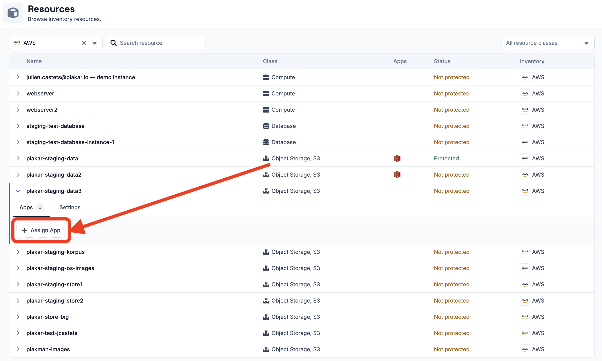
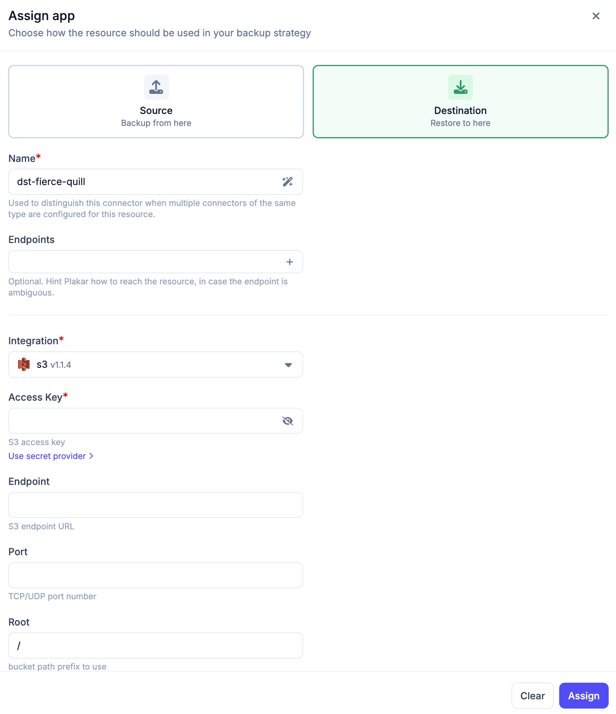
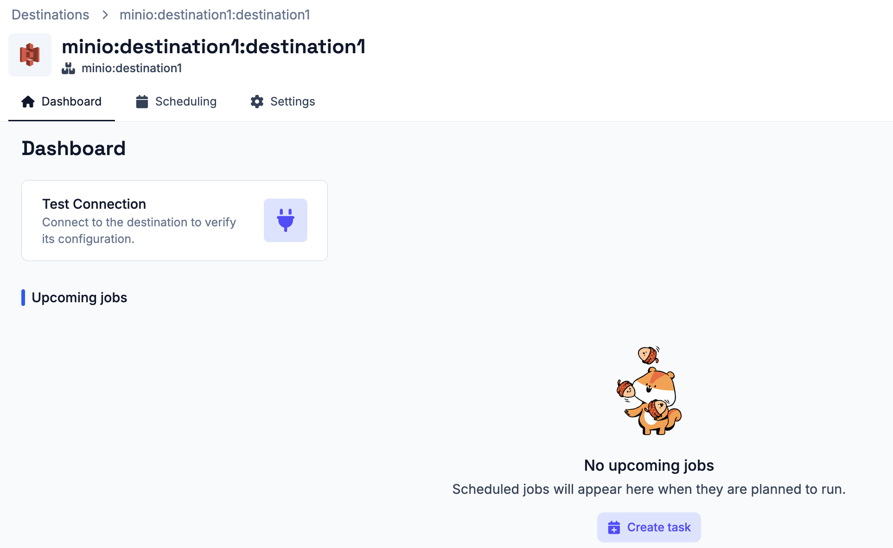
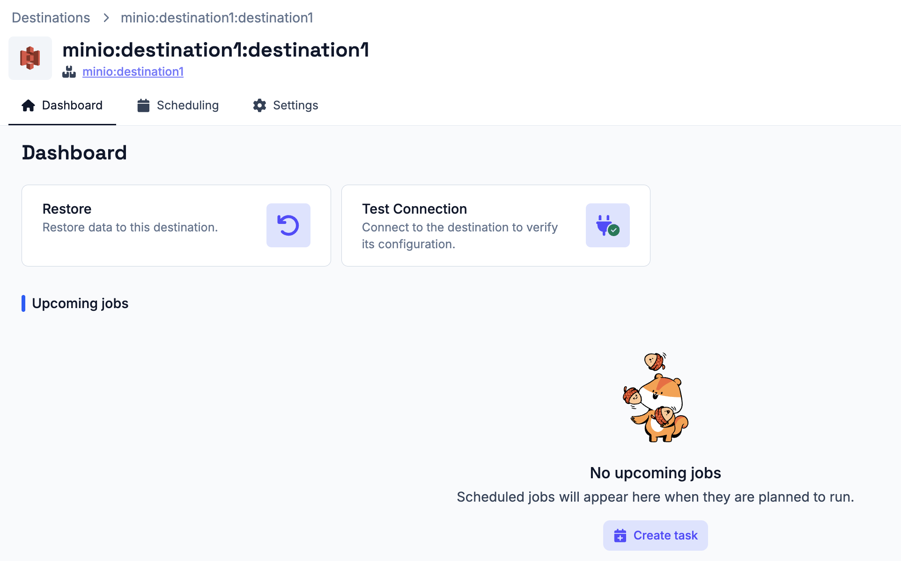

# Destination App

A destination app defines where Plakar Control Plane can restore backup data.

## Assigning a destination app

Destination apps are assigned from the **Resources** page. Click on a resource
to open it, then go to the **Apps** tab. This tab shows all source and
destination apps already assigned to the resource and allows you to assign new
ones. Store apps are not managed from here, see the [store app](../stores)
documentation for how to assign a store.

To assign a destination app, click **Assign app** from the **Apps** tab and
select **Destination**. Then provide a name for the app. The name is used to
distinguish this app when multiple apps of the same type are configured for the
same resource.

Plakar Control Plane checks the resource `class` and `subclass` to find
compatible integrations. If only one integration is compatible, it is selected
automatically, which is the most common case. If multiple integrations are
compatible, you will need to select one manually.

Finally, provide the configuration and credentials required for the selected
resource. See the [resources documentation](../../resources) for the required
fields.

## Testing the connection

Once a destination app is created, its details page provides a **Dashboard** tab
with a **Test Connection** action. Use this to verify that Plakar Control Plane
can connect to the destination using the provided configuration and credentials.

If the connection test fails, check the app configuration and credentials, then
run the test again. Once the store has been initialized, additional actions
become available from the dashboard:

- **Restore Backup** - restore a backup to this destination

## Tasks and Schedules

Tasks can be created directly from the destination app dashboard or from the
**Operations > Scheduling** section. See the
[scheduling documentation](../../operations/scheduling) for details on creating
and managing tasks and schedules.

