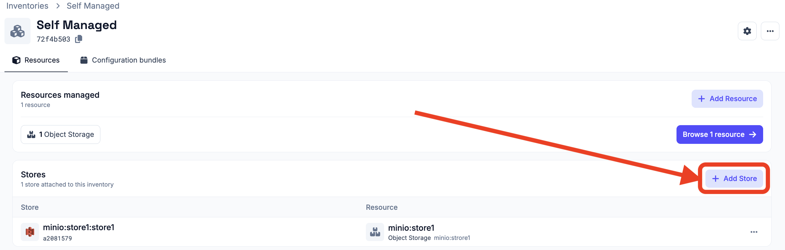
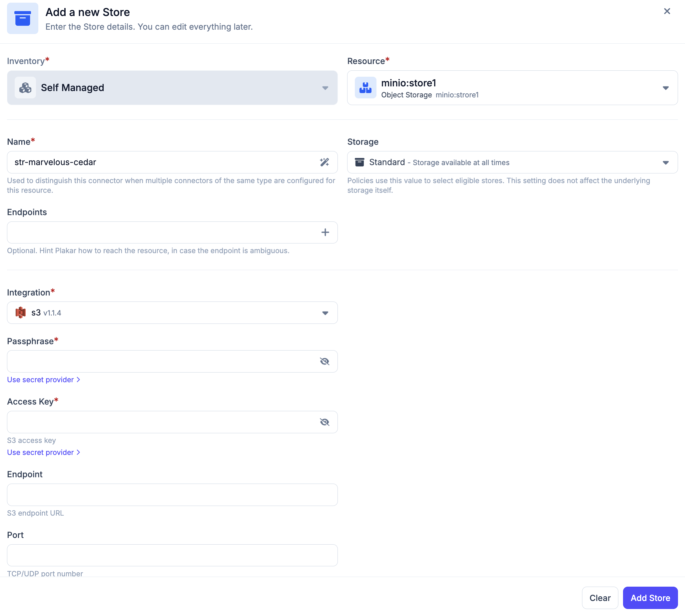
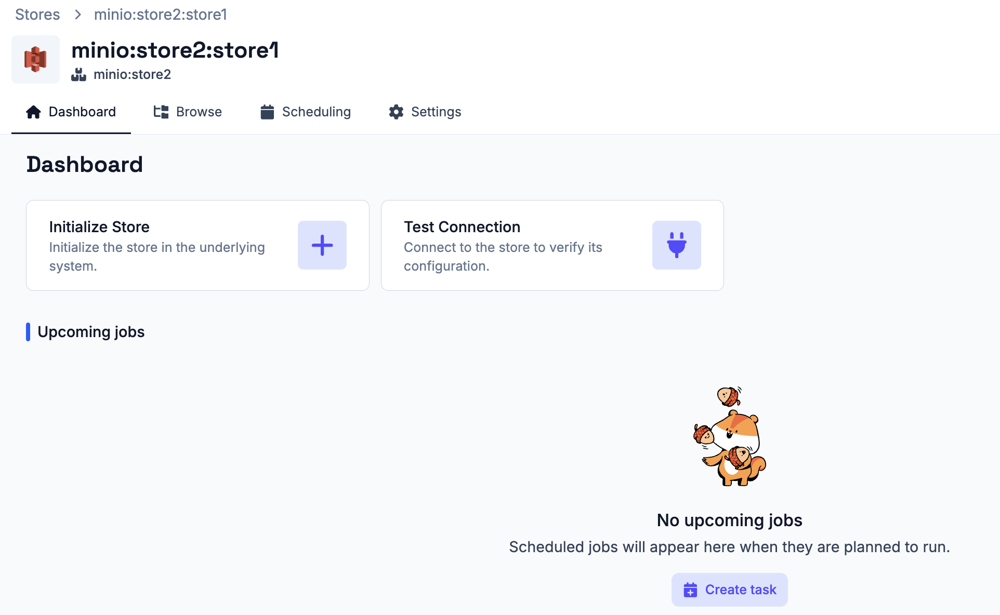
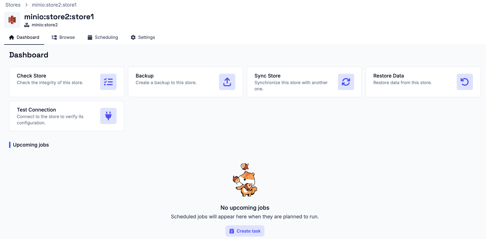
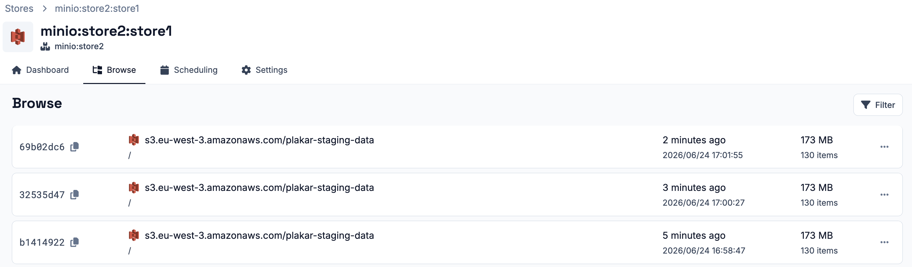
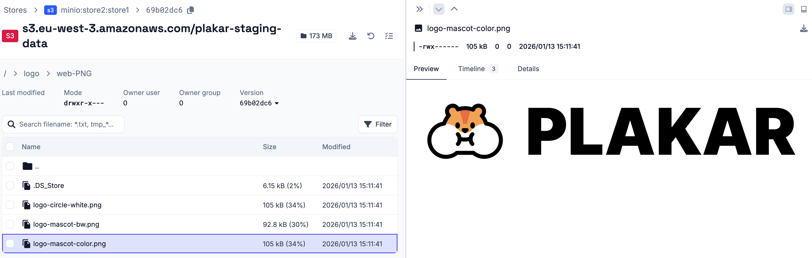

# Store App

A store app defines where Plakar Control Plane stores backup data.

## Creating a store app

To create a store app, open the **Inventories** page and click on the inventory
that contains the resource you want to use as a store. From the inventory
details page, click **Add Store** and select the resource to use as the store.
Provide a name for the app. The name is used to distinguish this app when
multiple apps of the same type are configured for the same resource.

Plakar Control Plane checks the resource `class` and `sub-class` to find
compatible integrations. If only one integration is compatible, it is selected
automatically, which is the most common case. If multiple integrations are
compatible, you will need to select the integration manually.

Some integrations support multiple protocols. For example, the Scaleway
integration supports three protocols, that is `scaleway-instance`,
`scaleway-block`, and `scaleway-secrets` and you will need to select the
appropriate one after choosing the integration.

Next, select a **Storage Type**:

- **Standard** - the store is available at all times
- **Cold** - the store uses archival storage where data must be retrieved before
  it can be accessed, such as Amazon S3 Glacier

The storage type is used by the policies engine to infer the nature of the
store. It does not affect the underlying storage itself.

Finally, provide the configuration and credentials required for the selected
resource. See the [resources documentation](../../resources) for the required
fields.

## Testing and initializing

Once a store app is created, its details page provides a **Dashboard** tab with
actions for testing and initializing the store. Use **Test Connection** to
verify that Plakar Control Plane can connect to the store using the provided
configuration and credentials.

If the selected store has already been initialized by Plakar Control Plane and
contains an existing Kloset store, the connection test detects it automatically
and no additional initialization is required.

If the store is in a new location, such as a new S3 bucket that has never been
used by Plakar before, you must use the **Initialize Store** action before the
store can receive backups. This prepares the store with the metadata and
structure required to receive backup data.

If the connection test fails, check the app configuration and credentials, then
run the test again. Once the store has been initialized, additional actions
become available from the dashboard:

- **Check Store** - create an integrity check task for the Kloset store
- **Create Backup** - create a backup task to the store
- **Sync Store** - create a synchronization task to another store
- **Restore Data** - create a restore task from the store

## Browsing Restore Points

You can view all backup restore points stored on a store from the **Browse** tab.

From there, you can view the files contained in each restore point and download
individual files without performing a full restore.

## Tasks and Schedules

Tasks can be created directly from the store app dashboard or from the
**Operations > Scheduling** section. See the
[scheduling documentation](../../operations/scheduling) for details on creating
and managing tasks and schedules.

