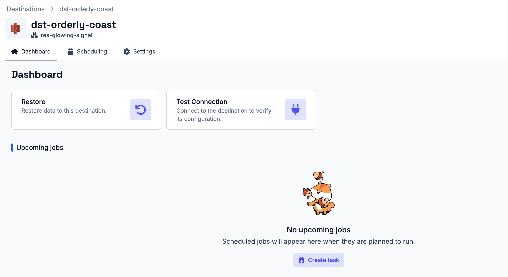

# Destination Connector

A destination connector defines where Plakar Control Plane can restore backup
data. Once a destination connector is created, its details page provides a
**Dashboard** tab with a **Test Connection** action.

Use **Test Connection** to verify that Plakar Control Plane can connect to the
destination using the provided configuration and credentials.

If the connection test fails, check the connector configuration and credentials,
then run the test again. Once the connection test succeeds, restore actions
become available from the dashboard:

- **Create Restore** - create a restore task to this destination

## Tasks and Schedules

Operations in Plakar Control Plane are managed by the scheduler. A task can be
created as a one-off operation or attached to a schedule so that it runs
repeatedly.

One-off tasks are useful when you want to run an operation immediately and do
not need it to repeat. Scheduled tasks are useful when you want Plakar Control
Plane to run an operation on a regular basis.

See the [scheduling documentation](../../operations/scheduling) for details on
creating and managing schedules.

## One-off Tasks on the Destination

### Restore Task

A restore task restores backup data from a store connector to this destination.
When creating a restore task from the destination connector, you must select the
[store connector](../stores) that contains the backup data to restore. You can
also select the snapshot to restore. If no snapshot is selected, Plakar Control
Plane restores the latest available snapshot.

You can also add a label to the task. See the
[scheduling documentation](../../operations/scheduling) for more details on
using labels. A restore task can be started immediately as a one-off task, or
attached to a schedule if you want the restore to run repeatedly.

Once the task has been created, you can follow its progress from the jobs
history page. This page shows the task status and progress, and also allows you
to cancel a running task when needed.

