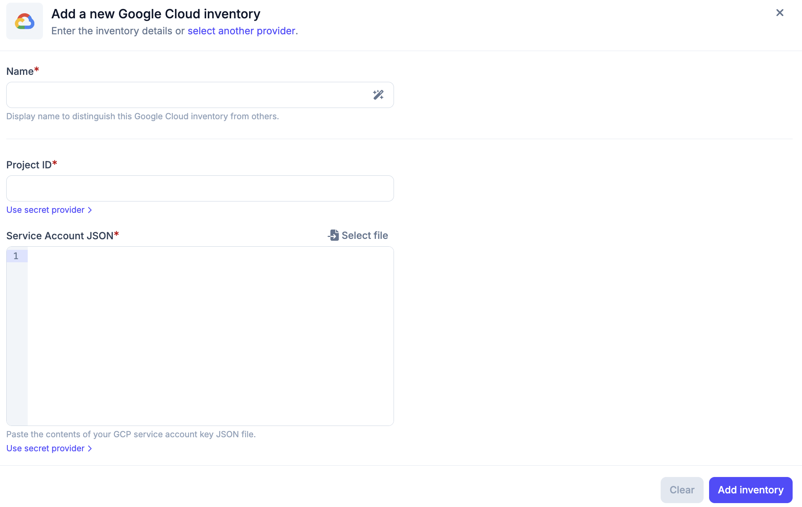
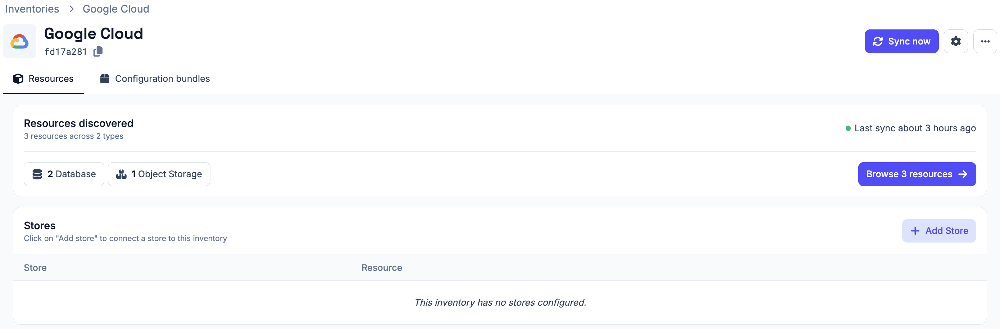
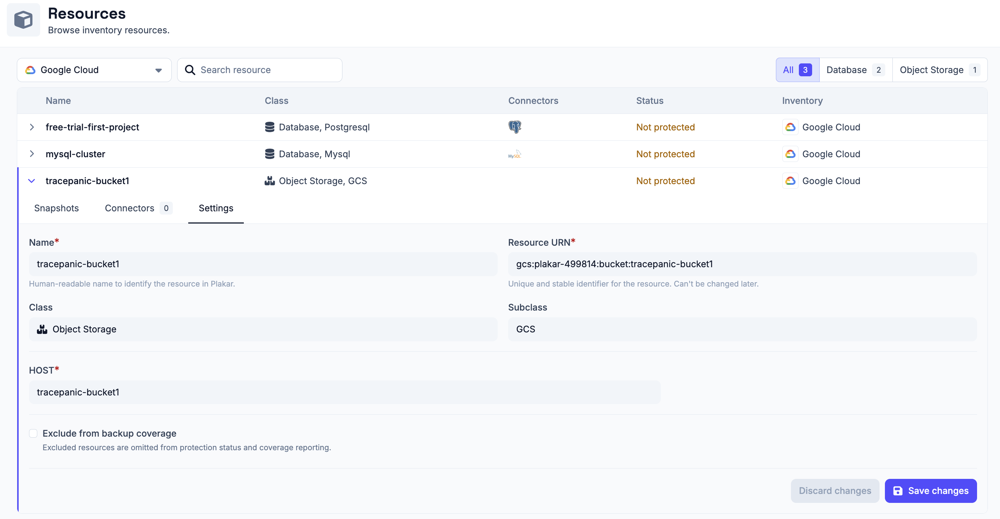

# Google Cloud Inventory

The Google Cloud inventory allows Plakar Control Plane to connect to your Google
Cloud project and discover resources within it.

Once connected, Plakar Control Plane discovers supported Google Cloud resources
and makes them available for management directly within Plakar Control Plane.

## Supported Resources

| Resource           | Source | Store | Destination |
| ------------------ | ------ | ----- | ----------- |
| Cloud Storage      | Yes    | Yes   | Yes         |
| CloudSQL (MySQL)   | Yes    | No    | Yes         |

## Authentication

Google Cloud inventories authenticate using a service account key. The service
account must have a custom IAM role with the permissions required to discover
resources in the Google Cloud project you want to inventory.

When creating a Google Cloud inventory in Plakar Control Plane, you must
provide:

- **Name** for the inventory
- **Project ID**
- **Service account key** (JSON)

The service account key can be pasted directly as JSON or the JSON file can be
uploaded directly.

For more information on creating custom IAM roles, service accounts, and service
account keys, see
[Managing IAM Roles and Service Accounts](../../../guides/google-cloud/iam-roles-and-service-accounts).

## Required Permissions

Plakar Control Plane requires read access to Google Cloud resources so it can
discover and classify them during inventory synchronization.

The custom IAM role assigned to the service account must include the following
permissions:

| Permission                             | Description                                   |
| -------------------------------------- | --------------------------------------------- |
| `cloudasset.assets.searchAllResources` | Searches for resources across the project     |
| `cloudsql.instances.get`               | Retrieves details of a CloudSQL instance      |
| `cloudsql.instances.list`              | Lists CloudSQL instances in the project       |
| `storage.buckets.get`                  | Retrieves metadata for a Cloud Storage bucket |
| `storage.buckets.list`                 | Lists Cloud Storage buckets in the project    |

## Adding the Google Cloud Inventory

When creating a new Google Cloud inventory, provide the inventory name, project
ID, and the service account key JSON.

The service account key can be entered in two ways:

- **Paste the JSON content** directly into the field
- **Select a file** using the file picker to load the JSON key file from your
  machine

After creating the inventory, trigger a synchronization to discover and load
resources from the configured Google Cloud project. You can run synchronization
again at any time to refresh the inventory, for example after creating new Cloud
Storage buckets or CloudSQL instances.

All configuration details provided during inventory creation can be updated
later by clicking the settings icon in the top right of the inventory page,
which opens a settings popup.

## Managing Resources

Resources in a Google Cloud inventory are automatically discovered and
synchronized. They are managed by the inventory and cannot be manually created
or deleted from Plakar Control Plane.

You can expand a resource row to view its details. Each row expands to show
three tabs:

- **Snapshots** - lists backups taken for this resource
- **Connectors** - shows connectors associated with this resource
- **Settings** - configure the resource, including backup coverage

Backup coverage tracks how many of your resources are protected by backups. If a
resource does not need to be backed up, for example a test database or temporary
bucket, you can exclude it from coverage using the **Exclude from backup
coverage** option in the **Settings** tab. Excluded resources are omitted from
protection status and coverage reporting.

