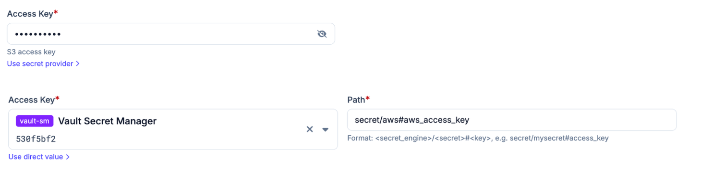

# Secret providers

Plakar Control Plane handles sensitive credentials like tokens, passwords, and
more. When configuring an app, inventory, or any other resource that
requires a credential, Plakar Control Plane gives you two options.

- **Direct value:** stores the credential directly in the Plakar Control Plane
  database. This is the simplest option and works well for most setups.
- **Secret provider:** delegates the credential resolution to an external secret
  manager. Instead of storing the value itself, Plakar Control Plane stores a
  path that points to the secret in your secret manager, and resolves it at
  runtime.

Using a secret provider is recommended if your organization already manages
credentials centrally, or if you want to avoid storing sensitive values in the
database.

## Setting up a secret provider

Before you can use a secret provider, you need to configure one. See the
provider-specific instructions for your secret manager:

## [AWS Secrets Manager](https://plakar.io/docs/control-plane/infrastructure/secret-providers/aws/index.md)

## [HashiCorp Vault](https://plakar.io/docs/control-plane/infrastructure/secret-providers/vault/index.md)

## [Scaleway Secret Manager](https://plakar.io/docs/control-plane/infrastructure/secret-providers/scaleway/index.md)

## [GCP Secret Manager](https://plakar.io/docs/control-plane/infrastructure/secret-providers/gcp/index.md)

