# VMware vSphere Installation

Plakar Control Plane can be deployed on vCenter using the vSphere HTML Client.
Two deployment methods are supported:

- **OVA**: imports a pre-built appliance with the recommended virtual machine
  configuration already defined, including CPU and memory settings
- **ISO**: creates a virtual machine manually and boot from the Plakar Control
  Plane ISO image, requiring the virtual machine configuration to be done
  manually

Both images can be downloaded from the
[Plakar Control Plane Downloads Page](https://www.plakar.io/download).

## Installation from OVA

In the vSphere HTML Client, open **Hosts and Clusters** (first column on the
sidebar), right-click the datacenter that will contain the appliance, and select
**Deploy OVF Template**.

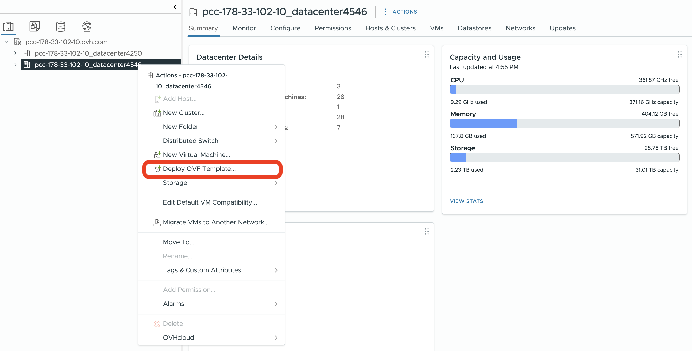

### Select an OVF template

The deployment wizard supports both a local file upload and a remote HTTP or
HTTPS URL. For most deployments, choose **Local file** and upload the Plakar OVA
from your workstation.

> [!WARNING]+
>
> URL-based imports are more sensitive to reachability and URL format than a
> direct upload. If you use the URL option, the OVA must be hosted at a stable,
> directly reachable HTTP or HTTPS URL that the VMware infrastructure can fetch.
> For a standalone installation, a local file upload is the more predictable
> path.

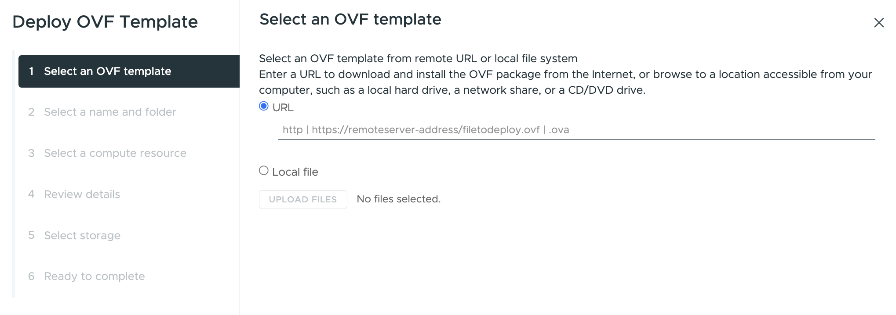

### Specify a name and target location

Enter a name for the virtual machine and select the datacenter as the target
location.

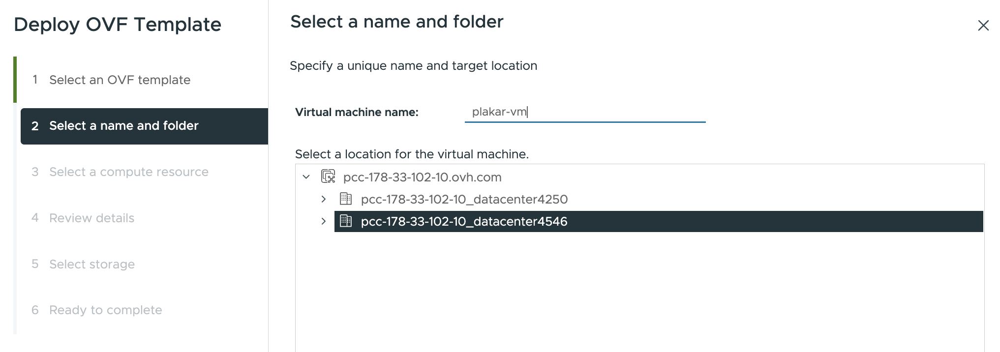

### Select a compute resource

Select the destination compute resource for the datacenter. This will typically
be your cluster, for example `Cluster1`.

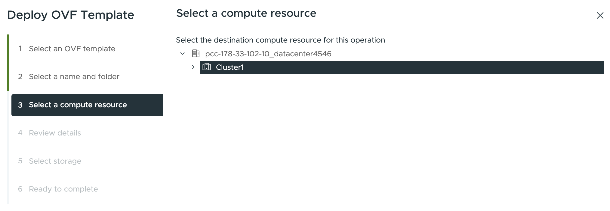

### Review details

The wizard displays package metadata for the OVA. It is normal for vSphere to
warn that the OVF package contains advanced configuration options. VMware
documents that these settings can include BIOS UUID information, MAC addresses,
boot order, and PCI slot numbers. If the OVA was downloaded from the Plakar
downloads page, this warning is expected and can be dismissed by clicking
**Next**.

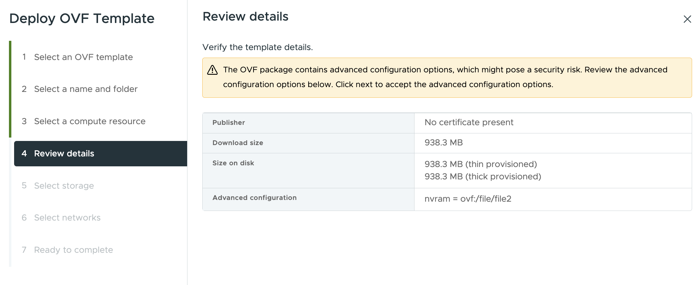

### Select storage

Select the datastore that will hold the virtual machine configuration and disk
files.

> [!NOTE]+
>
> Avoid selecting a host-local datastore such as `storageLocal` for production
> deployments. A host failure will leave the virtual machine unable to restart
> if its disk files are on local storage that is not accessible to other hosts
> in the cluster.

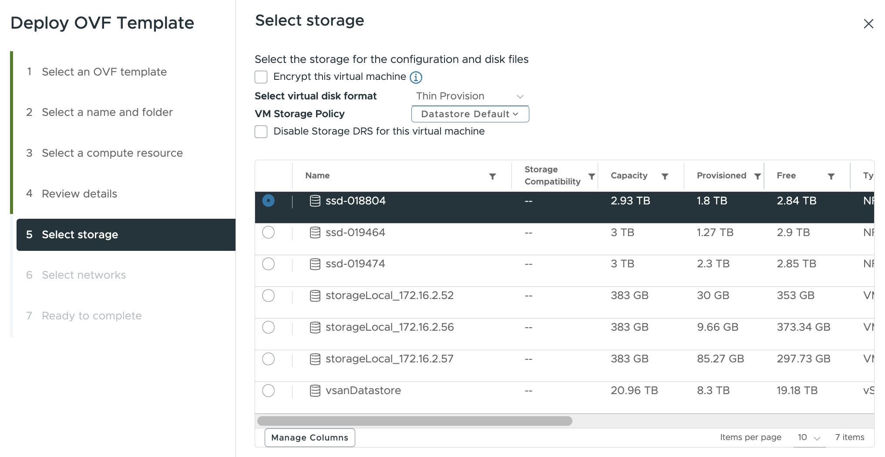

### Select networks

Map the source network to the destination network segment you have prepared in
your vCenter environment. If your environment uses an NSX-backed network segment,
select it as the destination network, for example `plakar-network`.

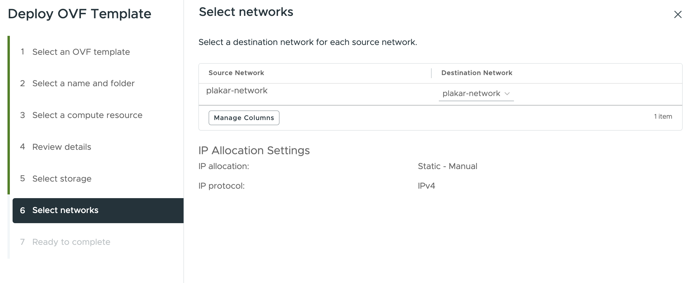

### Ready to complete

Review your selections and click **Finish**. You can monitor the import progress
from **Recent Tasks** until the virtual machine appears in the inventory.

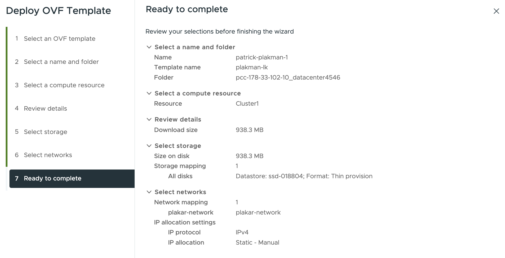

## Installation from ISO

The ISO installation method creates a new virtual machine manually and boots it
from the Plakar Control Plane ISO image. This method is used when you want to
configure the virtual machine hardware yourself instead of importing the
pre-built OVA appliance.

### Upload the ISO to a datastore

Before creating the virtual machine, upload the Plakar Control Plane ISO to a
datastore that can be accessed by the host or cluster that will run the
appliance.

In the vSphere HTML Client, open the datastore where you want to store the ISO,
then open the Files view. Create a folder for ISO images if needed, then upload
the Plakar Control Plane ISO from your workstation.

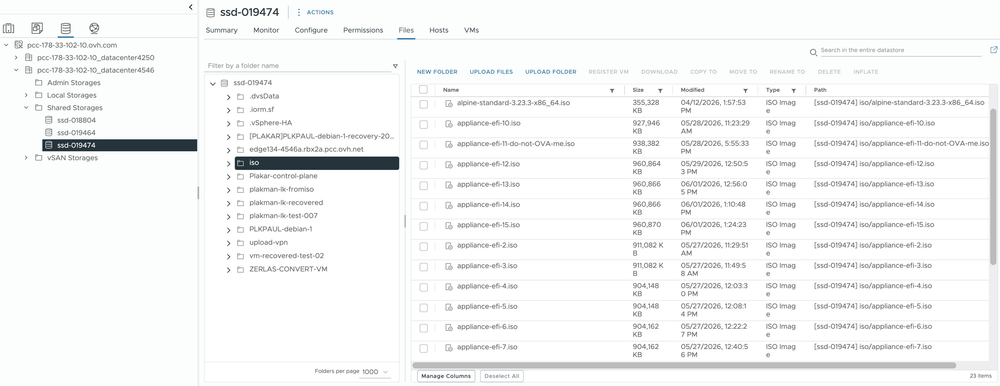

> [!NOTE]+
>
> Prefer a shared datastore for ISO images and production virtual machines.
> Keeping the ISO or the virtual machine disk files on host-local storage can
> cause access issues when the VM needs to run on another host.

### Create a new virtual machine

In the vSphere HTML Client, open **Hosts and Clusters** (first column on the
sidebar), right-click the datacenter that will contain the appliance, and select
**New Virtual Machine**.

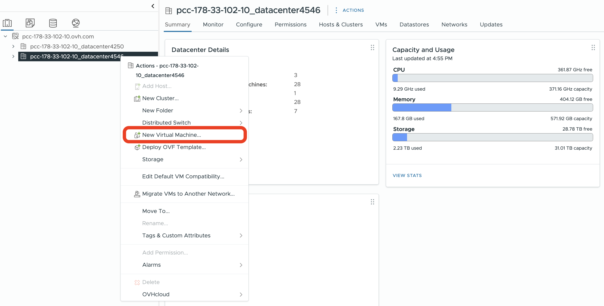

### Select a creation type

Select **Create a new virtual machine** and click **Next**.

### Specify a name and target location

Enter a name for the virtual machine and select the datacenter as the target
location.

### Select a compute resource

Select the destination compute resource for the datacenter. This will typically
be your cluster, for example `Cluster1`.

### Select storage

Select the datastore that will hold the virtual machine configuration and disk
files.

> [!NOTE]+
>
> Avoid selecting a host-local datastore such as `storageLocal` for production
> deployments. A host failure will leave the virtual machine unable to restart
> if its disk files are on local storage that is not accessible to other hosts
> in the cluster.

### Select compatibility

The compatibility setting determines the virtual hardware version available to
the virtual machine. Leave this at the default, **ESXi 8.0 U2 and later**
(hardware version 21), which provides the best performance and access to the
latest features supported by your vCenter environment. Click **Next**.

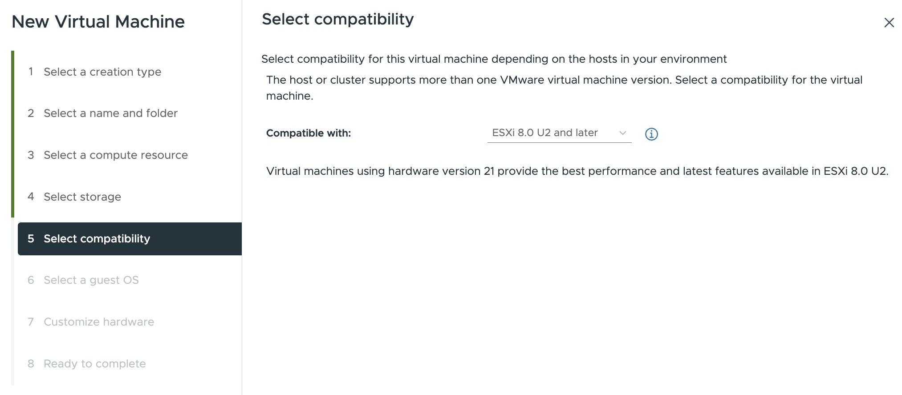

### Select a guest OS

Set the guest OS family to **Linux**, then select the closest modern 64-bit
Linux profile available in your vCenter. On many vSphere 8 environments, this
option is **Other 6.x or later Linux (64-bit)**. Click Next.

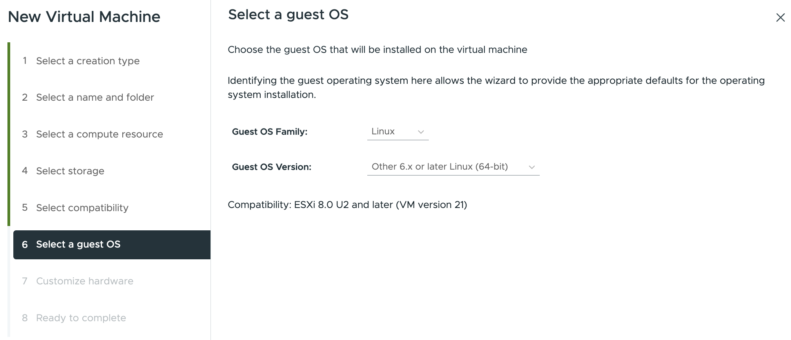

### Customize hardware

Configure the virtual machine with the recommended Plakar Control Plane sizing:

- CPU: 4vCPU
- Memory: 16 GB
- Hard disk: 1 TB

For the **CD/DVD Drive**, select **Datastore ISO File**, then browse to the
Plakar Control Plane ISO that you uploaded earlier. Enable **Connect At Power
On** so that the virtual machine boots from the ISO when it starts.

Attach the network adapter to the network segment you prepared for the
appliance, such as your NSX-backed segment or another destination network in
your vCenter environment. Select **Browse** then select your network, for
example `plakar-network`.

Other hardware settings can be left at their default values.

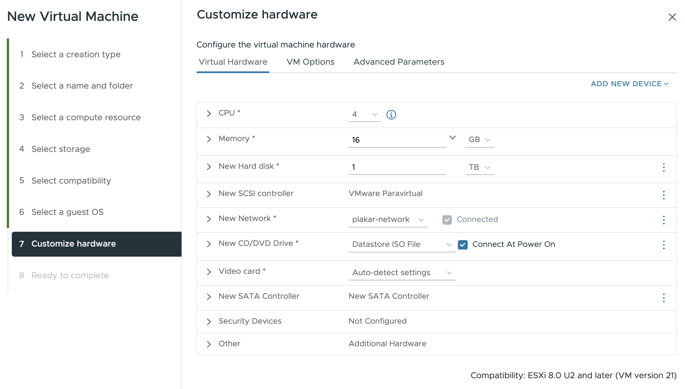

## Post-deployment configuration

After the virtual machine has been created, you need to do some VMware
configuration before the first power-on.

On the ISO path, the recommended 1 TB storage is already configured during
virtual machine creation. On the OVA path, you need to add the extra 1 TB data
disk.

You can edit the VM settings by right clicking on the VM then selecting **Edit
settings**. This opens a dialog with three tabs. We can add the extra 1TB data
disk from the **Virtual Hardware** tab by clicking on **Add New Device**, select
**Hard Disk** and set it to 1 TB.

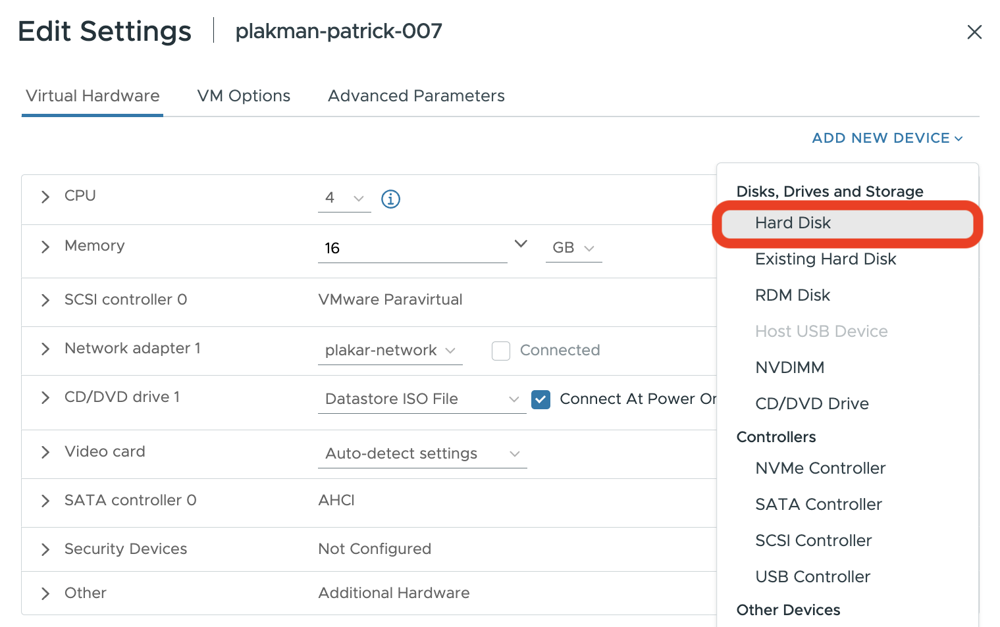

### Add Advanced Configuration Parameters

You can setup the parameters from the **Advanced Parameters** tab and set the
following information. You'll need to add this setup to both ISO and OVA
installation methods.

| Parameter                  | Description                                      |
| -------------------------- | ------------------------------------------------ |
| `guestinfo.plakar.ip`      | Appliance IP address with CIDR mask              |
| `guestinfo.plakar.dns`     | DNS resolver used by the appliance e.g `1.1.1.1` |
| `guestinfo.plakar.gateway` | Network gateway for the selected segment         |

The gateway can usually be found from the NSX network segment configuration.

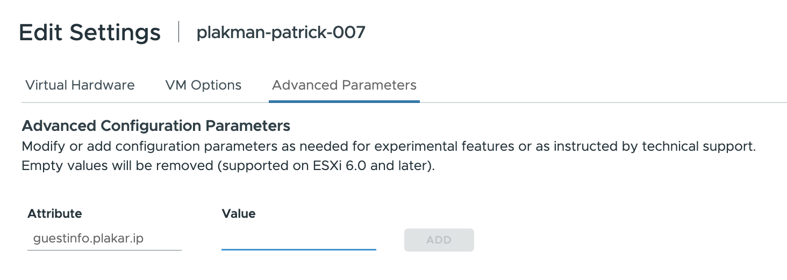

### Optional: enable SSH access

SSH access is optional and is not required for a standard installation.

Plakar Control Plane is designed to be managed from the web interface. Only
enable SSH if you intentionally need administrative shell access for your
environment.

To inject an SSH public key, add the following advanced parameter before booting
the VM:

| Parameter                              | Description                     |
| -------------------------------------- | ------------------------------- |
| `guestinfo.plakar.ssh_authorized_keys` | Contents of your SSH public key |

After the virtual machine has booted, connect to it with the `plakar` user:

```sh
ssh plakar@<ASSIGNED-IP>
```

Replace `<ASSIGNED-IP>` with the IP address configured in `guestinfo.plakar.ip`.

## Start the appliance and complete enrollment

Power on the virtual machine. Once the appliance has booted and is reachable on
the network, open it from a browser using its assigned IP address.

```txt
http://<ASSIGNED-IP>
```

For production environments, restrict access to trusted IP ranges, private
networking, a VPN, or a reverse proxy or load balancer with TLS.

For first-time installations, you will be guided through the enrollment process
to:

- Register the instance with Plakar services for licensing and billing
- Create the initial administrator account

See the [enrollment](../../enrollment) documentation for more details.

