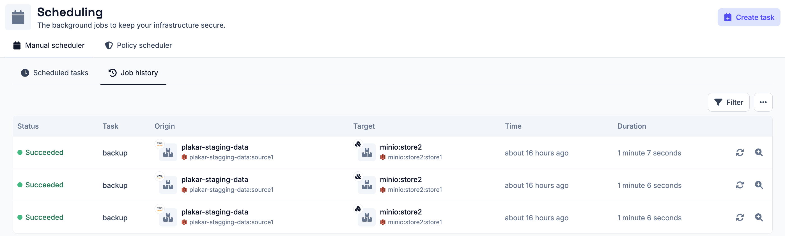
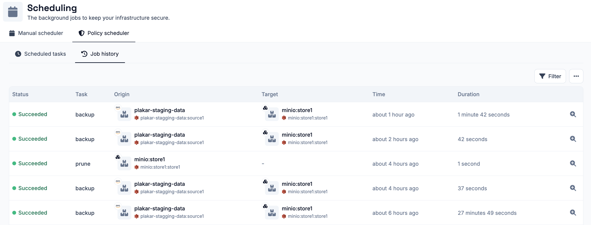
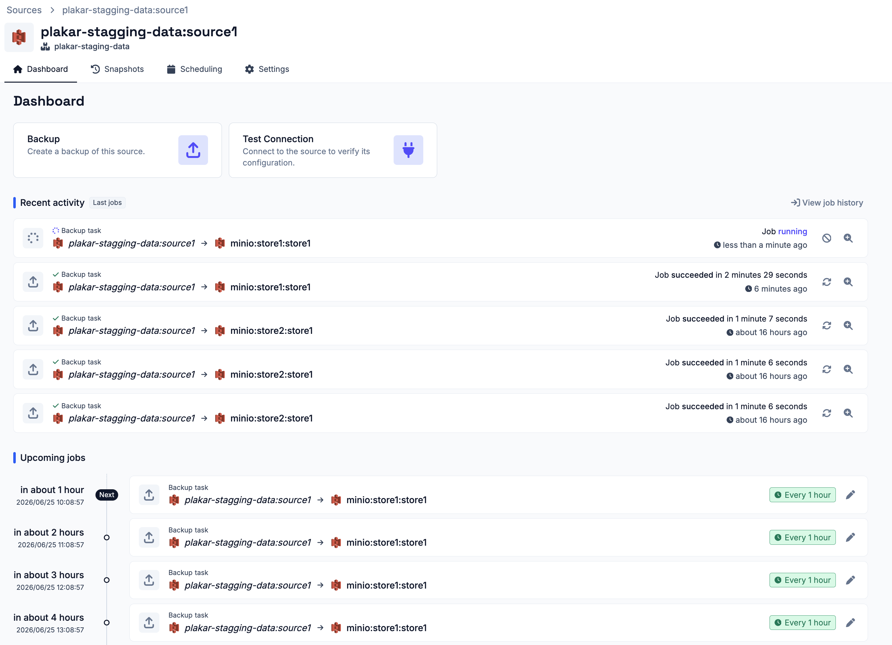
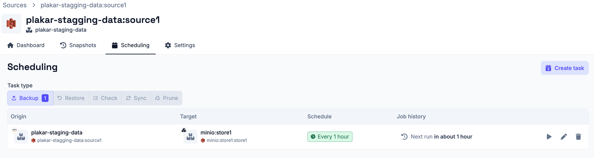

# Job History

The **Operations > Scheduling** section includes a **Job History** for both the
[manual scheduler](../manual-scheduler) and the
[policy scheduler](../policy-scheduler) that lists all jobs that have run,
whether they succeeded or failed, along with any jobs that are currently
running.

Each job has a details popup with the following information:

- **Job ID** - a unique identifier for the job
- **Status** - the outcome of the job: succeeded, failed, or running
- **Snapshot** - a link to browse the snapshot produced by the job, once the
  backup is complete
- **Progress** - the current progress of the job
- **Output** - the full log output for the job, useful for diagnosing failures



If a job is currently running, the output updates in real time and a **Cancel**
button is available to stop the job.

Failed or successful jobs from the manual scheduler can be retried directly from
the job history list. This is not available for jobs triggered by the policy
scheduler, as those are fully managed by the policies engine.



## Jobs and Schedules on Connectors

Each connector also surfaces scheduling information on its own details page:

- The **Dashboard** tab lists all past and upcoming jobs involving that
  connector, scoped to that connector only.
- The **Scheduling** tab lists all schedules that involve that connector, so you
  can see at a glance what is configured to run and when.

 

