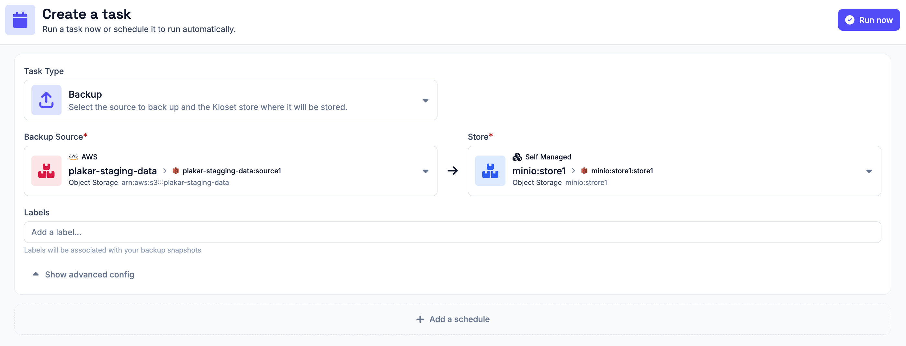
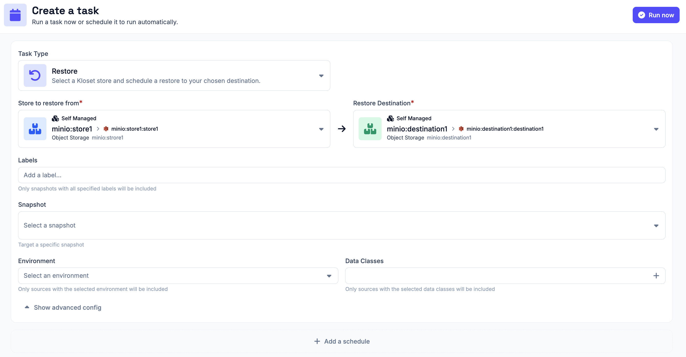
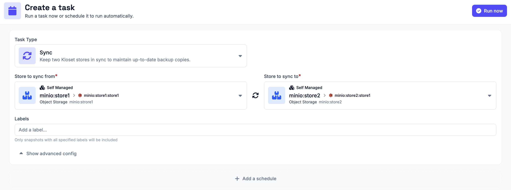
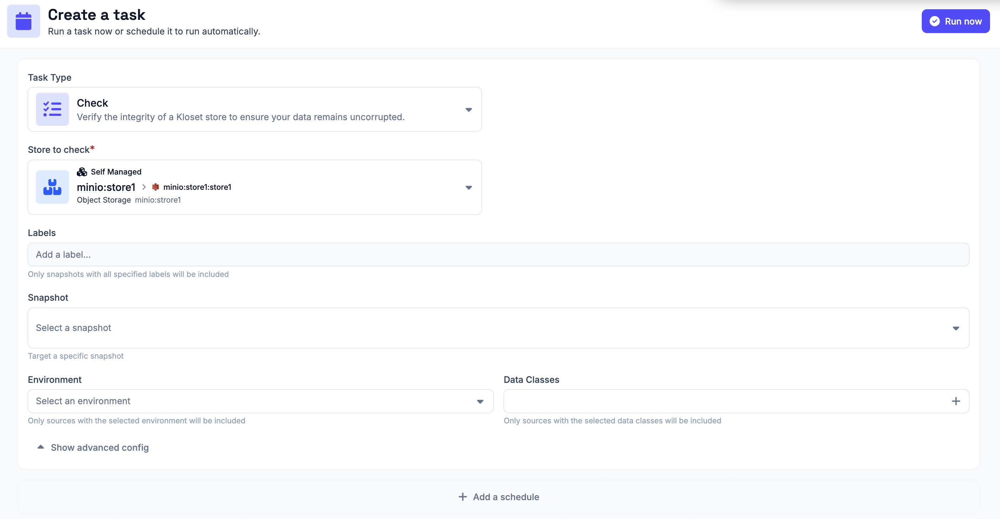

# Scheduled Tasks

Plakar Control Plane runs operations as tasks. There are four types of tasks,
each requiring a different combination of connectors. Any task can be run once
as a one-off operation or attached to a schedule so that it repeats
automatically.

## Backup Task

A backup task stores backup data from a source connector into a store connector.
It requires a source connector and a store connector.

## Restore Task

A restore task restores data from a store connector to a destination connector.
It requires a store connector and a destination connector. If no snapshot is
selected, Plakar Control Plane restores the latest available snapshot.

## Sync Task

A sync task copies backup data from one store connector to another. It requires
two store connectors. This is useful for replicating backups to a second
location or a different storage tier.

## Check Task

A check task verifies the integrity of data in a store connector. It checks that
the backup data can be read correctly and validates file MACs to make sure no
corruption has occurred. It requires a store connector. By default the entire
store is checked, but you can select a specific snapshot to check only that
snapshot.

