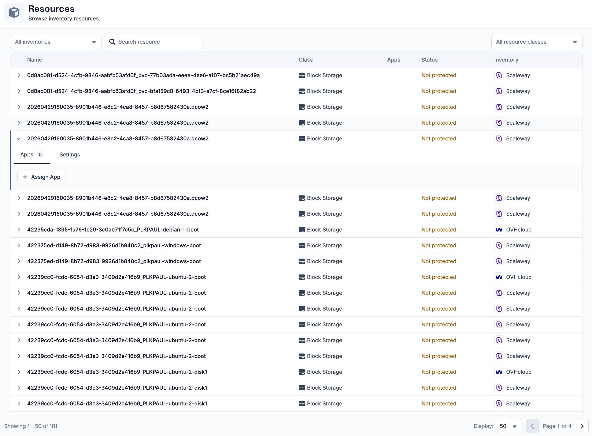
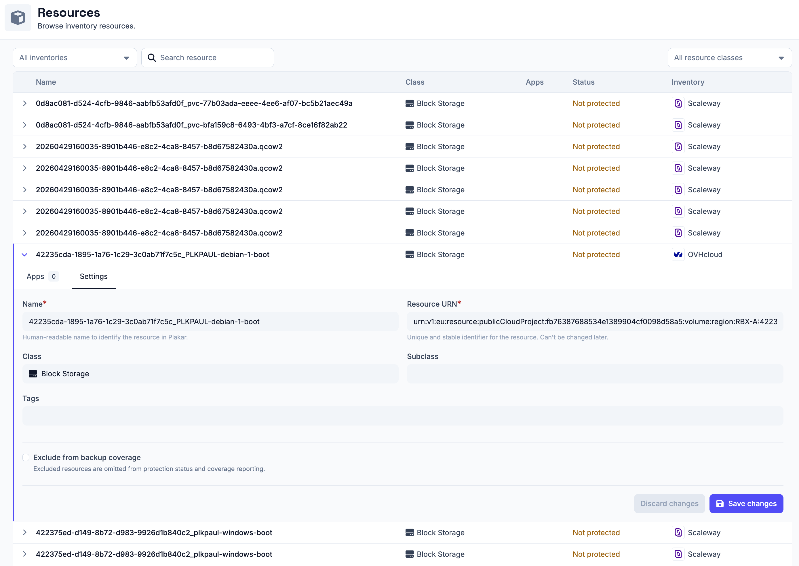

# Resources

Resources are the individual systems, services, or storage targets that Plakar
Control Plane manages as part of a backup workflow. Examples of resources
include S3 buckets, EC2 instances, PostgreSQL databases, virtual machines, and
filesystems.

All resources discovered across all inventories are available under
**Infrastructure -> Resources**. From here a resouce can be assigned to either a
[source](../apps/sources) or a [destination](../apps/destinations) app. You can
also filter resources by inventories or by resource class.

## Resource settings

Resource settings can be updated from the **Settings** tab under each resource.
For managed inventories, most settings are read-only since the resource is
managed by the inventory. For self-managed inventories, all settings can be
modified. Backup coverage can be modified for any resource regardless of
inventory type.

Backup coverage tracks how many of your resources are protected by backups. If a
resource does not need to be backed up (for example, a test database), you can
exclude it from coverage using the **Exclude from backup coverage**. Excluded
resources are omitted from protection status and coverage reporting.

## Resource classification

Each resource is assigned a `class` and `subclass` that describe what kind of
infrastructure it is.

The `class` describes the general category the resource belongs to, while the
`subclass` identifies the specific implementation or provider. Plakar Control
Plane uses this classification to determine which integrations are compatible
with a resource.

## Supported resources

The following pages document the supported resource types and the configuration
required to use each one as a source, store, or destination.

## [Object Storage](https://plakar.io/docs/control-plane/resources/object-storage/index.md)

- [S3](https://plakar.io/docs/control-plane/resources/object-storage/s3/index.md): How to configure an S3 resource in Plakar Control Plane.
- [Azure Blob Storage](https://plakar.io/docs/control-plane/resources/object-storage/azblob/index.md): How to configure Azure Azblob resource in Plakar Control Plane.
- [Google Cloud Storage](https://plakar.io/docs/control-plane/resources/object-storage/gcs/index.md): How to configure a Google Cloud Storage resource in Plakar Control Plane.

## [Block Storage](https://plakar.io/docs/control-plane/resources/block-storage/index.md)

- [Scaleway Block Storage](https://plakar.io/docs/control-plane/resources/block-storage/scaleway/index.md): How to configure a Scaleway block storage resource in Plakar Control Plane.

## [Compute](https://plakar.io/docs/control-plane/resources/compute/index.md)

- [Scaleway Compute](https://plakar.io/docs/control-plane/resources/compute/scaleway/index.md): How to configure a Scaleway compute resource in Plakar Control Plane.
- [SFTP](https://plakar.io/docs/control-plane/resources/compute/sftp/index.md): How to configure an SFTP resource in Plakar Control Plane.

