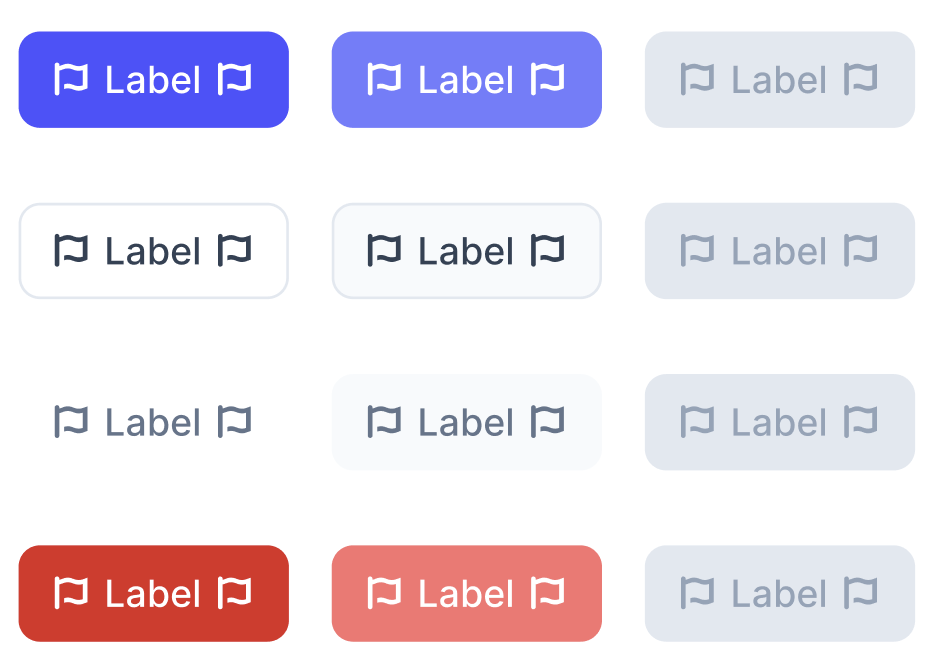
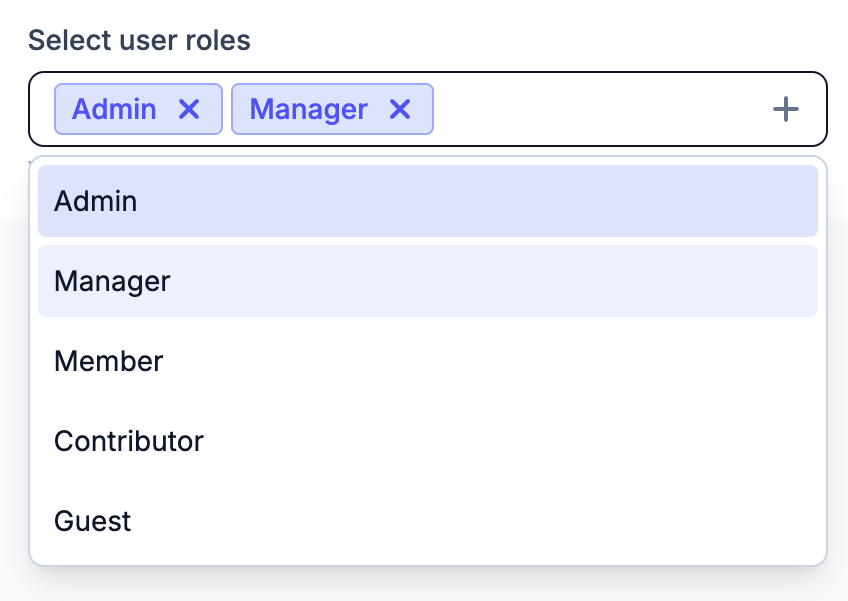
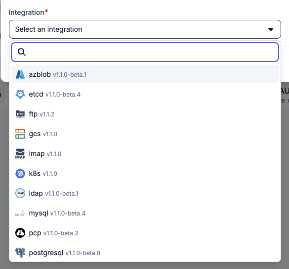

When you think about a UI component library, you probably picture something visual: buttons, dropdowns, date pickers. What you might not immediately think about is everything that has to work beneath the visual surface for those components to be truly usable. The select component has to fetch the list of options using an API call, and fetch the next page as the user scrolls. The date picker has to manage focus correctly so navigating with a keyboard is possible. You expect the popover to work on mobile, and the tooltip must be clickable on touch devices. All of this is invisible to the user, but it's what separates a component that looks right from one that actually works.

## Why rolling your own is harder than it looks

A `<button>` and a `<select>` in plain HTML get you somewhere. But the moment you build anything slightly more complex, a combobox with filtering, a multi-select with tags, a date range picker, you're on your own.

Take a custom dropdown. It's usually a `<div>` with a click handler that toggles a list. Looks fine on screen. But there's no keyboard navigation, no focus management, no touch handling on mobile, no correct behavior when the popover needs to reposition near the edge of the viewport. None of that comes for free. Implementing it correctly for a single component takes days. Doing it for a full suite of components takes months, and you'll still hit edge cases you didn't anticipate.

At some point, you either accept that your components will be half-broken, or you reach for a library that has already paid that cost.

## We considered MUI, and decided against it

Material UI (MUI) is one of the most popular React component libraries out there. It gives you a full set of production-ready components -- buttons, forms, tables, dialogs, date pickers -- all styled according to Google's Material Design guidelines. The components look polished out of the box. The problem is, they look like MUI. That aesthetic is immediately recognizable, and once you've seen it you can't unsee it.

When we started building Plakar UI, it was the obvious candidate. It's comprehensive, battle-tested, and has a massive community. We spent some time seriously considering it.

But we were working with [Pelostudio](https://pelo.studio/) on our visual identity. They helped us define our fonts, our colors, our mascot, the whole design system. Shipping a product that looks like every other MUI app on the internet was not an option. We wanted something that looks like Plakar, and that meant picking a library that stays out of the way visually.



## We started with Headless UI

Unstyled component libraries separate interaction logic from visual design. You style everything yourself; the library handles the behavior.

The first version of Plakar UI was built on [Headless UI](https://headlessui.com/). If you use Tailwind, it's almost the natural choice: Tailwind's own documentation and code examples use Headless UI throughout, so you end up reaching for it without much deliberation. It worked well for what it offered, but the catalog was limited, around a dozen components. There was no date picker, no combobox with filtering, a fairly basic select. For anything beyond those primitives, you were back to building from scratch. We also hit a few frustrating bugs that we never fully tracked down. Nothing catastrophic, but enough friction that we started looking at alternatives.

The real push was component breadth. We needed more, and Headless UI wasn't going to get us there.

## Enter React Aria Components

[React Aria Components](https://react-spectrum.adobe.com/react-aria/components.html) is Adobe's take on unstyled interactive components. It's part of the React Spectrum family, which powers Adobe's own products, and the depth of the catalog reflects that.

Where Headless UI offers around a dozen components, React Aria ships over forty. Every component ships with correct keyboard navigation, focus management, touch support, and proper behavior across browsers. A few of the less obvious ones that we actually use: DateRangePicker, RangeCalendar, TagGroup, Slider. The work has been done; you just compose and style.

The learning curve is real. React Aria doesn't give you a single `<Select />` with twenty props. Instead it gives you building blocks, `Select`, `SelectValue`, `ListBox`, `ListBoxItem`, `Popover`, `Button`, that you assemble yourself. This feels verbose at first, but it's exactly what makes the library so flexible.

## A concrete example: multi-select with search

Here's how we build a multi-select component in Plakar UI, one that lets users pick multiple options from a searchable dropdown list. This is the kind of component that would take days to implement correctly from scratch.

With React Aria, you assemble it from primitives:

```tsx
<Select selectionMode="multiple">
  <SelectValue />
  <Popover>
    <Autocomplete>
      <SearchField />
      <ListBox>
        {(option) => <ListBoxItem>{option.name}</ListBoxItem>}
      </ListBox>
    </Autocomplete>
  </Popover>
</Select>
```

Each component has a single job. `Select` owns the selection state. `SelectValue` renders what's currently selected. `Popover` handles the dropdown positioning and dismissal. `Autocomplete` wires the search field to the list so filtering works. `SearchField` is the input. `ListBox` and `ListBoxItem` are the actual options.

You didn't write any of that interaction logic. You just described the structure, and React Aria filled in the behavior.



React Aria applies `data-*` attributes to elements based on their state: `data-focused`, `data-selected`, `data-disabled`, `data-hovered`, `data-pressed`, and so on. Tailwind's arbitrary variant syntax lets you target these directly:

```tsx
<ListBoxItem
  className={clsx(
    "rounded px-2 py-1.5 text-sm",
    "data-focused:bg-gray-100",
    "data-selected:bg-blue-50 data-selected:font-medium",
    "data-focused:data-selected:bg-blue-100",
    "data-disabled:cursor-not-allowed data-disabled:opacity-50"
  )}
>
  {option.name}
</ListBoxItem>
```

Your hover and focus styles are driven by React Aria's state machine rather than CSS pseudo-classes. This matters because `:hover` doesn't apply during keyboard navigation, but React Aria's `data-focused` does.

## Async data out of the box

Multi-select with local options is useful, but a lot of what we build in Plakar UI needs to fetch data from an API. React Aria ships with `useAsyncList` from `react-stately`, and this is where the library earns its place most clearly.

Here's a resource picker that fetches from an API and filters results as the user types:

```tsx
import {
  ComboBox,
  Input,
  ListBox,
  ListBoxItem,
  Popover,
} from "react-aria-components";
import { useAsyncList } from "react-stately";

type Resource = { id: string; name: string };

export function ResourcePicker() {
  const list = useAsyncList<Resource>({
    async load({ signal, filterText }) {
      const res = await fetch(`/api/resources?q=${filterText ?? ""}`, { signal });
      const items = await res.json();
      return { items };
    },
  });

  return (
    <ComboBox
      items={list.items}
      inputValue={list.filterText}
      onInputChange={list.setFilterText}
      isLoading={list.isLoading}
    >
      <Input placeholder="Search resources..." />
      <Popover>
        <ListBox>
          {(item) => <ListBoxItem id={item.id}>{item.name}</ListBoxItem>}
        </ListBox>
      </Popover>
    </ComboBox>
  );
}
```

About twenty lines of code. In-flight requests are cancelled automatically via `AbortSignal`, so there's no debouncing to wire up and no stale responses landing out of order. The loading state is tracked and exposed through `isLoading` so you can show a spinner without any extra flags. If your API returns a `cursor` from `load`, pagination just works. And there's no `useEffect` anywhere in this; no manual loading flag, no request cancellation on unmount. All of that is inside `useAsyncList`.



## The composability payoff

The verbose composable API pays off when you need to deviate from a standard pattern. Want a "Select all" button at the top of the list? Add a `Button` above the `ListBox`. Want to group options under section headers? Use `ListBoxSection` and `Header` inside `ListBox`. Want a loading spinner instead of options while fetching? Replace the `ListBox` children with a spinner. React Aria doesn't lock you into a specific structure.

Compare this to passing `showSelectAll={true}` as a prop and hoping the library supports exactly the variant you need. With React Aria, you compose it.

This is the same philosophy as TanStack Form's field components or TanStack Table's headless approach: the library handles the hard invisible stuff, and you retain full control over the rendering.

## Accessibility comes along for the ride

We didn't choose React Aria primarily for accessibility. We chose it for the breadth of components and the quality of their interaction logic. But accessibility comes along for the ride. Every component ships with correct ARIA roles, keyboard navigation, screen reader announcements, and mobile touch support. We get that from Adobe's years of refinement across their own products, without having to think about it ourselves.

Next up: [TanStack Table](../plakar-ui-tanstack-table), and the discovery that a `<table>` element is not actually the whole story.

