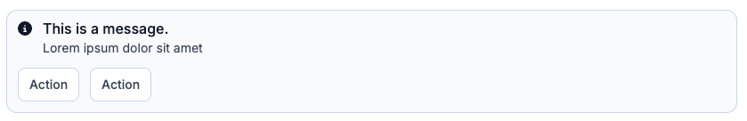

When I started building websites in the early 2000s, the model was simple: HTML for the structure, CSS for the style, PHP for the backend, and a sprinkle of JavaScript for interactivity. Pre-Web 2.0, JavaScript wasn't used that much, and that was fine.

The prevailing wisdom back then was clean separation of concerns: your HTML would only contain semantics, and your CSS would define how things looked. In theory, you could swap out `style.css` for a completely different stylesheet and the site would look entirely different while the HTML stayed untouched. Elegant idea.

In practice, you spent hours trying to find the right name for your classes and ended up with something like `.alert-container-inner-title-too-long-classname-who-reads-this-anyway`. And of course the CSS was deeply coupled to the HTML anyway: your `.alert-container` selector assumed a very specific DOM structure, so changing one silently broke the other. The "separation" was an illusion. The files were separate, but the concerns weren't.

When I discovered React a few years ago, it was a relief. Yes, you still suffer from the JavaScript ecosystem (`ETOOMANY` dependencies). But React offers a genuinely different way to think about UI, one that maps surprisingly well to how backend developers already think.

We use React specifically rather than Vue or Svelte — both are solid alternatives — mostly because it's what the team already knew, and the ecosystem around it (TanStack Query, TanStack Router, React Aria) is well-matched to what we needed. There's no deep technical reason React is better for our use case. Most of what we cover in this series would look similar in either framework.

A React component is a function. It takes inputs (props from its parent, and state it manages itself) and returns a description of what the UI should look like. Same inputs, same output. When the inputs change, React re-runs the function and updates the DOM.

```ts
UI = f(state, props)
```

If you've written HTTP handlers, you already know this pattern. A handler takes a request and returns a response; given the same request and the same application state, it always returns the same thing. A React component is the same idea, applied to the DOM.

**In practice, this means you stop thinking "when the user clicks this button, disable it and show a spinner" and start thinking "when `isLoading` is true, the button looks like this."** You describe the relationship between state and UI, and React handles the rest.

```jsx
function SubmitButton({ isLoading, onClick }) {
  return (
    <button disabled={isLoading} onClick={onClick}>
      {isLoading ? <Spinner /> : "Submit"}
    </button>
  );
}
```

When `isLoading` changes, React re-renders this component and figures out what changed. You don't touch the DOM directly. You just describe what the button looks like in each state.

## What is a component?

A component is a function that returns a description of some UI. That description is written in JSX — HTML-ish syntax inside JavaScript.

JSX is like your first glass of whisky. At first you look at it and think "beuuurkkk, what is this, why would anyone mix HTML with JavaScript." Then you get used to it, and after a while you can't imagine going back. Here's a real component from our `packages/ui` library, the `Alert`:

```jsx
function Alert({ variant = "default", title, children, actions, size = "md" }) {
  const icon = {
    default: "info-circle",
    success: "success-circle",
    warning: "warning-triangle",
    error: "error-circle",
  }[variant];

  return (
    <div className={clsx("border-1 flex flex-wrap items-center ...", variantClasses[variant])}>
      <Icon type={icon} size="md" />
      <Typography weight="medium">{title}</Typography>
      <div>{children}</div>
      {actions && <div>{actions}</div>}
    </div>
  );
}
```



A few things to notice. The structure, the logic, and the styles all live together. There's no separate `.css` file that might drift out of sync. The icon is derived from the variant — no need to pass it manually, the component figures it out. And if you change something here, every place using `Alert` gets the update.

Under the hood, JSX compiles down to regular JavaScript function calls. `<Alert variant="error" title="Connection failed" />` becomes something like `Alert({ variant: "error", title: "Connection failed" })`. No magic, just syntax.

This is what the HTML/CSS separation promise could never actually deliver. The structure and the presentation were always coupled — JSX just makes that honest.

You use a component by passing it props — function arguments, essentially. The caller decides what values to pass; the component decides how to render them:

```jsx
<Alert variant="error" title="Connection failed">
  Could not reach the Plakar API. Check your network settings.
</Alert>

<Alert variant="warning" title="Storage almost full" size="sm">
  You have used 90% of your storage quota.
</Alert>
```

You can pass any JavaScript value as a prop: strings, numbers, arrays, objects, other components, even functions. Passing a function is how you handle events — a button takes an `onClick` prop, and the parent decides what happens when it's clicked. If you're used to Go, think of props as a struct passed to a function.

## State

Props come from outside the component. State lives inside it. State is data that belongs to a component and can change over time.

```jsx
import { useState } from "react";

function CollapsiblePanel({ title, children }) {
  const [isOpen, setIsOpen] = useState(false);

  return (
    <div>
      <button onClick={() => setIsOpen(!isOpen)}>
        {isOpen ? "Hide" : "Show"} {title}
      </button>
      {isOpen && <div className="mt-2">{children}</div>}
    </div>
  );
}
```

`useState(false)` declares a piece of state initialized to `false`. It returns the current value and a setter. Call the setter with a new value, React re-renders the component with that new state. `{isOpen && <div>...</div>}` is just a JavaScript expression: render the div if `isOpen` is true, render nothing otherwise.

The component doesn't touch the DOM directly. It just describes what it looks like given the current `isOpen`, and React takes care of the rest.

## Composition

Components can render other components. This is how you build complex UIs from simple pieces — and where the component model really pays off.

Here's how our `Modal` component is used in the codebase:

```jsx
<Modal>
  <Modal.Dialog>
    <Modal.Header
      title="Delete backup"
      description="This action cannot be undone."
    />
    <Modal.Content>
      Are you sure you want to delete this backup?
    </Modal.Content>
    <Modal.Footer>
      <Button variant="secondary">Cancel</Button>
      <Button variant="error">Delete</Button>
    </Modal.Footer>
  </Modal.Dialog>
</Modal>
```

`Modal`, `Modal.Dialog`, `Modal.Header`, `Modal.Content`, `Modal.Footer` — each is a separate component that owns its own piece of the layout. The header handles the title, description, and close button. The footer handles the action area. None of them need to know about each other or about what's above them in the tree.

This is how every page in Plakar UI is built: a tree of components, each responsible for its own piece, none aware of its ancestors. When we fix a bug in `Modal.Header`, every modal in both apps gets the fix. When we add an animation to `Modal`, it applies everywhere.

Compare this to the old model: a shared CSS class, a convention, and three copies of the same HTML structure that you hoped stayed in sync. The component is the actual unit of reuse, not an approximation of one.

One thing worth noting: even something as "simple" as a button is more complex than it looks. Our `Button` component has 8 variants (`primary`, `secondary`, `tertiary`, `error`, and a few more), two sizes, optional left and right icons, a loading state with an integrated spinner, a tooltip, and it can render as either a `<button>` or an `<a>` link depending on whether you pass an `href`. That's before you factor in keyboard navigation and accessibility. The component handles all of it. The caller just writes `<Button variant="error" isPending={isDeleting}>Delete</Button>` and moves on.

This is the thing I got wrong about frontend development for years. I thought the complexity was in making things look nice. The actual complexity is managing state, composing behaviours, and keeping ten different things in sync on the same page — forms, API calls, loading states, error states, real-time updates. It's no longer "one page = one action." Modern UIs are closer to distributed systems than to static documents.

---

Next: TypeScript. Because a component that accepts `any` props with no validation is a bug waiting to happen.

