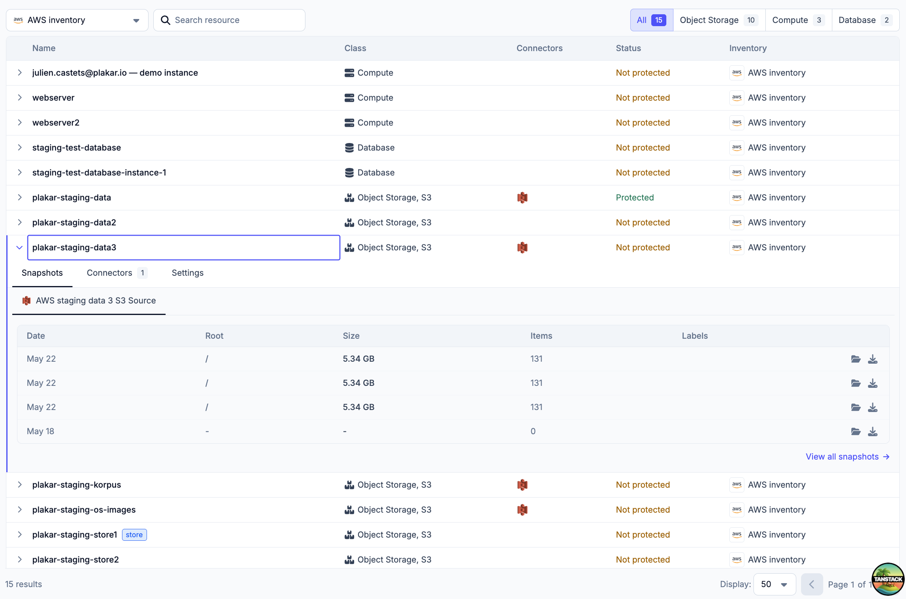
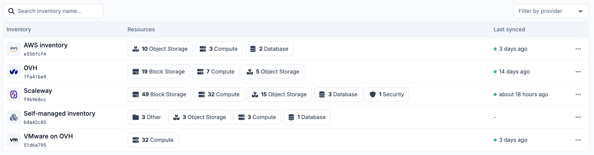
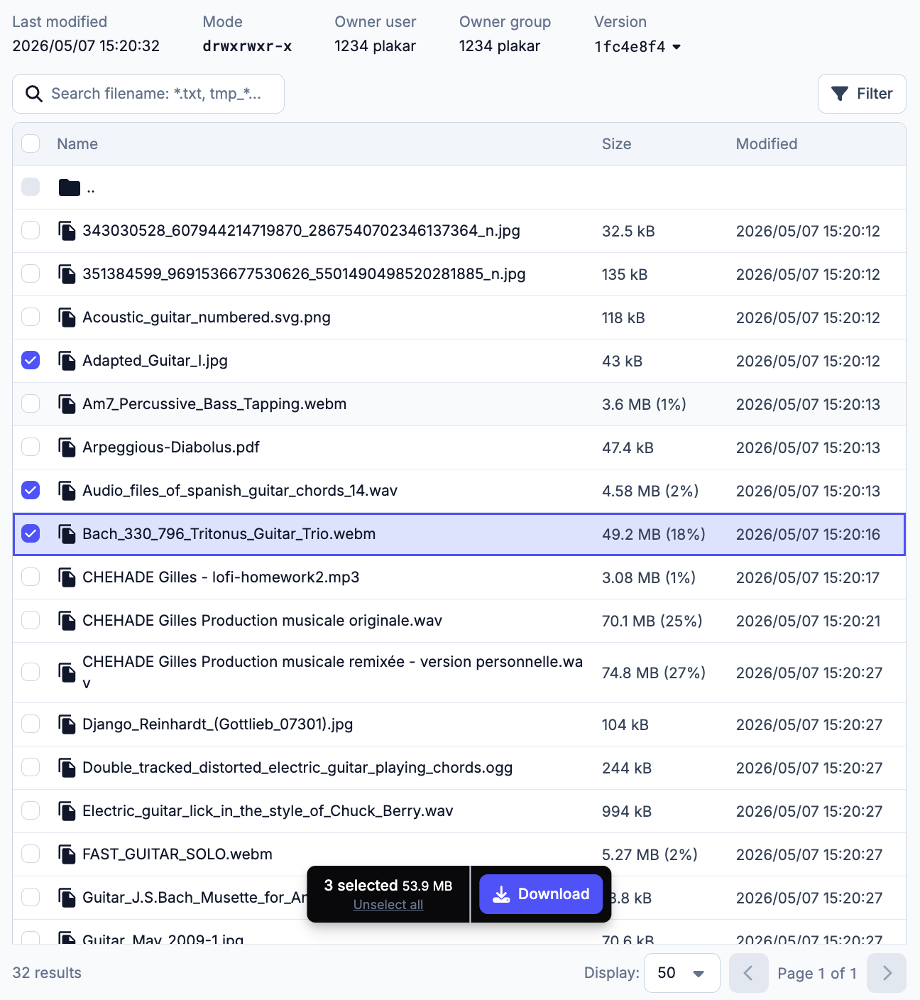

When a backend developer needs to display a list of things in a UI, the first instinct is reasonable: "I'll use an HTML `<table>`." And honestly? It works. For a read-only display of twenty rows, a plain `<table>` with a couple of `<tr>` and `<td>` elements is perfectly fine.

The problems start when the requirements grow. And in our experience, the requirements always grow.

First you need filtering. Then pagination, because there are ten thousand rows and you're not rendering all of them at once. Then sorting. Then a search box. Then someone asks if columns can be reordered, or resized. Then the design calls for a sticky header that stays visible while scrolling. Then expandable rows for nested data. Then row selection with a "delete selected" bulk action. Then virtual scrolling, because rendering tens of thousands of rows will kill the browser.

You could implement all of this yourself. It would take weeks, and the result would be a custom table library that only your team understands, with edge cases you discover in production.

Or you could use TanStack Table.



In the [previous article](../plakar-ui-react-aria-components) we covered how React Aria Components handles interaction logic. Now it's time to put some data in those components.

## The headless model

TanStack Table is a headless table library. Headless means it provides the logic, the state management, and the column/row model, but nothing about how the table looks. You write all the HTML and all the CSS yourself. This gives you complete control over the visual result, and it means TanStack Table integrates cleanly with any design system.

You own the `<table>`, the `<thead>`, the `<tr>`, the `<td>`. TanStack Table tells you what to put in them.

The column definitions know the shape of your data, and the cell render functions get the correct row type inferred automatically. If you rename a field in your data type, TypeScript will catch every column definition that breaks.

## How it works

You start by defining your columns. Each column maps to a field in your data type, and that mapping is type-checked: if you rename a field in your data model, TypeScript will flag every column that references the old name. You also define how each cell renders — a plain string, a formatted date, a link, a badge, whatever fits.

From there, you create a table instance by passing your data and your columns. What you get back is not a component. It's an object with methods: `getHeaderGroups()` to iterate over header rows, `getRowModel().rows` to iterate over data rows, `getVisibleCells()` for each row's cells. You call those methods in your own JSX, inside your own `<table>`, your own `<tr>`, your own `<td>`. TanStack Table never touches the DOM.

Pagination, filtering, and sorting all follow the same model: you pass a flag to opt in (`manualPagination: true`, `getSortedRowModel()`, `getFilteredRowModel()`), and the table instance exposes the state and the handlers. For server-side features (which is what we use, because our datasets can be large), you pass `manualPagination: true`, wire the page state to your API query, and TanStack Table computes page counts and navigation from the total row count your API returns. Sorting and filtering work the same way: the library owns the state, you pass it to the query, TanStack Query handles the refetch.

## A real example from Plakar

Here's a simplified version of the inventories table we use in the Plakar Control Plane, showing how everything comes together with server-side pagination:

```tsx
// apps/plakman/src/routes/_layout/inventories.index.tsx
export const Route = createFileRoute("/_layout/inventories/")({
  validateSearch: zodValidator(
    z.object({
      page: z.coerce.number().nonnegative().catch(0).default(0),
      per_page: z.coerce.number().nonnegative().catch(50).default(50),
      search: z.string().catch("").default(""),
    })
  ),
  loader: async ({ context, deps }) => {
    context.queryClient.prefetchQuery(
      listInventoriesQueryOptions({ page: deps.page, perPage: deps.per_page })
    );
  },
  component: RouteComponent,
});

function RouteComponent() {
  const { page, per_page, search } = Route.useSearch();
  const navigate = Route.useNavigate();

  const query = useQuery(
    listInventoriesQueryOptions({ page, perPage: per_page, search })
  );

  const columns = useMemo(() => getInventoryColumns(search), [search]);

  const table = useReactTable({
    data: query.data?.items ?? [],
    rowCount: query.data?.total,
    columns,
    state: {
      pagination: { pageIndex: page, pageSize: per_page },
    },
    getRowId: (row) => row.id,
    manualPagination: true,
    onPaginationChange: (updater) => {
      const state =
        typeof updater === "function"
          ? updater({ pageIndex: page, pageSize: per_page })
          : updater;
      navigate({
        search: (prev) => ({
          ...prev,
          page: prev.per_page !== state.pageSize ? 0 : state.pageIndex,
          per_page: state.pageSize,
        }),
      });
    },
    getCoreRowModel: getCoreRowModel(),
  });

  return <PaginatedTable table={table} query={query} ariaLabel="Inventories" />;
}
```

Note how the pagination state is stored in the URL search params (via TanStack Router, which we'll cover in the next article). This means that if you share the URL with someone, they land on the same page with the same filters. Refreshing the page preserves your position. The browser back button works. This is the correct behavior, and it falls naturally out of combining TanStack Router, TanStack Query, and TanStack Table.



## Where it scales

We've covered the basics — pagination, filtering, sorting. TanStack Table supports much more without requiring a different approach.

**Row selection** — pass `enableRowSelection: true` and a `rowSelection` state, and each row gets a checkbox. `table.getSelectedRowModel()` gives you the selected rows for bulk operations.

**Expandable rows** — define a `getSubRows` function, and nested data becomes automatically hierarchical with expand/collapse controls.

**Column resizing** — `enableColumnResizing: true` and a few event handlers let users drag column borders.

**Column visibility** — toggle columns on or off dynamically. Useful for letting users customize their view.

**Virtual scrolling** — combine TanStack Table with TanStack Virtual (another library from the same team) to render only the visible rows for datasets with hundreds of thousands of entries.

**Pinned columns** — columns that stay in place when scrolling horizontally.

The point isn't to use all of these on every table. It's that when the requirement arrives — and it will — you don't need to swap libraries or rebuild from scratch. You enable one flag and add a few lines of rendering code.



Because we write the HTML ourselves, our tables look exactly like the rest of Plakar UI — same typography, same border radius, same hover states. TanStack Table gives us the logic and stays out of the way of the design.

Next up: [TanStack Router](../plakar-ui-tanstack-router), and why the URL is state too.

