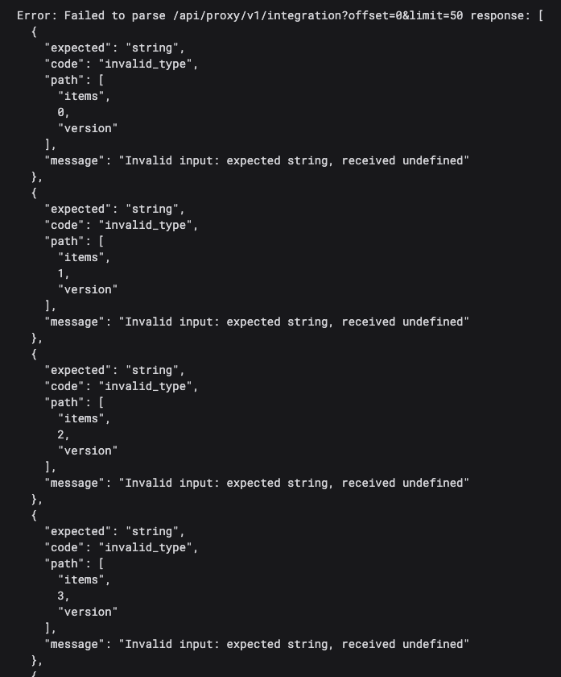

In the previous article, I made the case that TypeScript's type system is expressive, precise, and catches real bugs at compile time. I stand by that. But I left out a pretty significant limitation, and today I want to address it head-on.

TypeScript types describe code that *you* write. They say nothing about data that arrives from outside your program at runtime.

## The problem with raw JSON

When you fetch data from an API, the response comes back as raw JSON. TypeScript doesn't know what's in it — it can't. The network call happens at runtime, after the compiler has long since finished its job and gone home.

The naive approach that you'll see in a lot of TypeScript code is a cast:

```ts
const resp = await fetch("/api/users/123");
const data = await resp.json() as User;
```

The `as User` tells TypeScript: "trust me, this is a `User`." TypeScript shrugs and believes you. The code compiles cleanly.

But that cast is a lie. If the API returns `{ name: null }` and your type says `name: string`, TypeScript has no idea. You have a runtime bug, and the compiler was powerless to prevent it because you asked it not to look.

If you're coming from Go, this should feel familiar in the worst way. It's the equivalent of doing:

```go
data := resp.Body.(User)
```

…without any of the safety that Go's type assertion actually provides. At least in Go, a failed type assertion panics visibly. In TypeScript, a wrong cast just silently produces `undefined` values that slowly corrupt your UI state until something renders wrong three components deep and you spend an hour tracing back where the data went sideways.

## What Zod does

Zod is a schema definition and validation library. Instead of asserting what shape you *hope* the data has, you define a schema that describes the shape you *expect*, and then you validate the actual data against it at the point where it enters your application.

Here's the basic idea:

```ts
import z from "zod";

const UserSchema = z.object({
  id: z.string(),
  name: z.string(),
  email: z.string(),
});

type User = z.infer<typeof UserSchema>;

const data = UserSchema.parse(await resp.json());
// data is now typed as User — for real, not just asserted
```

Two things to notice here.

First, `.parse()` either succeeds or throws. If the API returns `{ name: null }` and the schema says `name: z.string()`, you get an exception right there at the API call, with a message like:

```
ZodError: Expected string, received null at path: name
```

You know immediately what broke and exactly where. Not three components deep when something tries to render a null as a string.

Second, `z.infer<typeof UserSchema>` derives the `User` type automatically from the schema. You define the shape once — in the schema — and TypeScript's type for the validated data is generated from it. No duplication, no risk of the type and the schema drifting apart.

## How we use it in Plakar UI

Every API response in Plakar UI is parsed with a Zod schema. Here's a real example from the codebase:

```ts
// apps/plakman/src/api/connectors/schema.ts
import z from "zod";

export const SourceSnapshotSchema = z.object({
  snapshot_id: z.string(),
  creation_time: z.string().transform((v) => new Date(v)),
  store_ids: z.array(z.string()),
});

export type SourceSnapshot = z.infer<typeof SourceSnapshotSchema>;
```

Notice the `.transform()` on `creation_time`. Zod doesn't just validate — it can transform data as it parses. The API sends a date as a string (as JSON requires), and Zod converts it into a real JavaScript `Date` object on the way in. From that point on, everywhere in the UI, `snapshot.creation_time` is a `Date`. No component ever has to remember to call `new Date(snapshot.creation_time)` — that conversion already happened, once, at the boundary.

## We want it to blow up

This is the part that might surprise you.

The Plakar UI is shipped alongside the API. They are not separate products with independent release cycles. When the API changes, the UI changes at the same time. There's no version mismatch to worry about.

That means when we get unexpected data, we *want* the parse to throw. Not degrade gracefully. Blow up.

Take the integration list. Every integration has a version. If the API stopped returning `version` for some reason, we could write lenient code that just hides it when it's missing. The UI would keep running. Nobody would immediately notice.

But that's a bug, not a feature. Integrations always have a version. If `version` is missing, something is wrong and we want to know about it immediately, not discover it two weeks later when someone asks why versions disappeared from the UI.

With Zod, the parse fails the moment `version` is absent. You can't miss it. And because that failure happens at the boundary, everything downstream is guaranteed: no component in the UI ever needs to handle "what if version is missing", because that case is impossible by the time the data reaches them. Entire categories of defensive code disappear.


## What happens when the API changes

Without Zod, your TypeScript types and the actual API can drift silently. A backend developer renames `creation_time` to `created_at`. They update the Go struct, the API handler, run the backend tests — everything passes on their side. The frontend keeps compiling cleanly because the TypeScript type still says `creation_time`. But now `snapshot.creation_time` is `undefined` at runtime, a date renders as "Invalid Date" somewhere in the UI, and you spend an afternoon tracing back where the data went wrong.

With Zod, the parse throws immediately:

```
ZodError: Expected string, received undefined at path: creation_time
```



You know what broke, where it broke, and that the problem is at the API boundary, not buried three components deep. Fix the schema to match the new field name, and you're done.

Parse once at the boundary, use typed objects everywhere. Components never touch raw JSON. TypeScript keeps them honest about every field, every method call, every assumption they make about the data. Combined with the no-`any` rule from the previous article, this closes the gap that compile-time analysis alone can't cover: the compiler protects your own code, Zod protects you from the outside world.

---

Next up: TanStack Query. We've now covered how types flow through the application and how we validate data at the boundary. Now let's look at how we actually manage the lifecycle of those API calls — fetching, caching, and keeping the UI in sync with the server.

